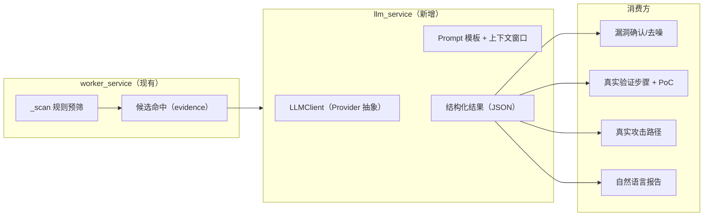

# LLM 集成实施文档（自动化安全评估系统）

> 本文档面向工程师，说明如何在现有「关键字规则匹配」基础上接入 LLM（大语言模型）
> 分析能力，覆盖动机、架构、配置、各角色增强点、Token 计量、安全设计与任务分解。
> 本文档是**实施指引**，不是对既有模块的重写；所有变更以「增强、可降级、可观测」为原则。

| 项目 | 内容 |
| --- | --- |
| 文档名称 | 自动化安全评估系统 LLM 集成实施方案 |
| 版本 | v1.0 |
| 日期 | 2026-08-28 |
| 状态 | 草案（Ready for Review） |

---

## 1. 现状与动机

### 1.1 现有分析机制（纯规则匹配，无 LLM）

当前分析流水线（`backend/app/services/worker_service.py`）的执行方式：

1. **来源解析**（`isolation_service.resolve_source_dir`）：本地路径校验或 `git clone --depth 1`。
2. **规则扫描**（`_scan` + `_iter_source_files`）：纯 Python 读文件，对每一行的内容做
   **关键字字面量包含匹配**（非正则、非语义）。
3. **规则集**（`backend/rules/default_keywords.yaml`）：11 条规则，按 `role` 分给
   `env_check`（2 条）与 `code_analyze`（8 条左右），每条规则命中最多记 1 个漏洞。
4. **漏洞验证**（`run_vuln_verify`）：**模板生成** `_reproduce_steps` / `_verify_code`，
   不读取代码上下文，全部漏洞直接 `verified`。
5. **攻击路径**（`run_report_gen` → `attack_path_service.create_attack_path`）：按
   `risk_level` 排序硬编码串联，路径标题/摘要/影响均为写死文案。
6. **报告**（`_build_markdown`）：Markdown 模板拼装，无自然语言分析。
7. **Token 计量**（`run_ops`）：`len(evidence) // 4` 的估算值，非真实消耗。

### 1.2 规则匹配的已知短板

| 短板 | 现象 | 根因 |
| --- | --- | --- |
| 高误报 | README / 注释 / 字符串里的关键字也被命中 | 无语义理解 |
| 高风险误判 | `os.path.join` 命中即判「路径穿越」，未看是否校验输入（如示例 `path_traversal` 规则） | 无数据流分析 |
| 漏报 | 复杂注入、逻辑漏洞、依赖漏洞（CVE）无法命中 | 无跨文件语义 |
| 假验证 | `vuln_verify` 无真实 PoC，`reproduce_steps` 是固定模板 | 无代码推理 |
| 假 Token | `ops` 阶段 token 为估算 | 无真实调用 |

### 1.3 LLM 集成的目标

在保留「规则预筛」确定性能力的前提下，用 LLM 做**语义强化**，实现：

- **双向降噪**：确认规则命中是否为真漏洞（去误报），发现规则未覆盖的漏洞（补漏报）。
- **真验证**：基于命中代码生成可复现的验证步骤与 PoC 骨架。
- **真报告**：自然语言总结、真实攻击链、针对性修复建议。
- **真实计量**：Token 消耗即为实际调用量，写入 `resource_usages`。

> 对齐 SPEC §1.2.2 原始设计意图：「LLM token 消耗与隔离技术无关，通过**本地白名单命令预筛 +
> 定向送审**降低 token」——**先规则预筛、只把命中的候选送 LLM 确认**，这是本方案的成本控制主线。

---

## 2. 设计原则（写文档时作为准则）

| 原则 | 说明 |
| --- | --- |
| P1 增强而非替代 | 规则预筛保留，LLM 挂在其后做确认/补充/验证/报告 |
| P2 可降级 | LLM 不可用/超时/无 key 时，回退到现有模板逻辑，`AC-7` 演示闭环不破坏 |
| P3 定向送审 | 只把「命中片段 + 上下文窗口」送审，不整库送审，控制成本与延迟 |
| P4 隔离与脱敏 | LLM 调用走独立模块；送审内容先 `mask()` 脱敏；支持本地模型避免外发 |
| P5 全程可观测 | 每次 LLM 调用记录：项目、角色、阶段、模型、耗时、token、是否降级，可回溯 |
| P6 异步非阻塞 | 使用 `asyncio.to_thread` 或 httpx 异步客户端，不阻塞事件循环 |

---

## 3. 总体架构



**数据流（以 code_analysis 阶段为例）：**

1. `_scan` 命中规则 → 生成候选 `Vulnerability`（`verify_status=unverified`，与现状一致）。
2. 调度器进入 `vulnerability_verify` 阶段 → `run_vuln_verify` 调用 `llm_service.confirm_vulns`：
   - 送审每一条候选的 `evidence` 摘要 + 命中文件上下文窗口；
   - LLM 结构化输出：`{"is_real": true/false, "confidence": 0.9, "risk_level": "high", "reason": "..."}`；
   - `is_real=false` 的候选标记为 `failed`（去误报），其余升级为 `verified` 并回填
     `reproduce_steps_text` / `verify_code_text`（真 PoC）。
3. `report_generate` 阶段 → `run_report_gen`：
   - 先调用 `llm_service.build_attack_path`（语义串联已确认漏洞）；
   - 再调用 `llm_service.summarize_report`（生成摘要、业务影响、定制修复建议）；
   - 最终仍走 `report_service.generate_and_save` 落库（Markdown 权威 + HTML 派生不变）。
4. `ops` 阶段：`llm_service` 的 `last_usage` 累加器返回真实 token，写入 `resource_usages`。

---

## 4. 新增模块设计

### 4.1 `backend/app/services/llm_service.py`（新增）

职责：Provider 抽象 + Prompt 构建 + 结构化结果解析 + 统计与降级。

```python
# 关键接口（草案）
class LLMClient:
    """OpenAI 兼容协议客户端（httpx 异步，支持 base_url 指向 openai/deepseek/qwen/ollama）。"""

    def __init__(self, base_url: str, api_key: str, model: str) -> None: ...

    async def chat_json(self, messages, *, temperature=0.1, timeout=60) -> dict:
        """请求 chat/completions 并要求 JSON 输出（response_format=json_object 或 parse 兜底）。
        记录 token usage 到累加器；失败抛 LLMError。"""


class LLMService:
    """面向 worker 的领域接口：确认/验证/攻击路径/报告/资源计量。"""

    def __init__(self, client: LLMClient | None, enabled: bool) -> None: ...

    async def confirm_vuln(self, vuln: Vulnerability, context: str) -> ConfirmResult: ...
    async def verify_vuln(self, vuln: Vulnerability, context: str) -> VerifyResult: ...
    async def build_attack_path(self, vulns: list[Vulnerability]) -> PathPlan | None: ...
    async def summarize_report(self, project, vulns) -> ReportEnhancement: ...

    def reset_usage(self) -> None:          # 每项目/每次 ops 前清零
    def get_usage(self) -> Usage:           # prompt_tokens/completion_tokens/cost 估算
```

- **全异步**：httpx `AsyncClient` 由 `lifespan` 管理；阻塞调用（如有同步 SDK）丢 `asyncio.to_thread`。
- **全部方法均需 try/except 兜底**：任何异常返回 `None`/默认值并 `logger.warning`，触发 P2 降级。

### 4.2 `backend/app/schemas/llm.py`（新增，可选）

Pydantic 模型：`LLMConfigOut`、`LLMUsageOut`（供 `/api/system/config` 扩展与监控页展示）。

---

## 5. 配置设计

### 5.1 `backend/app/config.py`（修改：追加字段）

```python
# ---- LLM ----
llm_enabled: bool = False              # 总开关；默认关闭，开启后才有增强
llm_base_url: str = ""                 # 如 https://api.deepseek.com/v1
llm_api_key: str = ""                  # 密钥（走 .env，不落库明文）
llm_model: str = "deepseek-chat"       # 或 qwen-plus / local-model
llm_timeout_seconds: int = 120
llm_max_retries: int = 2
llm_temperature: float = 0.1           # 尽量低，保证判定稳定
```

### 5.2 `backend/.env.example`（修改：追加示例）

```ini
# ---- LLM（默认关闭，开启 LLM_ENABLED=true 并配置后生效）----
LLM_ENABLED=false
LLM_BASE_URL=
LLM_API_KEY=
LLM_MODEL=
```

### 5.3 `system_config` 种子（`config_service.seed_configs`，可选扩展）

设计取舍：**key 直接保存在 `.env`（进程级），不放进 `system_config` 业务表**，避免明文密钥入库；
`system_config` 只放 `llm.enabled` / `llm.model` / `llm.timeout_seconds` 等非敏感项，供 admin 在线改。

---

## 6. 各角色 LLM 增强点（对应 `worker_service`）

### 6.1 env_check（环境检查，增强）

- 现状：`_run_scan_role` 只跑 `env_check` 规则。
- 增强：LLM 输入「项目结构树 + 依赖清单（顶层文件清单）+ 命中证据」，输出
  `{"framework": "flask", "entry": "app.py", "uncovered_risks": [...], "extra_keywords": [...]}`。
  可把 `extra_keywords` 回落为增强规则（P2 能力）。

### 6.2 code_analyze（代码分析，双向降噪）

- 现状：`_scan` 命中即建漏洞。
- 增强：命中后异步送 `confirm_vuln`，`is_real=false` 的候选标记 `verify_status=failed`
  （**去误报**），不回撤数据（保留回溯）。置信度低于阈值（如 <0.6）的保持 `unverified` 人工复核。

### 6.3 vuln_verify（漏洞验证，真 PoC）

- 现状：`_reproduce_steps` / `_verify_code` 为固定模板。
- 增强：对每一条 `is_real=true` 的漏洞，送「命中文件上下文窗口（±30 行）」，
  生成真实复现步骤与 PoC 骨架，回填 `reproduce_steps_text` / `verify_code_text`。
- 注意：**容器验证可选**。默认生成 PoC 文本（P2 再接入隔离容器实际执行）。

### 6.4 report_gen（报告生成，真实攻击链 + 自然语言）

- 现状：按 risk 排序硬编码一条路径。
- 增强：
  1. `build_attack_path`：按「数据流/利用前置关系」语义串联漏洞，生成 `PathPlan`
     （标题/摘要/影响/明细顺序），仍复用 `attack_path_service.create_attack_path` 落库；
  2. `summarize_report`：生成摘要段、业务影响、**基于命中证据的定制修复建议**，
     供 `_build_markdown` 渲染。

### 6.5 ops（运维/计量）

- 现状：`token = len(evidence)//4`。
- 增强：取 `llm_service.get_usage()` 真实 token，写入 `collect_and_record(token_count=...)`。

### 6.6 generic（无变更）

只做编排记录，不接入 LLM。

---

## 7. Token 计量与成本控制

1. **成本主线**：规则预筛 → 只送「命中候选」给 LLM（对齐 SPEC §1.2.2「定向送审」）。
2. **窗口截断**：单次送审携带代码上下文 ≤ 200 行 / ≤ 8KB；长文件截首尾。
3. **批量化**：同阶段多条候选可合并为一次对话请求（`confirm_vuln_batch`），减少往返。
4. **计量入库**：`llm_service.get_usage()` 累加 `prompt_tokens` / `completion_tokens`，
   `ops` 阶段写入 `resource_usages.token_count`；监控页资源图即展示（现有前端不改即生效）。
5. **熔断**：单项目累计 token 超阈值（`llm.max_tokens_per_project`，默认可配）后自动降级为规则模式。

---

## 8. 安全设计

| 风险 | 缓解 |
| --- | --- |
| 源码外发泄露 | ① 送审前 `mask()` 脱敏（复用 `app.utils.logging.mask`）；② 支持本地模型（ollama `base_url=http://localhost:11434/v1`）；③ `llm_enabled=false` 时零外发 |
| Prompt 注入（源码头/异常数据） | 系统提示词强调「仅分析，不执行」；解析 JSON 失败即降级 |
| 密钥泄露 | `LLM_API_KEY` 仅 `.env`/环境变量，不入库、不入日志；`mask()` 覆盖 `api_key=` |
| SSRF（恶意 `base_url`） | `llm_base_url` 仅 admin 可配（走 config 接口权限校验），默认空 |
| 超时/重试风暴 | 单次超时 `llm_timeout_seconds`（默认 120s）+ 重试 `llm_max_retries`（2 次）+ 累计熔断 |

---

## 9. 数据模型调整（最小化，不迁移亦可先跑）

现有模型足够承载结果，**本项目 P0 不需新增表**：

- `vulnerabilities.verify_status`：`failed` 已存在（去误报复用）。
- `vulnerabilities.reproduce_steps_text / verify_code_text`：已存在（真 PoC 复用）。
- `attack_paths / attack_path_items`：已存在（真实链复用）。
- `resource_usages.token_count`：已存在（真计量复用）。

如需留存 LLM 原始判定（可选 P1），新增 `llm_analysis_log` 表：

```sql
CREATE TABLE llm_analysis_log (
    id BIGINT UNSIGNED AUTO_INCREMENT PRIMARY KEY,
    project_id BIGINT UNSIGNED NOT NULL,
    stage_id BIGINT UNSIGNED NULL,
    vuln_id BIGINT UNSIGNED NULL,
    model VARCHAR(128) NOT NULL,
    task_type VARCHAR(32) NOT NULL,          -- confirm/verify/attack_path/summary
    raw_request TEXT NULL,
    raw_response TEXT NULL,
    prompt_tokens INT NOT NULL DEFAULT 0,
    completion_tokens INT NOT NULL DEFAULT 0,
    fallback BOOLEAN NOT NULL DEFAULT FALSE, -- 本次是否降级
    created_at DATETIME NOT NULL DEFAULT CURRENT_TIMESTAMP,
    INDEX ix_llm_log_project (project_id, created_at)
);
```

---

## 10. 实施任务分解

| 任务 | 说明 | 产出 | 依赖 | 优先级 |
| --- | --- | --- | --- | --- |
| L01 | `config.py` + `.env.example` 追加 LLM 配置 | 配置项可读 | - | P0 |
| L02 | `llm_service.py`（`LLMClient.chat_json` + `LLMService` 骨架 + 降级） | 可调用单测通过 | L01 | P0 |
| L03 | `code_analyze` 挂 `confirm_vuln`（去误报） | 示例项目误报数下降 | L02 | P0 |
| L04 | `vuln_verify` 挂 `verify_vuln`（真 PoC） | `reproduce_steps` 非模板化 | L03 | P0 |
| L05 | `report_gen` 挂 `build_attack_path` + `summarize_report` | 报告含语义分析 | L04 | P1 |
| L06 | `ops` 挂真实 `get_usage()` 计量 | 资源图 token 真实 | L02 | P0 |
| L07 | `llm_analysis_log` 表（可选 P1） | 判定可回溯 | L02 | P1 |
| L08 | 文档与样例 `scripts/demo*.sh` 更新 | 演示含 LLM 步骤 | L03~L06 | P2 |

**依赖图：** L01 → L02 → {L03, L06}；L03 → L04 → L05；L02 → L07。

---

## 11. 验收标准

1. **可降级**：`LLM_ENABLED=false` 或 key 无效时，`examples/sample-project` 仍能跑完整闭环
   （对齐 `AC-7`），终端有 `logger.warning("LLM 降级，使用规则模式")`。
2. **去误报**：开启 LLM 后，示例项目 `path_traversal` 等规则命中由 LLM 复核，
   `verify_status` 出现 `failed`（人工判定合理）。
3. **真验证**：任一确认漏洞的 `reproduce_steps_text` 已含「利用参数/请求样例」，非固定模板。
4. **真计量**：`resource_usages.token_count` 与 `llm_analysis_log` 的 token 一致（P1 后）。
5. **可观测**：后端终端与 Monitor 页日志可见「LLM 调用/降级/耗时」关键节点（沿用上一轮进度日志）。
6. **安全**：日志与报告全文无 `LLM_API_KEY` 明文（`mask()` 覆盖断言）。

---

> **一致性声明**：本文档不改变既有的阶段/角色/状态机/WebSocket/报告结构；LLM 作为
> `worker_service` 内部的可选增强层，所有对外 API（`/api/**`）与前端页面契约保持不变，
> 仅 `resource_usages.token_count` 与 `vulnerabilities` 各文本字段的**内容质量**提升。