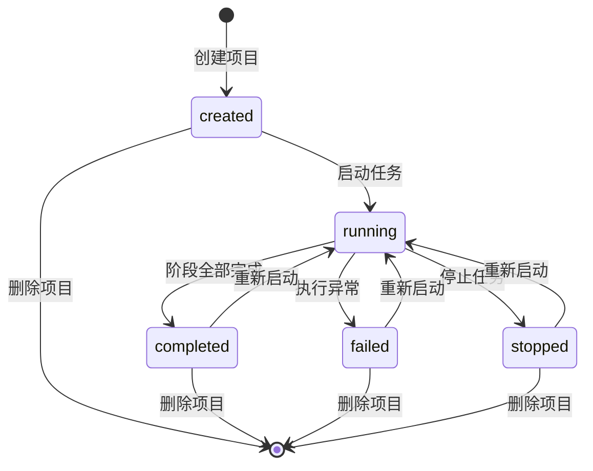
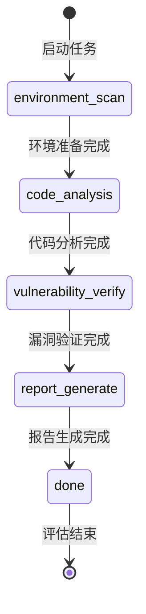
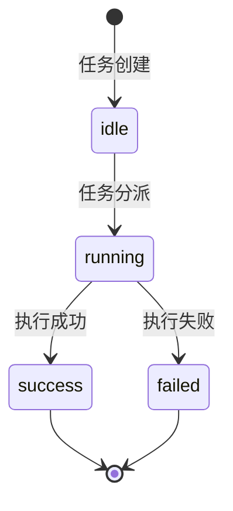

# PRD-自动化安全评估系统

> 产品需求文档（Product Requirement Document）

## 1. 文档信息

| 项目 | 内容 |
| --- | --- |
| 文档名称 | 自动化安全评估系统 PRD |
| 版本 | v1.0 |
| 日期 | 2026-08-25 |
| 作者 | 许清楚（产品经理） |
| 状态 | 待评审（Draft for Review） |
| 交付形式 | 可运行前端 + 后端 + 数据库初始化脚本 + 示例项目 + 接口说明 + 完整演示链路 |

## 2. 产品概述与项目目标

### 2.1 产品概述

自动化安全评估系统是一套面向「源码项目」的安全评估平台。系统接入源码项目后，在隔离环境中自动完成源码读取、目录遍历、关键字搜索、命令执行，从而发现潜在漏洞，对漏洞进行验证，整理攻击路径，并最终输出完整的安全评估报告。

### 2.2 项目目标（Product Goals）

| 编号 | 目标 | 说明 |
| --- | --- | --- |
| G1 | 全流程自动化 | 覆盖「项目接入 → 隔离分析 → 漏洞发现 → 漏洞验证 → 攻击路径整理 → 报告输出」的完整闭环，减少人工干预 |
| G2 | 安全隔离 | 所有分析在独立隔离环境中执行，源码只读挂载，保障宿主系统与被测项目安全 |
| G3 | 全程可观测 | 提供实时监控、阶段状态、角色执行状态、日志滚动、资源消耗等能力，评估过程透明可回溯 |

### 2.3 范围界定

- **项目能力**：项目创建、项目删除、任务启动、任务停止
- **执行能力**：隔离环境管理、源码读取、目录遍历、关键字搜索、命令执行
- **结果能力**：漏洞保存、攻击路径保存、报告输出、日志保存、阶段状态保存、实时监控

## 3. 用户角色与用户故事（Use Cases）

### 3.1 用户角色

| 角色 | 描述 | 核心权限 |
| --- | --- | --- |
| 普通使用者 | 使用系统进行安全评估的业务/开发人员 | 创建评估项目、启动/停止任务、查看漏洞、攻击路径、报告 |
| 管理员 | 系统运维与初始化人员 | 初始化系统、维护运行配置、维护隔离环境、查看资源消耗与系统日志 |

### 3.2 用户故事

| 编号 | 角色 | 用户故事 |
| --- | --- | --- |
| US-1 | 作为普通使用者 | 我希望通过用户名和密码登录系统，以便进入项目列表页开始工作 |
| US-2 | 作为普通使用者 | 我希望创建一个评估项目（填写项目名称、源码路径/仓库地址、任务说明、隔离环境类型），以便接入待评估的源码 |
| US-3 | 作为普通使用者 | 我希望启动评估任务并实时查看阶段状态、日志、角色状态和资源消耗，以便掌握评估进展 |
| US-4 | 作为普通使用者 | 我希望查看漏洞列表、漏洞详情、攻击路径和最终报告并下载，以便了解安全风险并推动修复 |
| US-5 | 作为普通使用者 | 我希望停止任务和删除项目，以便终止评估并清理无用项目 |
| US-6 | 作为管理员 | 我希望初始化系统（创建管理员账户），以便系统首次可用 |
| US-7 | 作为管理员 | 我希望维护隔离环境配置、默认超时、并发数、保留天数等运行配置，以便系统按预期运行 |
| US-8 | 作为管理员 | 我希望查看资源消耗和系统日志，以便监控系统健康状况 |

## 4. 需求池（Requirements Pool）

### 4.1 P0（Must Have，核心必需）

| 编号 | 需求 | 说明 |
| --- | --- | --- |
| R-P0-01 | 系统初始化与登录认证 | 管理员初始化系统、用户登录校验、登录态识别 |
| R-P0-02 | 项目全生命周期管理 | 项目创建、查询、详情、删除、状态更新 |
| R-P0-03 | 隔离环境管理 | 创建、启动、停止、销毁隔离环境；每个项目绑定独立隔离环境编号 |
| R-P0-04 | 任务启动与阶段推进 | 启动后先准备隔离环境，再进入阶段执行；阶段状态机完整 |
| R-P0-05 | 任务停止 | 停止后当前阶段不再继续执行，已保存数据保留 |
| R-P0-06 | 角色任务调度 | 至少 6 类执行角色，独立任务记录，结果可回溯到项目与阶段 |
| R-P0-07 | 漏洞发现与保存 | 漏洞记录保存、状态更新、证据保存；漏洞列表与详情 |
| R-P0-08 | 攻击路径整理 | 攻击路径保存、漏洞关联、利用顺序、最终影响 |
| R-P0-09 | 报告生成与输出 | 汇总结果生成最终报告，支持预览与下载 |
| R-P0-10 | 实时监控 | 实时订阅状态、日志、消息、资源变化（WebSocket） |
| R-P0-11 | 数据持久化 | 完整数据表结构、日志/报告/临时文件存储与清理 |
| R-P0-12 | 项目删除级联清理 | 删除项目同时删除漏洞、攻击路径、聊天消息、日志、资源记录及文件目录 |

### 4.2 P1（Should Have，重要）

| 编号 | 需求 | 说明 |
| --- | --- | --- |
| R-P1-01 | 系统配置管理 | 隔离环境配置、默认超时时间、并发数、保留天数的读取与更新 |
| R-P1-02 | 漏洞筛选 | 漏洞列表按风险等级、验证状态等维度筛选 |
| R-P1-03 | 资源消耗记录与展示 | CPU、内存、Token 消耗的记录与实时展示 |
| R-P1-04 | 日志滚动 | 实时日志滚动展示，按项目归档 |
| R-P1-05 | 阶段状态保存与回溯 | 各阶段开始/结束时间、状态、错误信息完整保存 |

### 4.3 P2（Nice to Have，可选增强）

| 编号 | 需求 | 说明 |
| --- | --- | --- |
| R-P2-01 | 多格式报告导出 | 在 Markdown/HTML 之外支持 PDF 等更多导出格式 |
| R-P2-02 | 漏洞去重与关联分析 | 同类漏洞去重、跨路径漏洞关联分析 |
| R-P2-03 | 操作审计日志 | 用户操作行为的完整审计记录 |
| R-P2-04 | 定时任务/周期扫描 | 对已接入项目定时重新评估 |

## 5. 功能需求详述

### 5.1 页面需求

| 页面 | 核心元素 |
| --- | --- |
| 登录页 | 用户名输入、密码输入、登录按钮，登录成功后进入项目列表页 |
| 项目列表页 | 项目名称、源码来源、项目状态、最近启动时间、最近完成时间 |
| 项目创建页 | 项目名称、源码路径或仓库地址、任务说明、隔离环境类型 |
| 项目详情页 | 项目基本信息、阶段状态、漏洞数量、攻击路径数量、报告状态 |
| 实时监控页 | 当前阶段、角色执行状态、聊天消息、日志滚动、资源消耗 |
| 漏洞列表页 | 漏洞编号、漏洞标题、风险等级、验证状态、文件位置 |
| 攻击路径页 | 攻击路径编号、关联漏洞、利用顺序、最终影响 |
| 报告页 | 完整安全评估报告展示，支持下载 |
| 系统配置页 | 隔离环境配置、默认超时时间、并发数、保留天数 |

### 5.2 前端模块要求

| 模块 | 功能 |
| --- | --- |
| 项目模块 | 项目创建、列表展示、详情查看、删除 |
| 监控模块 | 实时状态、日志滚动、资源消耗展示 |
| 漏洞模块 | 漏洞列表、详情展示、筛选 |
| 攻击路径模块 | 路径列表、详情展示、关联漏洞展示 |
| 报告模块 | 报告预览和下载 |
| 配置模块 | 系统配置读取和更新 |

### 5.3 后端模块要求

| 模块 | 功能 |
| --- | --- |
| 认证模块 | 系统初始化、登录校验、登录态识别 |
| 项目模块 | 项目创建、删除、查询、状态更新 |
| 隔离环境模块 | 创建、启动、停止、销毁隔离环境 |
| 调度模块 | 阶段推进、角色任务分发、状态汇总 |
| 漏洞模块 | 漏洞记录保存、状态更新、证据保存 |
| 路径模块 | 攻击路径保存和漏洞关联 |
| 报告模块 | 汇总结果并生成最终报告 |
| 监控模块 | 实时消息、日志记录、资源消耗记录 |

### 5.4 角色分工要求

系统需提供至少 **6 类执行角色**，覆盖以下能力：

| 角色 | 职责 |
| --- | --- |
| 通用处理角色 | 通用任务处理与编排 |
| 环境检查角色 | 隔离环境准备与检查 |
| 代码分析角色 | 源码读取、目录遍历、关键字搜索 |
| 漏洞验证角色 | 漏洞复现与验证、命令执行 |
| 报告整理角色 | 结果汇总与报告生成 |
| 运维辅助角色 | 资源监控、日志采集等运维辅助 |

**角色任务记录要求**：

- 每类角色保存独立任务记录，字段包括：接收的任务内容、开始时间、结束时间、执行结果、错误信息
- 角色执行结果必须能回溯到所属项目和所属阶段（通过 `project_id` + `stage_id` 关联）

### 5.5 状态机

#### 5.5.1 项目状态机

> 项目状态取值：`created`、`running`、`completed`、`failed`、`stopped`

#### 5.5.2 执行阶段状态机

> 执行阶段取值：`environment_scan`、`code_analysis`、`vulnerability_verify`、`report_generate`、`done`
> 启动任务后，必须先准备隔离环境（`environment_scan`），再进入后续阶段执行

#### 5.5.3 角色执行状态机

> 角色执行状态取值：`idle`、`running`、`success`、`failed`

## 6. 数据需求

### 6.1 数据表字段清单

#### users（用户表）

| 字段 | 类型 | 说明 |
| --- | --- | --- |
| id | 主键 | 用户 ID |
| username | 字符串 | 用户名 |
| password_hash | 字符串 | 密码哈希 |
| role | 字符串 | 角色（admin / user） |
| status | 字符串 | 状态 |
| created_at | 时间 | 创建时间 |

#### projects（项目表）

| 字段 | 类型 | 说明 |
| --- | --- | --- |
| id | 主键 | 项目 ID |
| project_name | 字符串 | 项目名称 |
| source_type | 字符串 | 源码来源类型（本地路径 / 仓库地址） |
| source_path | 字符串 | 源码路径或仓库地址 |
| task_content | 文本 | 任务说明 |
| project_status | 字符串 | 项目状态 |
| created_by | 外键 | 创建人（关联 users.id） |
| created_at | 时间 | 创建时间 |
| updated_at | 时间 | 更新时间 |

#### runtime_stages（阶段表）

| 字段 | 类型 | 说明 |
| --- | --- | --- |
| id | 主键 | 阶段 ID |
| project_id | 外键 | 所属项目 |
| stage_name | 字符串 | 阶段名称 |
| stage_status | 字符串 | 阶段状态 |
| started_at | 时间 | 开始时间 |
| finished_at | 时间 | 结束时间 |
| error_message | 文本 | 错误信息 |

#### worker_tasks（角色任务表）

| 字段 | 类型 | 说明 |
| --- | --- | --- |
| id | 主键 | 任务 ID |
| project_id | 外键 | 所属项目 |
| stage_id | 外键 | 所属阶段 |
| worker_role | 字符串 | 执行角色 |
| task_content | 文本 | 接收的任务内容 |
| task_status | 字符串 | 任务状态（idle/running/success/failed） |
| result_summary | 文本 | 执行结果摘要 |
| started_at | 时间 | 开始时间 |
| finished_at | 时间 | 结束时间 |

#### vulnerabilities（漏洞表）

| 字段 | 类型 | 说明 |
| --- | --- | --- |
| id | 主键 | 漏洞 ID |
| project_id | 外键 | 所属项目 |
| vuln_code | 字符串 | 漏洞编号 |
| vuln_title | 字符串 | 漏洞标题 |
| risk_level | 字符串 | 风险等级 |
| file_path | 字符串 | 文件位置 |
| condition_text | 文本 | 触发条件 |
| evidence_text | 文本 | 证据内容 |
| verify_status | 字符串 | 验证状态 |
| reproduce_steps_text | 文本 | 复现步骤 |
| verify_code_text | 文本 | 验证代码 |
| created_at | 时间 | 创建时间 |

#### attack_paths（攻击路径表）

| 字段 | 类型 | 说明 |
| --- | --- | --- |
| id | 主键 | 路径 ID |
| project_id | 外键 | 所属项目 |
| path_code | 字符串 | 路径编号 |
| path_title | 字符串 | 路径标题 |
| path_summary | 文本 | 路径摘要 |
| final_impact_text | 文本 | 最终影响 |
| created_at | 时间 | 创建时间 |

#### attack_path_items（攻击路径明细表）

| 字段 | 类型 | 说明 |
| --- | --- | --- |
| id | 主键 | 明细 ID |
| path_id | 外键 | 所属路径 |
| vuln_id | 外键 | 关联漏洞 |
| step_order | 整数 | 利用顺序 |
| step_text | 文本 | 步骤说明 |

#### chat_messages（聊天消息表）

| 字段 | 类型 | 说明 |
| --- | --- | --- |
| id | 主键 | 消息 ID |
| project_id | 外键 | 所属项目 |
| worker_role | 字符串 | 来源角色 |
| message_type | 字符串 | 消息类型 |
| message_text | 文本 | 消息内容 |
| created_at | 时间 | 创建时间 |

#### runtime_logs（运行日志表）

| 字段 | 类型 | 说明 |
| --- | --- | --- |
| id | 主键 | 日志 ID |
| project_id | 外键 | 所属项目 |
| stage_id | 外键 | 所属阶段 |
| worker_task_id | 外键 | 所属角色任务 |
| log_level | 字符串 | 日志级别 |
| log_content | 文本 | 日志内容 |
| created_at | 时间 | 创建时间 |

#### resource_usages（资源消耗表）

| 字段 | 类型 | 说明 |
| --- | --- | --- |
| id | 主键 | 记录 ID |
| project_id | 外键 | 所属项目 |
| cpu_usage | 数值 | CPU 使用率 |
| memory_usage | 数值 | 内存使用量 |
| token_count | 整数 | Token 消耗 |
| recorded_at | 时间 | 记录时间 |

#### reports（报告表）

| 字段 | 类型 | 说明 |
| --- | --- | --- |
| id | 主键 | 报告 ID |
| project_id | 外键 | 所属项目 |
| report_markdown | 文本 | Markdown 报告 |
| report_html | 文本 | HTML 报告 |
| report_file_path | 字符串 | 报告文件路径 |
| created_at | 时间 | 创建时间 |

### 6.2 隔离环境与文件存储规范

| 规范项 | 要求 |
| --- | --- |
| 隔离环境编号 | 每个项目必须绑定独立隔离环境编号 |
| 源码挂载 | 源码目录以只读形式挂载到隔离环境 |
| 日志文件 | 按 `runtime_logs/{project_id}/` 存储 |
| 报告文件 | 按 `reports/{project_id}/` 存储 |
| 临时执行文件 | 按 `workspace/{project_id}/` 存储 |
| 项目删除清理 | 删除项目时，同时删除日志目录、报告目录和临时目录 |

## 7. 接口需求

### 7.1 REST 接口清单

| 方法 | 路径 | 说明 | 关键请求字段 |
| --- | --- | --- | --- |
| POST | /api/system/init | 初始化管理员账户 | username、password |
| POST | /api/system/login | 登录 | username、password |
| POST | /api/projects | 创建项目 | project_name、source_type、source_path、task_content |
| GET | /api/projects | 查询项目列表 | - |
| GET | /api/projects/{project_id} | 查询项目详情 | - |
| POST | /api/projects/{project_id}/start | 启动评估任务 | - |
| POST | /api/projects/{project_id}/stop | 停止评估任务 | - |
| DELETE | /api/projects/{project_id} | 删除项目 | - |
| GET | /api/projects/{project_id}/stages | 查询阶段状态 | - |
| GET | /api/projects/{project_id}/workers | 查询角色执行状态 | - |
| GET | /api/projects/{project_id}/vulnerabilities | 查询漏洞列表 | - |
| GET | /api/projects/{project_id}/attack-paths | 查询攻击路径列表 | - |
| GET | /api/projects/{project_id}/report | 查询最终报告 | - |
| GET | /api/projects/{project_id}/logs | 查询运行日志 | - |
| GET | /api/projects/{project_id}/resources | 查询资源消耗 | - |
| WS | /api/projects/{project_id}/stream | 实时订阅状态、日志、消息、资源变化 | - |

### 7.2 实时消息类型

| 消息类型 | 至少包含字段 |
| --- | --- |
| project_status | project_id、project_status |
| stage_status | project_id、stage_name、stage_status |
| worker_status | worker_task_id、worker_role、task_status |
| chat_message | worker_role、message_text |
| runtime_log | log_level、log_content |
| resource_usage | cpu_usage、memory_usage、token_count |
| vulnerability_found | vuln_id、vuln_title、risk_level |
| report_ready | project_id、report_id |

## 8. 输出结果格式约定

| 输出 | 内容要求 |
| --- | --- |
| 漏洞列表 | 数组，每项至少包含：漏洞编号、漏洞标题、风险等级、文件位置、验证状态 |
| 漏洞详情 | 至少包含：影响说明、触发条件、证据内容、复现步骤、验证代码 |
| 攻击路径 | 至少包含：路径编号、关联漏洞、利用顺序、最终影响 |
| 最终报告 | 至少包含：项目概述、执行过程、漏洞汇总、攻击路径、风险结论、修复建议 |

## 9. 非功能性需求

| 类别 | 要求 |
| --- | --- |
| 并发 | 支持多项目并行评估，并发数可配置（系统配置页维护） |
| 超时 | 各阶段默认超时时间可配置，超时后阶段标记 failed 并记录错误信息 |
| 保留策略 | 已完成项目的日志/报告/临时文件按「保留天数」策略定期清理 |
| 安全隔离 | 源码只读挂载，隔离环境与宿主机网络/文件系统隔离，分析命令仅在隔离环境内执行 |
| 可观测性 | 阶段状态、角色状态、日志、消息、资源消耗全部持久化并可回溯 |
| 数据一致性 | 项目删除时事务性删除关联业务数据 + 文件目录 |

## 10. 验收标准

| 编号 | 验收项 |
| --- | --- |
| AC-1 | 能初始化系统并完成登录 |
| AC-2 | 能创建项目并成功接入源码目录或仓库地址 |
| AC-3 | 能启动评估任务并看到阶段状态变化 |
| AC-4 | 能在实时监控页看到日志、角色状态、消息和资源变化 |
| AC-5 | 能生成漏洞记录、攻击路径和最终报告 |
| AC-6 | 能停止任务、删除项目并保留必要操作结果 |
| AC-7 | 能完成一个示例项目从接入、分析、验证到报告输出的完整演示 |

## 11. 待确认问题（Open Questions）

| 编号 | 问题 | 影响 |
| :--- | :--- | :--- |
| Q-1 | 登录态采用 Session 还是 JWT？有效期多长？ | 影响认证模块设计与安全策略 |
| Q-2 | 隔离环境采用何种技术实现（Docker 容器 / 虚拟机 / 沙箱进程）？ | 影响隔离环境模块实现与资源开销 |
| Q-3 | 源码来源「仓库地址」支持哪些类型（Git / SVN）？是否需要认证凭据？ | 影响源码接入模块设计 |
| Q-4 | 关键字搜索的默认规则集是否内置？是否允许用户自定义关键字？ | 影响漏洞发现的准确度与覆盖范围 |
| Q-5 | 漏洞验证通过「命令执行」实现时，命令白名单/权限边界如何界定？ | 影响安全性与执行能力设计 |
| Q-6 | 风险等级（high/medium/low）与验证状态（verified/unverified/...）的完整枚举取值是什么？ | 影响数据字典与前端展示 |
| Q-7 | 「聊天消息」的 message_type 枚举取值有哪些（如 info/warn/error）？ | 影响消息分类与前端渲染 |
| Q-8 | 资源消耗中的 token_count 具体指什么（LLM Token / 其他计量）？ | 影响计量口径与统计 |
| Q-9 | 前端技术栈是否遵循默认（Vite + React + MUI + Tailwind CSS）？ | 影响架构师技术选型 |
| Q-10 | 报告文件落盘格式以 Markdown 还是 HTML 为权威版本？下载时输出何种格式？ | 影响报告模块实现 |
