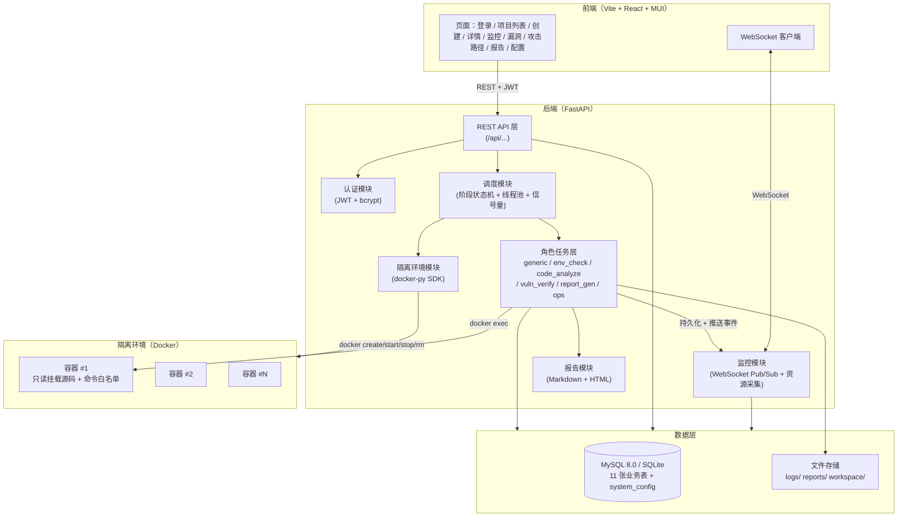
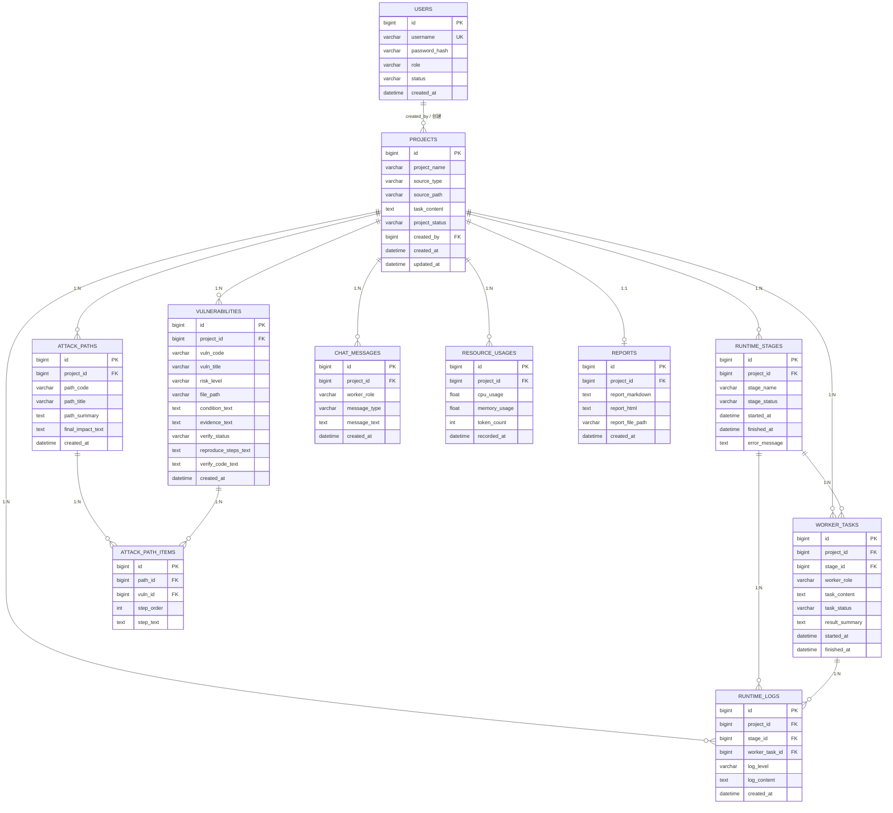
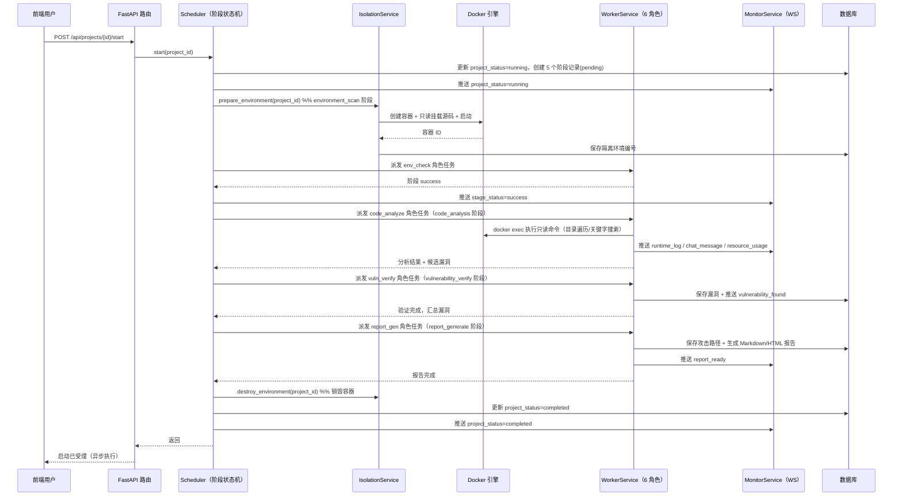
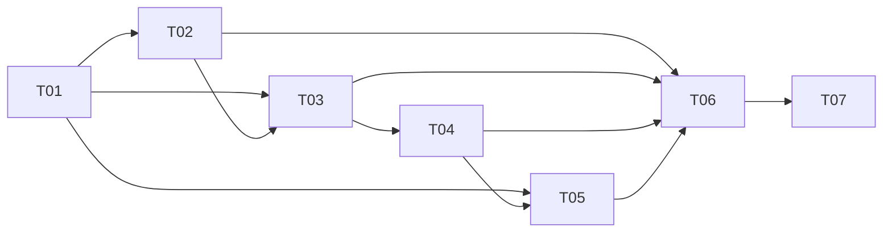

# SPEC-自动化安全评估系统

> 技术规范文档（Software Specification）
>
> 本文档为《PRD-自动化安全评估系统》的可落地技术实现规范，覆盖技术选型、数据模型、API 接口、目录结构四大核心章节，并附系统架构图、调度时序图、依赖清单与实现任务分解，供工程师实现时直接参照。

| 项目 | 内容 |
| --- | --- |
| 文档名称 | 自动化安全评估系统 SPEC |
| 版本 | v1.0 |
| 日期 | 2026-08-25 |
| 作者 | 高见远（架构师） |
| 依据 | PRD-自动化安全评估系统 v1.0 |
| 状态 | 可评审（Ready for Review） |

---

## 目录

1. [技术选型](#1-技术选型含理由)
2. [数据模型设计](#2-数据模型设计字段类型--关系)
3. [API 接口设计](#3-api-接口设计restful-风格)
4. [项目目录结构](#4-项目目录结构)
5. [附录](#5-附录)

---

## 1. 技术选型（含理由）

### 1.1 总体技术栈清单

| 分层 | 选型 | 版本（建议） | 说明 |
| --- | --- | --- | --- |
| 后端框架 | FastAPI | 0.115.x | 异步、Pydantic 原生校验、自动 OpenAPI |
| ASGI 服务器 | Uvicorn | 0.32.x | FastAPI 官方推荐生产服务器 |
| 前端框架 | Vite + React + TypeScript | Vite 5.x / React 18.3 | 默认前端栈（Q-9 决策） |
| UI 组件库 | MUI（@mui/material） | 6.x | 企业级表格/表单/图表组件 |
| 样式方案 | Tailwind CSS | 3.4.x | 原子化样式，与 MUI 并存 |
| 状态管理 | Zustand | 5.x | 轻量，替代 Redux 降低样板代码 |
| 路由 | React Router | 6.x | 前端页面路由 |
| HTTP 客户端 | Axios | 1.x | 拦截器统一处理 token/错误 |
| 数据库 | MySQL（生产）/ SQLite（开发默认） | MySQL 8.0 / SQLite 3 | SQLAlchemy 统一抽象，演示零依赖启动 |
| ORM | SQLAlchemy | 2.0.x | 声明式映射（Mapped/declarative） |
| 数据库迁移 | Alembic | 1.14.x | 版本化 DDL 管理 |
| 认证方案 | JWT（PyJWT）+ passlib[bcrypt] | PyJWT 2.x | 无状态令牌（Q-1 决策） |
| 隔离环境 | Docker 容器（docker-py SDK） | docker 7.x | 每项目独立容器 + 只读挂载（Q-2 决策） |
| 任务调度 | asyncio 自研阶段调度器 + ThreadPoolExecutor | Python 3.11 | 轻量，无需外部消息中间件 |
| WebSocket | FastAPI 原生 WebSocket + 内存 Pub/Sub | 内置 | 按 project_id 分组的订阅广播 |
| 报告渲染 | Python-Markdown | 3.x | Markdown 为权威，HTML 为派生 |
| 资源监控 | psutil | 5.x | 采集 CPU/内存 |
| 数据库驱动 | PyMySQL（生产）/ SQLite（开发） | 1.1.x | 与 SQLAlchemy 配合 |

### 1.2 逐项选型理由

#### 1.2.1 后端框架：FastAPI

- **异步原生**：本系统核心是「长任务调度 + 实时推送」，一个评估任务会跨越多个阶段并持续推送日志/状态。FastAPI 的 `async/await` 与 ASGI 天然适配「任务在后台执行、前端通过 WebSocket 持续接收」的模型，避免 WSGI 同步框架在高并发推送下的线程开销。
- **Pydantic 校验**：PRD 中 15 个 REST 接口 + 8 种实时消息的请求/响应结构非常适合用 Pydantic 模型声明，天然生成参数校验与文档（Swagger UI）。
- **WebSocket 一等公民**：FastAPI 内置 WebSocket 支持，无需额外集成。

#### 1.2.2 数据库：MySQL 8.0（生产）+ SQLite（开发默认）

- 项目存在明确的**级联删除**（项目删除时事务性清理漏洞/路径/消息/日志/资源记录）与**外键约束**需求，MySQL InnoDB 提供可靠的事务与外键级联。
- 开发/演示阶段默认使用 **SQLite**，通过 SQLAlchemy 抽象，工程师可零依赖跑通完整演示链路（AC-7），生产通过环境变量切换 MySQL。
- 不选 PostgreSQL 是为降低部署门槛（Atguigu 教学/演示场景常见 MySQL），功能上两者均可满足。

#### 1.2.3 ORM：SQLAlchemy 2.0

- 声明式映射 + `relationship()` 可清晰表达 11 张表之间的 1:N 关联与级联删除（`cascade="all, delete-orphan"`）。
- 配合 Alembic 做迁移，保证「数据库初始化脚本」既可手工执行又可版本化演进。
- 本文档数据模型采用 **SQLAlchemy 2.0 语义**（`Mapped[str]`、`mapped_column`）描述，与实现一一对应。

#### 1.2.4 认证方案：JWT（Q-1 决策）

- **决策**：采用 **JWT（无状态）**，`Authorization: Bearer <token>` 传递登录态，有效期默认 **24 小时**（可经系统配置调整），可选 `refresh token` 列为 P2。
- **理由**：
  1. 前后端分离（Vite 独立部署）下 Cookie+Session 需处理跨域与 CSRF，JWT 更简洁；
  2. WebSocket 握手时可从 `Authorization`/query 参数取 token 校验，与 REST 共用同一鉴权逻辑；
  3. 密码哈希用 `bcrypt`（passlib），不落明文。
- **结论**：不选 Session，避免服务端状态与分布式共享会话的复杂度。

#### 1.2.5 隔离环境方案：Docker 容器（Q-2 决策）

- **决策**：采用 **Docker 容器**（通过 `docker-py` SDK 管理），每个项目绑定独立容器；源码目录以 **只读卷（read-only volume）** 挂载；容器网络使用 **none / 内网模式**，与宿主机隔离。
- **理由**：
  1. 相对虚拟机，容器启动快（秒级）、资源开销小，满足「多项目并行评估」；
  2. 相对沙箱进程，容器提供更彻底的文件系统/网络隔离，安全评估场景更稳妥；
  3. docker-py 生态成熟，创建/启动/停止/销毁/查看资源均可编程化。
- **边界**：Docker 为第一版方案，如需更强隔离（内核级），P2 可平滑升级为 gVisor/Firecracker，接口层（`IsolationDriver`）已抽象，不影响上层。

#### 1.2.6 任务调度/异步方案：asyncio 自研调度器 + ThreadPoolExecutor

- **决策**：**不引入 Celery/Redis/RabbitMQ**，用「FastAPI 内置 asyncio 事件循环 + 阶段状态机 + 线程池执行阻塞命令」实现调度。
- **理由**：
  1. 评估流程是**线性阶段推进**（environment_scan → code_analysis → vulnerability_verify → report_generate），不是海量细粒度任务，无需分布式任务队列；
  2. 命令执行、Docker SDK 调用属阻塞 IO，丢入 `ThreadPoolExecutor` 即可，不阻塞事件循环；
  3. 并发数通过系统配置 `task.max_concurrency` 限制，用 `asyncio.Semaphore` 控制同时运行的项目数；
  4. 减少外部中间件依赖，降低部署与演示成本，符合「务实、可落地」原则。
- **演进路径**：若未来并发量级上升，可在 `Scheduler` 接口下替换为 Celery，业务层不变。

#### 1.2.7 WebSocket 实时方案：FastAPI 原生 + 内存 Pub/Sub

- 每个项目维护一个 `asyncio.Queue` 广播集合，`MonitorService` 作为统一消息出口，`WebSocketManager` 按 `project_id` 管理订阅者，收到事件即广播给该项目所有连接。
- 内存方案在单实例部署下足够；多实例扩展时可替换为 Redis Pub/Sub（接口已隔离）。

#### 1.2.8 前端技术栈（Q-9 决策）

- **遵循默认**：Vite + React 18 + TypeScript + MUI + Tailwind CSS。
- 状态管理选 **Zustand**（轻量、无样板），全局 `useProjectStore` 管理当前项目与 WebSocket 连接，局部状态用 React hooks。
- 实时监控页、日志滚动用 WebSocket 数据驱动，MUI 表格 + 自绘资源图表。

### 1.3 Open Questions 架构决策汇总

| 编号 | 问题 | 架构决策 |
| --- | --- | --- |
| Q-1 | 认证方式 | JWT 无状态令牌，`Authorization: Bearer`，有效期默认 24h 可配，bcrypt 哈希密码 |
| Q-2 | 隔离环境技术 | Docker 容器（docker-py），每项目一容器，源码只读挂载，网络隔离 |
| Q-3 | 仓库地址类型 | P0 支持 `local_path`（本地路径）与 `git_repo`（Git HTTPS）；SVN 与私有凭据列为 P2 |
| Q-4 | 关键字规则集 | P0 内置默认规则集（配置文件 `rules/default_keywords.yaml`），P2 支持用户自定义 |
| Q-5 | 命令白名单 | 内置只读命令白名单（grep/find/cat/head/tail/sed -n 等）+ 容器网络隔离，验证命令在容器内执行且禁止出网 |
| Q-6 | 风险/验证枚举 | risk_level：`critical/high/medium/low`；verify_status：`unverified/verifying/verified/failed` |
| Q-7 | message_type 枚举 | `info/warn/error/success` |
| Q-8 | token_count 口径 | LLM Token（角色执行消耗的大模型 token 计数），资源监控页计量展示 |
| Q-9 | 前端技术栈 | 遵循默认 Vite + React + MUI + Tailwind CSS |
| Q-10 | 报告权威格式 | Markdown 为权威版本，HTML 为渲染派生版本；下载默认输出 Markdown（P2 支持 PDF/HTML） |

### 1.4 系统总体架构图



---

## 2. 数据模型设计（字段类型 + 关系）

### 2.1 命名与类型约定

- **主键**：统一 `id BIGINT UNSIGNED AUTO_INCREMENT`。
- **字符串**：`VARCHAR(n)`；**长文本**：`TEXT`（>64KB 的报告用 `LONGTEXT`）。
- **时间**：`DATETIME`，UTC 存储（应用层转本地时区展示）；`created_at/updated_at` 默认 `CURRENT_TIMESTAMP`。
- **枚举**：数据库以 `VARCHAR` 存储 + 应用层 `Enum` 约束（避免数据库枚举变更成本）。
- **软删除**：本项目不采用软删除，删除项目走**物理删除 + 级联清理**（满足 R-P0-12）。
- **SQLAlchemy 语义**：下文类型列标注的为数据库 DDL 类型，实现时映射为 SQLAlchemy `mapped_column`。

### 2.2 表结构定义（11 张业务表 + system_config）

#### 2.2.1 users（用户表）

| 字段 | 数据类型 | 可空 | 默认值 | 约束/索引 | 说明 |
| --- | --- | --- | --- | --- | --- |
| id | BIGINT UNSIGNED | 否 | AUTO_INCREMENT | PK | 用户 ID |
| username | VARCHAR(64) | 否 | - | UNIQUE | 用户名 |
| password_hash | VARCHAR(255) | 否 | - | - | bcrypt 密码哈希 |
| role | VARCHAR(16) | 否 | 'user' | - | 角色 admin / user |
| status | VARCHAR(16) | 否 | 'active' | - | active / disabled |
| created_at | DATETIME | 否 | CURRENT_TIMESTAMP | - | 创建时间 |

#### 2.2.2 projects（项目表）

| 字段 | 数据类型 | 可空 | 默认值 | 约束/索引 | 说明 |
| --- | --- | --- | --- | --- | --- |
| id | BIGINT UNSIGNED | 否 | AUTO_INCREMENT | PK | 项目 ID |
| project_name | VARCHAR(128) | 否 | - | - | 项目名称 |
| source_type | VARCHAR(16) | 否 | - | - | local_path / git_repo |
| source_path | VARCHAR(512) | 否 | - | - | 源码路径或仓库地址 |
| task_content | TEXT | 是 | NULL | - | 任务说明 |
| project_status | VARCHAR(16) | 否 | 'created' | INDEX | created/running/completed/failed/stopped |
| created_by | BIGINT UNSIGNED | 是 | NULL | FK → users.id | 创建人 |
| created_at | DATETIME | 否 | CURRENT_TIMESTAMP | - | 创建时间 |
| updated_at | DATETIME | 否 | CURRENT_TIMESTAMP ON UPDATE | - | 更新时间 |

> 外键策略：`created_by` → `users.id` 采用 `ON DELETE SET NULL`（用户删除时保留项目，创建人置空）。

#### 2.2.3 runtime_stages（执行阶段表）

| 字段 | 数据类型 | 可空 | 默认值 | 约束/索引 | 说明 |
| --- | --- | --- | --- | --- | --- |
| id | BIGINT UNSIGNED | 否 | AUTO_INCREMENT | PK | 阶段 ID |
| project_id | BIGINT UNSIGNED | 否 | - | FK → projects.id，INDEX | 所属项目 |
| stage_name | VARCHAR(32) | 否 | - | - | environment_scan/code_analysis/vulnerability_verify/report_generate/done |
| stage_status | VARCHAR(16) | 否 | 'pending' | - | pending/running/success/failed |
| started_at | DATETIME | 是 | NULL | - | 开始时间 |
| finished_at | DATETIME | 是 | NULL | - | 结束时间 |
| error_message | TEXT | 是 | NULL | - | 错误信息 |

> 约束：`UNIQUE(project_id, stage_name)`（每个项目每个阶段一条记录）。

#### 2.2.4 worker_tasks（角色任务表）

| 字段 | 数据类型 | 可空 | 默认值 | 约束/索引 | 说明 |
| --- | --- | --- | --- | --- | --- |
| id | BIGINT UNSIGNED | 否 | AUTO_INCREMENT | PK | 任务 ID |
| project_id | BIGINT UNSIGNED | 否 | - | FK → projects.id，INDEX | 所属项目 |
| stage_id | BIGINT UNSIGNED | 否 | - | FK → runtime_stages.id，INDEX | 所属阶段 |
| worker_role | VARCHAR(32) | 否 | - | - | generic/env_check/code_analyze/vuln_verify/report_gen/ops |
| task_content | TEXT | 是 | NULL | - | 接收的任务内容 |
| task_status | VARCHAR(16) | 否 | 'idle' | - | idle/running/success/failed |
| result_summary | TEXT | 是 | NULL | - | 执行结果摘要 |
| started_at | DATETIME | 是 | NULL | - | 开始时间 |
| finished_at | DATETIME | 是 | NULL | - | 结束时间 |

#### 2.2.5 vulnerabilities（漏洞表）

| 字段 | 数据类型 | 可空 | 默认值 | 约束/索引 | 说明 |
| --- | --- | --- | --- | --- | --- |
| id | BIGINT UNSIGNED | 否 | AUTO_INCREMENT | PK | 漏洞 ID |
| project_id | BIGINT UNSIGNED | 否 | - | FK → projects.id，INDEX | 所属项目 |
| vuln_code | VARCHAR(64) | 否 | - | - | 漏洞编号（如 VULN-0001） |
| vuln_title | VARCHAR(255) | 否 | - | - | 漏洞标题 |
| risk_level | VARCHAR(16) | 否 | - | INDEX | critical/high/medium/low |
| file_path | VARCHAR(512) | 是 | NULL | - | 文件位置 |
| condition_text | TEXT | 是 | NULL | - | 触发条件 |
| evidence_text | TEXT | 是 | NULL | - | 证据内容 |
| verify_status | VARCHAR(16) | 否 | 'unverified' | INDEX | unverified/verifying/verified/failed |
| reproduce_steps_text | TEXT | 是 | NULL | - | 复现步骤 |
| verify_code_text | TEXT | 是 | NULL | - | 验证代码 |
| created_at | DATETIME | 否 | CURRENT_TIMESTAMP | - | 创建时间 |

> 约束：`UNIQUE(project_id, vuln_code)`。

#### 2.2.6 attack_paths（攻击路径表）

| 字段 | 数据类型 | 可空 | 默认值 | 约束/索引 | 说明 |
| --- | --- | --- | --- | --- | --- |
| id | BIGINT UNSIGNED | 否 | AUTO_INCREMENT | PK | 路径 ID |
| project_id | BIGINT UNSIGNED | 否 | - | FK → projects.id，INDEX | 所属项目 |
| path_code | VARCHAR(64) | 否 | - | - | 路径编号（如 PATH-0001） |
| path_title | VARCHAR(255) | 否 | - | - | 路径标题 |
| path_summary | TEXT | 是 | NULL | - | 路径摘要 |
| final_impact_text | TEXT | 是 | NULL | - | 最终影响 |
| created_at | DATETIME | 否 | CURRENT_TIMESTAMP | - | 创建时间 |

> 约束：`UNIQUE(project_id, path_code)`。

#### 2.2.7 attack_path_items（攻击路径明细表）

| 字段 | 数据类型 | 可空 | 默认值 | 约束/索引 | 说明 |
| --- | --- | --- | --- | --- | --- |
| id | BIGINT UNSIGNED | 否 | AUTO_INCREMENT | PK | 明细 ID |
| path_id | BIGINT UNSIGNED | 否 | - | FK → attack_paths.id，INDEX | 所属路径 |
| vuln_id | BIGINT UNSIGNED | 否 | - | FK → vulnerabilities.id，INDEX | 关联漏洞 |
| step_order | INT | 否 | - | - | 利用顺序 |
| step_text | TEXT | 是 | NULL | - | 步骤说明 |

> 约束：`UNIQUE(path_id, step_order)`。

#### 2.2.8 chat_messages（聊天消息表）

| 字段 | 数据类型 | 可空 | 默认值 | 约束/索引 | 说明 |
| --- | --- | --- | --- | --- | --- |
| id | BIGINT UNSIGNED | 否 | AUTO_INCREMENT | PK | 消息 ID |
| project_id | BIGINT UNSIGNED | 否 | - | FK → projects.id，INDEX | 所属项目 |
| worker_role | VARCHAR(32) | 否 | - | - | 来源角色 |
| message_type | VARCHAR(16) | 否 | 'info' | - | info/warn/error/success |
| message_text | TEXT | 否 | - | - | 消息内容 |
| created_at | DATETIME | 否 | CURRENT_TIMESTAMP | - | 创建时间 |

#### 2.2.9 runtime_logs（运行日志表）

| 字段 | 数据类型 | 可空 | 默认值 | 约束/索引 | 说明 |
| --- | --- | --- | --- | --- | --- |
| id | BIGINT UNSIGNED | 否 | AUTO_INCREMENT | PK | 日志 ID |
| project_id | BIGINT UNSIGNED | 否 | - | FK → projects.id，INDEX | 所属项目 |
| stage_id | BIGINT UNSIGNED | 是 | NULL | FK → runtime_stages.id | 所属阶段 |
| worker_task_id | BIGINT UNSIGNED | 是 | NULL | FK → worker_tasks.id | 所属角色任务 |
| log_level | VARCHAR(16) | 否 | 'info' | - | debug/info/warn/error |
| log_content | TEXT | 否 | - | - | 日志内容 |
| created_at | DATETIME | 否 | CURRENT_TIMESTAMP | INDEX(project_id, created_at) | 创建时间 |

#### 2.2.10 resource_usages（资源消耗表）

| 字段 | 数据类型 | 可空 | 默认值 | 约束/索引 | 说明 |
| --- | --- | --- | --- | --- | --- |
| id | BIGINT UNSIGNED | 否 | AUTO_INCREMENT | PK | 记录 ID |
| project_id | BIGINT UNSIGNED | 否 | - | FK → projects.id，INDEX | 所属项目 |
| cpu_usage | FLOAT | 是 | NULL | - | CPU 使用率（%） |
| memory_usage | FLOAT | 是 | NULL | - | 内存使用量（MB） |
| token_count | INT | 是 | NULL | - | LLM Token 消耗 |
| recorded_at | DATETIME | 否 | CURRENT_TIMESTAMP | INDEX(project_id, recorded_at) | 记录时间 |

#### 2.2.11 reports（报告表）

| 字段 | 数据类型 | 可空 | 默认值 | 约束/索引 | 说明 |
| --- | --- | --- | --- | --- | --- |
| id | BIGINT UNSIGNED | 否 | AUTO_INCREMENT | PK | 报告 ID |
| project_id | BIGINT UNSIGNED | 否 | - | FK → projects.id，UNIQUE | 所属项目 |
| report_markdown | LONGTEXT | 是 | NULL | - | Markdown 报告（权威） |
| report_html | LONGTEXT | 是 | NULL | - | HTML 报告（派生） |
| report_file_path | VARCHAR(512) | 是 | NULL | - | 报告文件路径 |
| created_at | DATETIME | 否 | CURRENT_TIMESTAMP | - | 创建时间 |

> 约束：`UNIQUE(project_id)`（每个项目一份权威报告）。

#### 2.2.12 system_config（系统配置表）

| 字段 | 数据类型 | 可空 | 默认值 | 约束/索引 | 说明 |
| --- | --- | --- | --- | --- | --- |
| id | BIGINT UNSIGNED | 否 | AUTO_INCREMENT | PK | 配置 ID |
| config_key | VARCHAR(64) | 否 | - | UNIQUE | 配置键 |
| config_value | TEXT | 否 | - | - | 配置值 |
| config_type | VARCHAR(16) | 否 | 'string' | - | string/int/float/bool/json |
| description | VARCHAR(255) | 是 | NULL | - | 配置说明 |
| updated_at | DATETIME | 否 | CURRENT_TIMESTAMP ON UPDATE | - | 更新时间 |

> 初始配置键：`isolation.default_image`、`isolation.mount_readonly`、`task.default_timeout_seconds`、`task.max_concurrency`、`retention.days`（详见 §2.5）。

### 2.3 ER 图



### 2.4 关系与级联删除策略

| 关系 | 类型 | 外键 | 级联策略 |
| --- | --- | --- | --- |
| users → projects | 1:N | projects.created_by | `ON DELETE SET NULL` |
| projects → runtime_stages | 1:N | runtime_stages.project_id | `ON DELETE CASCADE` |
| projects → worker_tasks | 1:N | worker_tasks.project_id | `ON DELETE CASCADE` |
| runtime_stages → worker_tasks | 1:N | worker_tasks.stage_id | `ON DELETE CASCADE` |
| projects → vulnerabilities | 1:N | vulnerabilities.project_id | `ON DELETE CASCADE` |
| projects → attack_paths | 1:N | attack_paths.project_id | `ON DELETE CASCADE` |
| attack_paths → attack_path_items | 1:N | attack_path_items.path_id | `ON DELETE CASCADE` |
| vulnerabilities → attack_path_items | 1:N | attack_path_items.vuln_id | `ON DELETE CASCADE` |
| projects → chat_messages | 1:N | chat_messages.project_id | `ON DELETE CASCADE` |
| projects → runtime_logs | 1:N | runtime_logs.project_id | `ON DELETE CASCADE` |
| runtime_stages → runtime_logs | 1:N | runtime_logs.stage_id | `ON DELETE SET NULL` |
| worker_tasks → runtime_logs | 1:N | runtime_logs.worker_task_id | `ON DELETE SET NULL` |
| projects → resource_usages | 1:N | resource_usages.project_id | `ON DELETE CASCADE` |
| projects → reports | 1:1 | reports.project_id | `ON DELETE CASCADE` |

> **删除项目事务（满足 R-P0-12）**：删除项目在单个数据库事务内完成 —— ① 先销毁隔离容器；② 级联删除上述所有业务数据；③ 删除文件目录 `runtime_logs/{project_id}/`、`reports/{project_id}/`、`workspace/{project_id}/`。文件删除失败不阻塞事务回滚，但需记录告警日志。

### 2.5 系统配置（system_config）结构

| config_key | config_type | 默认值 | 说明 |
| --- | --- | --- | --- |
| isolation.default_image | string | `sec-evaluator:latest` | 隔离环境默认镜像 |
| isolation.mount_readonly | bool | `true` | 源码是否只读挂载 |
| isolation.network_mode | string | `none` | 容器网络模式 |
| task.default_timeout_seconds | int | `1800` | 阶段默认超时（秒） |
| task.max_concurrency | int | `2` | 最大并行评估项目数 |
| retention.days | int | `30` | 已完成项目文件保留天数 |

### 2.6 实时消息 JSON 结构定义

WebSocket 推送统一外层结构：

```json
{
  "type": "<消息类型>",
  "project_id": 1,
  "timestamp": "2026-08-25T12:00:00Z",
  "data": { }
}
```

8 种消息类型与 `data` 字段定义（与 PRD §7.2 对应）：

```json
// 1. project_status
{"type":"project_status","project_id":1,"timestamp":"...","data":{"project_status":"running"}}

// 2. stage_status
{"type":"stage_status","project_id":1,"timestamp":"...","data":{"stage_name":"code_analysis","stage_status":"running"}}

// 3. worker_status
{"type":"worker_status","project_id":1,"timestamp":"...","data":{"worker_task_id":12,"worker_role":"code_analyze","task_status":"running"}}

// 4. chat_message
{"type":"chat_message","project_id":1,"timestamp":"...","data":{"worker_role":"code_analyze","message_type":"info","message_text":"开始目录遍历"}}

// 5. runtime_log
{"type":"runtime_log","project_id":1,"timestamp":"...","data":{"log_level":"info","log_content":"扫描 /src 目录..."}}

// 6. resource_usage
{"type":"resource_usage","project_id":1,"timestamp":"...","data":{"cpu_usage":42.5,"memory_usage":512.0,"token_count":12800}}

// 7. vulnerability_found
{"type":"vulnerability_found","project_id":1,"timestamp":"...","data":{"vuln_id":8,"vuln_title":"SQL 注入","risk_level":"high"}}

// 8. report_ready
{"type":"report_ready","project_id":1,"timestamp":"...","data":{"report_id":3}}
```

---

## 3. API 接口设计（RESTful 风格）

### 3.1 通用约定

#### 3.1.1 统一响应封装

```json
{
  "code": 0,
  "message": "success",
  "data": {}
}
```

- `code = 0` 表示成功，非 0 表示业务错误。
- 列表数据统一返回 `data.list` + `data.total`；详情返回 `data` 对象。
- HTTP 状态码：成功 `200`，参数错误 `400`，未认证 `401`，权限不足 `403`，资源不存在 `404`，冲突 `409`，内部错误 `500`。

#### 3.1.2 错误码约定

| code | HTTP | 含义 |
| --- | --- | --- |
| 0 | 200 | 成功 |
| 1001 | 400 | 参数校验失败 |
| 1002 | 401 | 未认证 / 登录态失效 |
| 1003 | 403 | 权限不足（非管理员操作管理接口） |
| 1004 | 409 | 系统已初始化（重复初始化） |
| 2001 | 404 | 资源不存在 |
| 2002 | 409 | 状态冲突（如非 created/completed 状态启动） |
| 3001 | 500 | 隔离环境异常（容器创建/启动失败） |
| 5000 | 500 | 内部错误 |

#### 3.1.3 认证方式

- 登录成功后返回 `access_token`（JWT），有效期默认 24h（可经 `system_config` 调整）。
- 除 `/api/system/init`、`/api/system/login` 外，所有接口需在请求头携带：`Authorization: Bearer <token>`。
- WebSocket 握手时，通过查询参数 `?token=<jwt>` 或 `Authorization` 头进行鉴权。
- 管理员专属接口（系统配置读写）需校验 `role == admin`。

### 3.2 认证与系统接口

#### 3.2.1 POST /api/system/init —— 初始化管理员账户

| 参数 | 类型 | 必填 | 说明 |
| --- | --- | --- | --- |
| username | string | 是 | 管理员用户名 |
| password | string | 是 | 密码（8~64 位） |

请求/响应示例：

```json
// 请求
{"username":"admin","password":"Admin@123456"}

// 响应
{"code":0,"message":"success","data":{"id":1,"username":"admin","role":"admin"}}
```

> 仅当 `users` 表无 admin 用户时可调用；已初始化返回 `1004`。

#### 3.2.2 POST /api/system/login —— 登录

| 参数 | 类型 | 必填 | 说明 |
| --- | --- | --- | --- |
| username | string | 是 | 用户名 |
| password | string | 是 | 密码 |

请求/响应示例：

```json
// 请求
{"username":"admin","password":"Admin@123456"}

// 响应
{"code":0,"message":"success","data":{
  "access_token":"eyJhbGciOiJIUzI1NiIs...",
  "token_type":"Bearer",
  "expires_in":86400,
  "user":{"id":1,"username":"admin","role":"admin"}
}}
```

#### 3.2.3 GET /api/system/config —— 查询系统配置（管理员，P1）

响应示例：

```json
{"code":0,"message":"success","data":{
  "isolation":{"default_image":"sec-evaluator:latest","mount_readonly":true,"network_mode":"none"},
  "task":{"default_timeout_seconds":1800,"max_concurrency":2},
  "retention":{"days":30}
}}
```

#### 3.2.4 PUT /api/system/config —— 更新系统配置（管理员，P1）

| 参数 | 类型 | 必填 | 说明 |
| --- | --- | --- | --- |
| config | object | 是 | 键值对，键遵循 §2.5 |

请求/响应示例：

```json
// 请求
{"config":{"task.max_concurrency":4,"task.default_timeout_seconds":3600}}

// 响应
{"code":0,"message":"success","data":{"task":{"default_timeout_seconds":3600,"max_concurrency":4}}}
```

### 3.3 项目接口

#### 3.3.1 POST /api/projects —— 创建项目

| 参数 | 类型 | 必填 | 说明 |
| --- | --- | --- | --- |
| project_name | string | 是 | 项目名称（1~128） |
| source_type | string | 是 | `local_path` / `git_repo` |
| source_path | string | 是 | 本地路径或 Git 仓库地址 |
| task_content | string | 否 | 任务说明 |

请求/响应示例：

```json
// 请求
{"project_name":"示例评估项目","source_type":"local_path","source_path":"/data/src/demo","task_content":"评估注入类漏洞"}

// 响应
{"code":0,"message":"success","data":{
  "id":1,"project_name":"示例评估项目","source_type":"local_path",
  "source_path":"/data/src/demo","task_content":"评估注入类漏洞",
  "project_status":"created","created_at":"2026-08-25T12:00:00Z"
}}
```

#### 3.3.2 GET /api/projects —— 查询项目列表

| 参数 | 类型 | 必填 | 说明 |
| --- | --- | --- | --- |
| page | int | 否 | 页码，默认 1 |
| page_size | int | 否 | 每页数量，默认 10 |
| project_status | string | 否 | 按状态过滤 |

响应示例：

```json
{"code":0,"message":"success","data":{
  "total":1,
  "list":[{
    "id":1,"project_name":"示例评估项目","source_type":"local_path",
    "project_status":"completed",
    "last_started_at":"2026-08-25T12:01:00Z",
    "last_finished_at":"2026-08-25T12:20:00Z"
  }]
}}
```

#### 3.3.3 GET /api/projects/{project_id} —— 查询项目详情

响应示例：

```json
{"code":0,"message":"success","data":{
  "id":1,"project_name":"示例评估项目","source_type":"local_path",
  "source_path":"/data/src/demo","task_content":"评估注入类漏洞",
  "project_status":"running",
  "vuln_count":3,"attack_path_count":1,"report_status":"none",
  "created_at":"2026-08-25T12:00:00Z","updated_at":"2026-08-25T12:05:00Z"
}}
```

#### 3.3.4 POST /api/projects/{project_id}/start —— 启动评估任务

- 请求体：无（或可选 `{}`）。
- 前置校验：项目状态须为 `created/completed/failed/stopped`；否则返回 `2002`。
- 响应示例：

```json
{"code":0,"message":"success","data":{"project_id":1,"project_status":"running"}}
```

#### 3.3.5 POST /api/projects/{project_id}/stop —— 停止评估任务

- 前置校验：项目状态须为 `running`。
- 响应示例：

```json
{"code":0,"message":"success","data":{"project_id":1,"project_status":"stopped"}}
```

#### 3.3.6 DELETE /api/projects/{project_id} —— 删除项目

- 行为：销毁容器 + 级联删除数据 + 清理文件目录（§2.4）。
- 响应示例：

```json
{"code":0,"message":"success","data":{"deleted_project_id":1}}
```

### 3.4 结果查询接口

#### 3.4.1 GET /api/projects/{project_id}/stages —— 查询阶段状态

响应示例：

```json
{"code":0,"message":"success","data":{
  "list":[
    {"stage_name":"environment_scan","stage_status":"success","started_at":"...","finished_at":"..."},
    {"stage_name":"code_analysis","stage_status":"running","started_at":"...","finished_at":null},
    {"stage_name":"vulnerability_verify","stage_status":"pending","started_at":null,"finished_at":null},
    {"stage_name":"report_generate","stage_status":"pending","started_at":null,"finished_at":null}
  ]
}}
```

#### 3.4.2 GET /api/projects/{project_id}/workers —— 查询角色执行状态

响应示例：

```json
{"code":0,"message":"success","data":{
  "list":[
    {"id":12,"worker_role":"code_analyze","task_status":"running","stage_name":"code_analysis","started_at":"...","finished_at":null}
  ]
}}
```

#### 3.4.3 GET /api/projects/{project_id}/vulnerabilities —— 查询漏洞列表

| 参数 | 类型 | 必填 | 说明 |
| --- | --- | --- | --- |
| risk_level | string | 否 | 按风险等级过滤 |
| verify_status | string | 否 | 按验证状态过滤 |
| page | int | 否 | 页码 |
| page_size | int | 否 | 每页数量 |

响应示例：

```json
{"code":0,"message":"success","data":{"total":3,"list":[
  {"id":8,"vuln_code":"VULN-0001","vuln_title":"SQL 注入","risk_level":"high","file_path":"src/UserService.java","verify_status":"verified","created_at":"..."}
]}}
```

#### 3.4.4 GET /api/projects/{project_id}/vulnerabilities/{vuln_id} —— 查询漏洞详情

响应示例：

```json
{"code":0,"message":"success","data":{
  "id":8,"vuln_code":"VULN-0001","vuln_title":"SQL 注入","risk_level":"high",
  "file_path":"src/UserService.java","condition_text":"未过滤用户输入","evidence_text":"...",
  "verify_status":"verified","reproduce_steps_text":"...","verify_code_text":"...","created_at":"..."
}}
```

#### 3.4.5 GET /api/projects/{project_id}/attack-paths —— 查询攻击路径列表

响应示例：

```json
{"code":0,"message":"success","data":{"total":1,"list":[
  {"id":5,"path_code":"PATH-0001","path_title":"SQL 注入链","path_summary":"...","final_impact_text":"数据泄露","vuln_count":2,"created_at":"..."}
]}}
```

#### 3.4.6 GET /api/projects/{project_id}/attack-paths/{path_id} —— 查询攻击路径详情

响应示例：

```json
{"code":0,"message":"success","data":{
  "id":5,"path_code":"PATH-0001","path_title":"SQL 注入链",
  "path_summary":"...","final_impact_text":"数据泄露",
  "items":[
    {"step_order":1,"step_text":"利用登录接口注入","vuln_id":8,"vuln_code":"VULN-0001","vuln_title":"SQL 注入"},
    {"step_order":2,"step_text":"读取敏感数据","vuln_id":9,"vuln_code":"VULN-0002","vuln_title":"敏感信息泄露"}
  ]
}}
```

#### 3.4.7 GET /api/projects/{project_id}/report —— 查询最终报告

响应示例：

```json
{"code":0,"message":"success","data":{
  "report_id":3,
  "report_markdown":"# 安全评估报告\n...",
  "report_html":"<h1>安全评估报告</h1>...",
  "created_at":"2026-08-25T12:20:00Z"
}}
```

#### 3.4.8 GET /api/projects/{project_id}/report/download —— 下载报告（补充）

- 返回：`application/octet-stream`，文件名为 `report-{project_id}.md`（P0 默认 Markdown）。

#### 3.4.9 GET /api/projects/{project_id}/logs —— 查询运行日志

| 参数 | 类型 | 必填 | 说明 |
| --- | --- | --- | --- |
| log_level | string | 否 | 按级别过滤 |
| page | int | 否 | 页码 |
| page_size | int | 否 | 每页数量 |

响应示例：

```json
{"code":0,"message":"success","data":{"total":120,"list":[
  {"id":900,"log_level":"info","log_content":"扫描 /src 目录...","stage_name":"code_analysis","created_at":"..."}
]}}
```

#### 3.4.10 GET /api/projects/{project_id}/resources —— 查询资源消耗

| 参数 | 类型 | 必填 | 说明 |
| --- | --- | --- | --- |
| limit | int | 否 | 返回最近 N 条，默认 100 |

响应示例：

```json
{"code":0,"message":"success","data":{
  "list":[
    {"cpu_usage":42.5,"memory_usage":512.0,"token_count":12800,"recorded_at":"..."}
  ]
}}
```

### 3.5 WebSocket 接口

#### WS /api/projects/{project_id}/stream —— 实时订阅

- **握手**：`ws://<host>/api/projects/{project_id}/stream?token=<jwt>`
- **鉴权**：校验 token 与项目访问权限。
- **行为**：连接后推送 8 种实时消息（§2.6），服务端不接收客户端消息（仅支持心跳 ping）。
- **连接示例**：

```javascript
const ws = new WebSocket(`ws://localhost:8000/api/projects/${projectId}/stream?token=${token}`);
ws.onmessage = (e) => {
  const msg = JSON.parse(e.data); // msg.type ∈ {project_status, stage_status, ...}
};
```

---

## 4. 项目目录结构

### 4.1 Monorepo 目录树

```text
code-sec-evaluator/
├── README.md                          # 项目总览与启动说明
├── docs/                              # 文档
│   ├── PRD-自动化安全评估系统.md
│   └── SPEC-自动化安全评估系统.md
├── backend/                           # 后端（FastAPI）
│   ├── app/
│   │   ├── main.py                    # 应用入口：挂载路由、CORS、WS、启动事件
│   │   ├── config.py                  # 配置（pydantic-settings 读 .env）
│   │   ├── database.py                # SQLAlchemy engine / session / Base
│   │   ├── models/                    # 数据模型（11 张表 + system_config）
│   │   │   ├── __init__.py
│   │   │   ├── user.py
│   │   │   ├── project.py
│   │   │   ├── stage.py
│   │   │   ├── worker_task.py
│   │   │   ├── vulnerability.py
│   │   │   ├── attack_path.py
│   │   │   ├── chat_message.py
│   │   │   ├── runtime_log.py
│   │   │   ├── resource_usage.py
│   │   │   ├── report.py
│   │   │   └── system_config.py
│   │   ├── schemas/                   # Pydantic 请求/响应模型
│   │   │   ├── __init__.py
│   │   │   ├── auth.py
│   │   │   ├── project.py
│   │   │   ├── stage.py
│   │   │   ├── worker.py
│   │   │   ├── vulnerability.py
│   │   │   ├── attack_path.py
│   │   │   ├── report.py
│   │   │   ├── log.py
│   │   │   └── resource.py
│   │   ├── api/                       # 路由层（REST）
│   │   │   ├── __init__.py
│   │   │   ├── deps.py                # 依赖注入：get_db / get_current_user / require_admin
│   │   │   ├── system.py              # /api/system/*（init/login/config）
│   │   │   ├── projects.py            # /api/projects/*
│   │   │   └── ws.py                  # /api/projects/{id}/stream
│   │   ├── core/                      # 核心横切能力
│   │   │   ├── security.py            # JWT 签发/校验、bcrypt
│   │   │   ├── errors.py              # 错误码与异常处理
│   │   │   └── constants.py           # 枚举常量（状态、角色、消息类型）
│   │   ├── services/                  # 业务服务层
│   │   │   ├── __init__.py
│   │   │   ├── auth_service.py        # 初始化、登录
│   │   │   ├── project_service.py     # 项目 CRUD + 级联删除
│   │   │   ├── scheduler.py           # 阶段状态机 + 信号量 + 线程池调度
│   │   │   ├── isolation_service.py   # Docker 容器管理（IsolationDriver）
│   │   │   ├── worker_service.py      # 6 类角色任务执行
│   │   │   ├── vulnerability_service.py
│   │   │   ├── attack_path_service.py
│   │   │   ├── report_service.py      # Markdown 权威 + HTML 派生
│   │   │   ├── monitor_service.py     # 事件发布 + 资源采集（psutil）
│   │   │   └── config_service.py      # system_config 读写
│   │   ├── ws/                        # WebSocket 管理
│   │   │   ├── manager.py             # 按 project_id 管理连接
│   │   │   └── publisher.py           # 内存 Pub/Sub 广播
│   │   └── utils/                     # 工具函数（文件、编号生成、命令白名单）
│   ├── migrations/                    # Alembic 迁移脚本
│   ├── scripts/
│   │   ├── init_db.py                 # 建表 + 初始化 system_config
│   │   └── init_admin.py              # 命令行初始化管理员
│   ├── rules/
│   │   └── default_keywords.yaml      # 内置关键字规则集（Q-4）
│   ├── requirements.txt
│   └── .env.example
├── frontend/                          # 前端（Vite + React + MUI）
│   ├── src/
│   │   ├── main.tsx                   # 入口
│   │   ├── App.tsx                    # 路由 + 主题
│   │   ├── api/                       # Axios 实例 + 各模块 API 封装
│   │   ├── store/                     # Zustand（auth、project、ws）
│   │   ├── hooks/                     # useWebSocket、usePolling 等
│   │   ├── components/                # 通用组件（状态标签、日志滚动、图表）
│   │   ├── pages/                     # 页面
│   │   │   ├── Login.tsx
│   │   │   ├── ProjectList.tsx
│   │   │   ├── ProjectCreate.tsx
│   │   │   ├── ProjectDetail.tsx
│   │   │   ├── Monitor.tsx            # 实时监控
│   │   │   ├── VulnerabilityList.tsx
│   │   │   ├── AttackPathList.tsx
│   │   │   ├── Report.tsx
│   │   │   └── SystemConfig.tsx
│   │   └── types/                     # TS 类型定义（与 Pydantic 对应）
│   ├── package.json
│   ├── vite.config.ts
│   ├── tsconfig.json
│   ├── tailwind.config.ts
│   └── index.html
├── db/
│   └── init.sql                       # 数据库初始化脚本（DDL + 默认配置种子）
├── examples/
│   └── sample-project/                # 示例项目（含故意埋点漏洞的演示源码）
└── docker/
    ├── evaluator.Dockerfile           # 隔离环境评估镜像
    └── compose.yml                    # 可选：一键启动后端+前端+MySQL
```

### 4.2 模块职责说明

| 模块/目录 | 职责 |
| --- | --- |
| `backend/app/api` | REST + WebSocket 路由，仅做参数校验与鉴权，不写业务逻辑 |
| `backend/app/services` | 业务核心：调度、隔离、角色执行、报告、监控、配置 |
| `backend/app/models` | SQLAlchemy 模型，与 §2 表结构一一对应 |
| `backend/app/schemas` | Pydantic 模型，与 §3 接口请求/响应一一对应 |
| `backend/app/ws` | WebSocket 连接管理与事件广播，隔离于业务层 |
| `backend/migrations` | Alembic 版本化迁移；`db/init.sql` 为手工初始化脚本 |
| `backend/rules` | 关键字搜索规则集，支持扩展 |
| `frontend/src/pages` | 与 PRD §5.1 页面需求一一对应 |
| `frontend/src/store` | Zustand 全局状态（登录态、当前项目、WS 连接） |
| `docker/evaluator.Dockerfile` | 隔离环境镜像（内置只读命令工具），供隔离容器复用 |

---

## 5. 附录

### 5.1 依赖包清单

#### 5.1.1 backend/requirements.txt

```text
fastapi==0.115.6
uvicorn[standard]==0.32.1
sqlalchemy==2.0.36
alembic==1.14.0
pydantic==2.10.4
pydantic-settings==2.7.0
PyJWT==2.10.1
passlib[bcrypt]==1.7.4
bcrypt==4.2.1
python-multipart==0.0.20
PyMySQL==1.1.1
docker==7.1.0
psutil==6.1.1
Markdown==3.7
PyYAML==6.0.2
python-dotenv==1.0.1
aiofiles==24.1.0
```

#### 5.1.2 frontend/package.json（关键依赖）

```json
{
  "dependencies": {
    "react": "^18.3.1",
    "react-dom": "^18.3.1",
    "react-router-dom": "^6.28.0",
    "@mui/material": "^6.2.0",
    "@emotion/react": "^11.13.5",
    "@emotion/styled": "^11.13.5",
    "@mui/icons-material": "^6.2.0",
    "axios": "^1.7.9",
    "zustand": "^5.0.2"
  },
  "devDependencies": {
    "vite": "^5.4.11",
    "@vitejs/plugin-react": "^4.3.4",
    "typescript": "^5.7.2",
    "tailwindcss": "^3.4.17",
    "autoprefixer": "^10.4.20",
    "postcss": "^8.4.49"
  }
}
```

### 5.2 任务调度时序图



### 5.3 实现任务分解清单（供工程师实现）

| 任务 ID | 任务名称 | 主要产出文件 | 依赖 | 优先级 |
| --- | --- | --- | --- | --- |
| T01 | 后端基础设施与数据层 | `backend/requirements.txt`、`config.py`、`database.py`、`models/*`、`db/init.sql`、`migrations/`、`core/security.py`、`core/errors.py` | - | P0 |
| T02 | 认证与系统接口 | `api/system.py`、`services/auth_service.py`、`services/config_service.py`、`schemas/auth.py`、`scripts/init_admin.py` | T01 | P0 |
| T03 | 项目生命周期与隔离环境 | `services/project_service.py`、`services/isolation_service.py`、`api/projects.py`、`schemas/project.py`、`docker/evaluator.Dockerfile` | T01, T02 | P0 |
| T04 | 调度器与角色执行 | `services/scheduler.py`、`services/worker_service.py`、`services/vulnerability_service.py`、`services/attack_path_service.py`、`services/report_service.py`、`rules/default_keywords.yaml` | T03 | P0 |
| T05 | 实时监控与 WebSocket | `services/monitor_service.py`、`ws/manager.py`、`ws/publisher.py`、`api/ws.py`、`schemas/log.py`、`schemas/resource.py` | T01, T04 | P0 |
| T06 | 前端页面与集成 | `frontend/src/*`（全部页面、store、hooks、api、组件） | T02, T03, T04, T05 | P0 |
| T07 | 示例项目与端到端演示 | `examples/sample-project/*`、`README.md`、`docker/compose.yml` | T06 | P0 |



---

> **一致性声明**：本文档第 1 章技术选型（FastAPI + SQLAlchemy 2.0 + JWT + Docker + asyncio 调度）与第 2 章数据模型（SQLAlchemy 语义）、第 3 章接口设计（Pydantic 语义 + 统一响应封装）、第 4 章目录结构（后端 services/api/models/schemas 分层、前端 pages/store）相互自洽，可直接作为实现依据。
