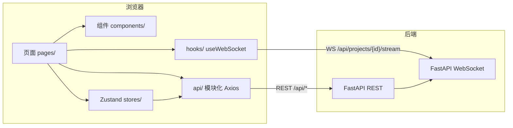

# 前端实施计划 — 自动化安全评估系统

> 阶段交付文档：规划前端（`frontend/`）的完整落地路径，供评审通过后实施。
> 本文档与 `PRD`、`SPEC`、`编码规范`、`API接口文档`、`openapi.yaml` 保持对齐，若与契约存在差异，以 SPEC 与 `docs/openapi.yaml` 为准。

| 项目 | 内容 |
| --- | --- |
| 文档名称 | 自动化安全评估系统前端实施计划 |
| 版本 | v1.0 |
| 日期 | 2026-08-27 |
| 状态 | 待评审 |
| 适用范围 | `frontend/` 目录（Vite + React + TypeScript + MUI + Tailwind CSS） |
| 依赖 | 后端 20 个 REST 接口 + 1 个 WebSocket 接口（已实现） |

---

## 1. 背景与目标

当前仓库已完成后端（FastAPI）与数据库/示例项目/文档部分，但 `frontend/` 目录尚未创建。本次实施目标是补齐缺失的前端，交付一套可运行、可维护、与后端契约严格对齐的完整用户界面，覆盖 PRD §5.1 页面需求与 AC-1 ~ AC-7 验收项。

### 1.1 核心目标

| 目标 | 说明 |
| --- | --- |
| 完整页面覆盖 | 登录、项目列表/创建/详情、实时监控、漏洞、攻击路径、报告、系统配置 |
| 路由与导航 | React Router 6 统一管理，含受保护路由与管理员路由 |
| 后端数据交互 | Axios 统一实例 + 模块化 API + TypeScript 类型对齐 Pydantic schema |
| 实时能力 | WebSocket 订阅 8 种消息，驱动阶段/日志/消息/资源实时刷新 |
| 状态管理 | Zustand 管理 auth / project / ws / config，局部状态用 hooks |
| 表单与错误 | 创建项目、登录、配置更新等表单校验，统一错误提示 |
| 响应式 | 桌面与移动端自适应布局，适配 MUI 断点 |
| 工程质量 | 符合编码规范：Prettier/ESLint/严格 TS，模块化、可维护 |

### 1.2 范围界定

- **在范围内**：`frontend/` 全部工程文件、路由、页面、组件、状态、API 层、类型定义、开发代理配置、构建配置。
- **不在范围内**：后端接口改动、数据库结构改动、Docker 隔离环境改动。若联调发现后端契约不一致，仅回推问题并请求后端修正，不在前端侧 hack。

---

## 2. 依据文档

| 文档 | 用途 |
| --- | --- |
| `docs/PRD-自动化安全评估系统.md` | 页面需求、模块要求、验收标准 AC-1~AC-7 |
| `docs/SPEC-自动化安全评估系统.md` | 技术选型、目录结构、API 设计、数据模型 |
| `docs/API接口文档.md` | 20 个 REST 端点、统一响应封装、8 种 WS 消息、错误码 |
| `docs/openapi.yaml` | 请求/响应字段契约基线 |
| `docs/编码规范.md` | TypeScript/React 前端编码规范、命名、类型安全、状态管理约定 |
| `docs/安全规范.md` | 前端 XSS 防护、token 存储、报告渲染安全 |
| `docs/测试规范.md` | 前端测试与验收要求 |
| `backend/app/**` | 已实现后端真实响应结构（实施时以代码为准二次核对） |

---

## 3. 技术栈与版本

对齐 SPEC §5.1.2，依赖清单如下（实施时以该版本为基线）：

| 类别 | 依赖 | 版本 |
| --- | --- | --- |
| 运行时 | react / react-dom | ^18.3.1 |
| 路由 | react-router-dom | ^6.28.0 |
| UI | @mui/material | ^6.2.0 |
| UI | @emotion/react / @emotion/styled | ^11.13.5 |
| 图标 | @mui/icons-material | ^6.2.0 |
| HTTP | axios | ^1.7.9 |
| 状态 | zustand | ^5.0.2 |
| 渲染 | react-markdown | ^9.0.1 |
| 渲染 | rehype-sanitize | ^6.0.0 |
| 构建 | vite | ^5.4.11 |
| 构建 | @vitejs/plugin-react | ^4.3.4 |
| 语言 | typescript | ^5.7.2 |
| 样式 | tailwindcss / postcss / autoprefixer | ^3.4.17 / ^8.4.49 / ^10.4.20 |
| 质量 | eslint + @typescript-eslint + eslint-plugin-react-hooks + prettier | 最新稳定版 |

> 说明：报告预览以 `react-markdown` + `rehype-sanitize` 渲染权威 Markdown（评审已确认），同时保留后端 `report_html` 的 sandboxed iframe 预览与下载能力；资源图表采用**自绘 SVG**（SPEC 要求“自绘资源图表”），不引入图表库。

---

## 4. 总体架构与数据流



- 页面组件只负责编排与交互，不直接散落请求逻辑；异步动作收敛到 store action 或 API 模块。
- 所有 REST 请求经 `api/client.ts` 统一实例：自动注入 token、解包 `{code, message, data}`、统一错误处理。
- WebSocket 连接生命周期由 `useWebSocket` 集中管理，消息按 `type` 分发到 store 与页面回调。

---

## 5. 目录结构规划

```text
frontend/
├── index.html
├── package.json
├── vite.config.ts              # dev proxy /api -> http://localhost:8000
├── tsconfig.json
├── tsconfig.node.json
├── tailwind.config.ts
├── postcss.config.js
├── .eslintrc.cjs
├── .prettierrc.json
├── .env.example                # VITE_API_BASE_URL=/api
└── src/
    ├── main.tsx                # 挂载 React + ThemeProvider + RouterProvider
    ├── App.tsx                 # 路由表 + 全局 Provider 组合
    ├── vite-env.d.ts
    ├── theme/
    │   └── index.ts            # MUI 主题 + 与 Tailwind 的映射
    ├── types/
    │   ├── api.ts              # ApiResponse / Paginated
    │   ├── enums.ts            # 所有枚举联合类型（as const）
    │   ├── auth.ts
    │   ├── project.ts
    │   ├── stage.ts
    │   ├── worker.ts
    │   ├── vulnerability.ts
    │   ├── attackPath.ts
    │   ├── report.ts
    │   ├── log.ts
    │   ├── resource.ts
    │   ├── config.ts
    │   └── ws.ts               # 8 种 WS 消息类型
    ├── api/
    │   ├── client.ts           # Axios 实例 + 拦截器
    │   ├── auth.ts
    │   ├── projects.ts
    │   ├── results.ts
    │   └── system.ts
    ├── store/
    │   ├── authStore.ts
    │   ├── projectStore.ts
    │   ├── wsStore.ts
    │   └── configStore.ts
    ├── hooks/
    │   ├── useWebSocket.ts
    │   └── usePolling.ts       # 详情兜底刷新
    ├── components/
    │   ├── layout/
    │   │   ├── AppLayout.tsx   # 响应式侧栏 + 顶栏
    │   │   └── ProtectedRoute.tsx
    │   ├── common/
    │   │   ├── StatusTag.tsx
    │   │   ├── RiskTag.tsx
    │   │   ├── EmptyState.tsx
    │   │   ├── LoadingState.tsx
    │   │   ├── ErrorAlert.tsx
    │   │   ├── ConfirmDialog.tsx
    │   │   └── PageHeader.tsx
    │   ├── project/
    │   │   ├── ProjectStatusBadge.tsx
    │   │   └── ProjectTable.tsx
    │   ├── monitor/
    │   │   ├── StageStepper.tsx
    │   │   ├── WorkerStatusList.tsx
    │   │   ├── ChatMessageList.tsx
    │   │   ├── LogStream.tsx
    │   │   └── ResourceChart.tsx
    │   └── report/
    │       └── ReportViewer.tsx
    └── pages/
        ├── Login.tsx
        ├── ProjectList.tsx
        ├── ProjectCreate.tsx
        ├── ProjectDetail.tsx    # 含标签页布局
        ├── Monitor.tsx
        ├── VulnerabilityList.tsx
        ├── VulnerabilityDetail.tsx
        ├── AttackPathList.tsx
        ├── AttackPathDetail.tsx
        ├── Report.tsx
        └── SystemConfig.tsx
```

---

## 6. 路由与页面规划

### 6.1 路由表

| 路径 | 页面 | 鉴权 | 说明 |
| --- | --- | --- | --- |
| `/login` | Login | 公开 | 登录；已登录则跳转 `/projects` |
| `/` | 重定向 | - | 跳转 `/projects` |
| `/projects` | ProjectList | Bearer | 项目列表、分页、状态筛选、启动/停止/删除入口 |
| `/projects/new` | ProjectCreate | Bearer | 创建项目 |
| `/projects/:projectId` | ProjectDetail | Bearer | 详情布局，含概览/监控/漏洞/路径/报告标签 |
| `/projects/:projectId/monitor` | Monitor | Bearer | 实时监控（阶段、角色、消息、日志、资源） |
| `/projects/:projectId/vulnerabilities` | VulnerabilityList | Bearer | 漏洞列表与筛选 |
| `/projects/:projectId/vulnerabilities/:vulnId` | VulnerabilityDetail | Bearer | 漏洞详情 |
| `/projects/:projectId/attack-paths` | AttackPathList | Bearer | 攻击路径列表 |
| `/projects/:projectId/attack-paths/:pathId` | AttackPathDetail | Bearer | 攻击路径详情 |
| `/projects/:projectId/report` | Report | Bearer | 报告预览与下载 |
| `/system/config` | SystemConfig | Bearer + admin | 系统配置读取与更新 |
| `*` | 404 | - | 统一未匹配页（重定向 `/projects` 或友好提示） |

### 6.2 路由实现要点

- 使用 `createBrowserRouter` + `RouterProvider`。
- `ProtectedRoute`：无 `access_token` 时重定向 `/login`，登录后回跳原地址（`state.from`）。
- `AdminRoute`：`role !== 'admin'` 时展示权限不足提示或跳转 `/projects`（对齐错误码 1003）。
- 项目详情页用 `<Outlet/>` 承载子路由，监控/漏洞/路径/报告作为标签导航，避免重复加载项目头信息。

---

## 7. 组件结构规划

### 7.1 布局组件

| 组件 | 职责 |
| --- | --- |
| `AppLayout` | 全局侧栏（桌面）＋抽屉（移动）＋顶栏＋内容区；根据 `useMediaQuery` 切换；登出按钮 |
| `ProtectedRoute` / `AdminRoute` | 鉴权与角色守卫 |

### 7.2 通用组件

| 组件 | 职责 |
| --- | --- |
| `StatusTag` | 统一渲染 `project_status / stage_status / verify_status / task_status`，颜色与文案映射 |
| `RiskTag` | 风险等级 `critical/high/medium/low` 颜色标签 |
| `EmptyState` / `LoadingState` / `ErrorAlert` | 空态、加载、错误提示 |
| `ConfirmDialog` | 启动/停止/删除等破坏性操作的二次确认 |
| `PageHeader` | 页面标题、面包屑、操作按钮 |

### 7.3 业务组件

| 组件 | 职责 |
| --- | --- |
| `ProjectStatusBadge` | 项目状态徽标（含阶段推进提示） |
| `ProjectTable` | 项目列表表格（桌面）＋卡片列表（移动） |
| `StageStepper` | 5 阶段（environment_scan/code_analysis/vulnerability_verify/report_generate/done）步骤展示 |
| `WorkerStatusList` | 6 类角色任务状态 |
| `ChatMessageList` | 角色消息流，按 `message_type` 着色 |
| `LogStream` | 日志滚动，按 `log_level` 着色，自动滚动到底 |
| `ResourceChart` | CPU/内存/Token 折线/面积图（自绘 SVG） |
| `ReportViewer` | Markdown 安全渲染（react-markdown + rehype-sanitize）、HTML 沙箱预览、下载 |

---

## 8. 状态管理规划

采用 Zustand，拆分为 4 个 store，单一职责：

### 8.1 authStore

```ts
interface AuthState {
  accessToken: string | null;
  user: User | null;
  isInitialized: boolean;
  initAuth: () => void;       // 从 localStorage 恢复
  login: (username: string, password: string) => Promise<void>;
  logout: () => void;
}
```

- token 与 `user` 持久化到 `localStorage`（键名如 `cse_token` / `cse_user`）。
- `logout` 清理持久化数据并跳转登录页。

### 8.2 projectStore

```ts
interface ProjectState {
  list: ProjectListItem[];
  total: number;
  listStatus: AsyncStatus;
  detail: ProjectDetail | null;
  detailStatus: AsyncStatus;
  fetchList: (params?: ProjectListParams) => Promise<void>;
  fetchDetail: (projectId: number) => Promise<void>;
  resetDetail: () => void;
}
```

### 8.3 wsStore

```ts
interface WsState {
  status: 'idle' | 'connecting' | 'open' | 'closed';
  lastMessage: WsMessage | null;
  messages: WsMessage[];       // 最多保留 N 条，环形/截断
  connect: (projectId: number) => void;
  disconnect: () => void;
  handleMessage: (raw: string) => void;
}
```

- 收到消息后按 `type` 更新项目状态/阶段/角色/消息/日志/资源/漏洞/报告，页面订阅细粒度 selector。

### 8.4 configStore

```ts
interface ConfigState {
  config: SystemConfig | null;
  status: AsyncStatus;
  fetchConfig: () => Promise<void>;
  updateConfig: (updates: ConfigUpdates) => Promise<void>;
}
```

> 所有 store action 内处理 loading/error，页面不散落请求逻辑；订阅使用细粒度 selector 避免多余渲染。

---

## 9. API 层设计

### 9.1 统一实例 `client.ts`

- `baseURL` 取自 `import.meta.env.VITE_API_BASE_URL ?? '/api'`。
- 请求拦截器：有 token 时注入 `Authorization: Bearer <token>`。
- 响应拦截器：
  - 成功：直接返回 `data`（即后端 `{code,message,data}` 中的 `data`）。
  - 业务失败（HTTP 200 但 `code !== 0`）：抛出携带 `code/message` 的错误。
  - HTTP 401 或业务码 1002：清理 token，跳转 `/login`。
  - HTTP 403 或业务码 1003：提示权限不足。
  - 其余错误：统一 `message` 供页面/表单展示。
- 统一类型：

```ts
export interface ApiResponse<T> {
  code: number;
  message: string;
  data: T;
}
export interface Paginated<T> {
  list: T[];
  total: number;
}
```

### 9.2 模块封装

| 模块 | 方法 | 对应端点 |
| --- | --- | --- |
| `auth.ts` | `initSystem`、`login` | POST /api/system/init、/login |
| `projects.ts` | `createProject`、`listProjects`、`getProject`、`startProject`、`stopProject`、`deleteProject` | POST/GET /api/projects、GET/DELETE /api/projects/{id}、start/stop |
| `results.ts` | `getStages`、`getWorkers`、`listVulnerabilities`、`getVulnerability`、`listAttackPaths`、`getAttackPath`、`getReport`、`downloadReport`、`listLogs`、`listResources` | /api/projects/{id}/* |
| `system.ts` | `getConfig`、`updateConfig` | GET/PUT /api/system/config |

- `downloadReport` 使用 `responseType: 'blob'`，手动解析 `Content-Disposition` 文件名并触发浏览器下载。

---

## 10. WebSocket 实时集成

### 10.1 连接地址与鉴权

```ts
const proto = location.protocol === 'https:' ? 'wss' : 'ws';
const url = `${proto}://${location.host}/api/projects/${projectId}/stream?token=${token}`;
```

- 开发态由 Vite 代理 `/api` 到后端，WebSocket 同源代理转发。
- 建立连接后发送心跳 `ping`，接收 `pong`；断线时指数退避重连，页面卸载时关闭。

### 10.2 8 种消息分发

| type | data 字段 | 前端处理 |
| --- | --- | --- |
| `project_status` | `project_status` | 更新项目详情状态 |
| `stage_status` | `stage_name`、`stage_status` | 刷新阶段列表 |
| `worker_status` | `worker_task_id`、`worker_role`、`task_status` | 刷新角色任务列表 |
| `chat_message` | `worker_role`、`message_type`、`message_text` | 追加消息流 |
| `runtime_log` | `log_level`、`log_content` | 追加日志滚动 |
| `resource_usage` | `cpu_usage`、`memory_usage`、`token_count` | 追加资源点，重绘图表 |
| `vulnerability_found` | `vuln_id`、`vuln_title`、`risk_level` | 提示并刷新漏洞列表 |
| `report_ready` | `report_id` | 提示报告就绪，刷新报告页 |

> WS 作为实时增量来源；页面首屏仍通过 REST 拉取全量/历史数据，保证刷新后数据完整。

---

## 11. 表单处理与校验

| 表单 | 字段 | 校验 |
| --- | --- | --- |
| 登录 | username / password | 非空；密码长度 8~64（登录态宽松，按后端 schema 至少 1 字符，但初始化页强校验） |
| 系统初始化 | username / password / confirm | 密码 8~64 且含大写/小写/数字/特殊字符至少三类；两次一致 |
| 创建项目 | project_name / source_type / source_path / task_content | 名称 1~128；`local_path` 须绝对路径；`git_repo` 须 `https://…\.git`；任务说明 ≤4096 |
| 系统配置 | isolation / task / retention 分组 | 镜像非空；超时/并发/保留天数为正整数；只读挂载/网络模式使用受控控件 |

- 使用 MUI `TextField` + `react-hook-form` 或受控组件 + 自写校验（实施时统一一种，避免混用）。
- 后端返回的 `1001` 校验错误（`message`）回填到对应字段提示。
- 提交时按钮进入 loading 态并禁用，防止重复提交。

---

## 12. 错误提示与统一处理

- 页面级错误用 `ErrorAlert` 展示，表单错误用 `FormHelperText`/`Snackbar`。
- 全局 `SnackbarProvider`（或 MUI `Snackbar`）统一展示 toast，避免各页面重复实现。
- 错误码映射：

| code | 含义 | 前端行为 |
| --- | --- | --- |
| 0 | 成功 | 正常返回 |
| 1001 | 参数校验失败 | 表单回填/提示 |
| 1002 | 未认证/登录失效 | 清理 token，跳登录 |
| 1003 | 权限不足 | 提示无权限 |
| 1004 | 系统已初始化 | 登录/初始化页提示 |
| 2001 | 资源不存在 | 404/空态提示 |
| 2002 | 状态冲突 | 提示当前状态不允许操作 |
| 3001 | 隔离环境异常 | 提示环境异常 |
| 5000 | 内部错误 | 通用错误提示 |

---

## 13. 响应式适配方案

- 断点遵循 MUI：`xs(<600)` / `sm(≥600)` / `md(≥900)` / `lg(≥1200)`。
- **桌面（md+）**：侧栏常驻，表格布局，详情页左侧导航＋右侧内容。
- **移动（<md）**：侧栏折叠为临时抽屉；表格降级为卡片/列表；详情标签改为底部或下拉；图表纵向堆叠；操作按钮收进更多菜单。
- 使用 MUI `Grid`/`Stack`/`Box` + `useMediaQuery`/`useTheme` 实现，关键布局不依赖固定像素宽度。
- 图表 SVG 使用 `viewBox` 自适应宽度；长文本（报告、日志、代码）允许横向滚动并 `word-break` 处理。

---

## 14. 主题与样式

- 在 `theme/index.ts` 定义 MUI 主题：主色、状态色、字体、间距、圆角，与系统“安全评估”语义匹配。
- Tailwind 仅用于原子化布局辅助（如间距、flex、文本截断），组件视觉主要用 MUI 组件，避免两套样式系统冲突；Tailwind `preflight` 关闭或与 MUI 基线协调。
- 状态颜色与标签组件映射：风险等级、项目状态、阶段状态、验证状态、消息/日志级别统一配色表。

---

## 15. 类型与枚举对齐

`types/enums.ts` 使用 `as const` + 联合类型，值严格等于后端/数据库枚举：

```ts
export const PROJECT_STATUSES = ['created', 'running', 'completed', 'failed', 'stopped'] as const;
export type ProjectStatus = (typeof PROJECT_STATUSES)[number];

export const RISK_LEVELS = ['critical', 'high', 'medium', 'low'] as const;
export type RiskLevel = (typeof RISK_LEVELS)[number];
// 其余：stage_name / stage_status / worker_role / task_status / verify_status / log_level / message_type / source_type
```

- 所有接口类型与后端 `schemas/` 字段一一对应（camelCase 与 snake_case 对应关系见编码规范 §7）。
- `tsconfig.json` 开启 `strict: true`、`noImplicitAny: true`；禁止 `any`、禁止非空断言 `!`。

---

## 16. 分阶段实施步骤

| 里程碑 | 内容 | 产出 | 验收要点 |
| --- | --- | --- | --- |
| M1 工程初始化 | 创建 `frontend/` 脚手架、配置文件、主题、类型、枚举、Axios client | 可 `npm run dev` 启动、`tsc --noEmit` 通过 | ✅ 完成：typecheck/lint/format/build 全通过 |
| M2 认证与布局 | authStore、登录/初始化页、AppLayout、ProtectedRoute/AdminRoute | 登录可跳转、登出可用、布局响应式 | ✅ 完成 |
| M3 项目模块 | 项目列表/创建/详情、启动/停止/删除、分页与状态筛选 | 项目 CRUD 闭环 | ✅ 完成：联调创建/列表/详情/启动/阶段/删除全通过 |
| M4 结果查询 | 阶段、角色、漏洞、攻击路径、报告、日志、资源各页面与 API | 结果查询页完整 | AC-5 |
| M5 实时监控 | useWebSocket、wsStore、监控页（阶段/角色/消息/日志/资源图表） | WS 实时刷新可用 | AC-3、AC-4 |
| M6 配置与权限 | 系统配置页、管理员守卫、表单校验与统一错误 | 配置读写可用 | AC-6 |
| M7 联调与质量 | 端到端联调、响应式打磨、ESLint/Prettier/tsc、README 补充 | 全链路验收通过 | AC-1~AC-7 |

实施顺序遵循依赖关系：M1 → M2 → M3 → M4 → M5 → M6 → M7；M5 可并行于 M3/M4 的数据查询开发。

---

## 17. 验收标准（对齐 PRD）

| 编号 | 验收项 | 前端对应验证 |
| --- | --- | --- |
| AC-1 | 初始化系统并登录 | 登录/初始化页可调用接口、token 持久化、登出 |
| AC-2 | 创建项目并接入源码 | 项目创建页表单校验与提交成功 |
| AC-3 | 启动评估并看到阶段变化 | 启动后阶段步骤实时更新 |
| AC-4 | 监控页看到日志/角色/消息/资源 | 监控页 WebSocket 实时刷新 |
| AC-5 | 生成漏洞/攻击路径/报告 | 漏洞/路径/报告页数据渲染与下载 |
| AC-6 | 停止任务、删除项目 | 停止/删除操作与状态刷新、二次确认 |
| AC-7 | 示例项目完整演示 | 前端与 `scripts/demo.py` 后端链路兼容，完整闭环 |

---

## 18. 编码规范与自查

- 遵循 `docs/编码规范.md` §2.2、§3.3、§6：2 空格缩进、单引号、分号、尾随逗号、`XxxProps` 接口、具名导出、严格 TS、JSDoc。
- 提交前通过：`prettier --check`、`eslint`、`tsc --noEmit`；无 `any`、无 `!`、无 `console.log`。
- 组件卸载清理定时器/WS 连接/未完成请求；WS 断线重连不泄漏。
- 前端安全：token 仅存 localStorage（本项目无状态 JWT，属既有决策）；报告 HTML 用 sandboxed iframe 渲染，禁用脚本；不信任用户输入直接拼接 HTML。

---

## 19. 风险与注意事项

| 风险 | 影响 | 应对 |
| --- | --- | --- |
| 报告渲染 XSS | 安全风险 | `react-markdown` + `rehype-sanitize` 渲染 Markdown；HTML 仅在 sandboxed iframe 中预览，禁止脚本 |
| WebSocket 断线 | 实时中断 | 心跳 + 指数退避重连 + 断线状态提示 + REST 兜底 |
| 本地路径校验差异 | 创建失败 | 前端校验与后端 `os.path.isabs` / Git URL 规则一致，展示后端 1001 信息 |
| 移动端表格溢出 | 可用性 | 桌面表格/移动卡片降级，关键列优先展示 |
| 配置类型转换 | 提交报错 | 表单按 `int/bool/string` 严格提交，`mount_readonly` 用 switch，`network_mode` 用下拉 |
| 依赖版本漂移 | 构建不稳定 | 锁定 SPEC §5.1.2 基线，`package-lock.json` 提交 |

---

## 20. 交付物清单

1. `frontend/` 完整源码（页面、组件、store、hooks、api、types、theme、配置）。
2. `frontend/package.json`、`vite.config.ts`、`tsconfig.json`、`tailwind.config.ts`、`.prettierrc.json`、`.eslintrc.cjs`、`.env.example`。
3. 更新仓库根 `README.md` 补充前端启动与联调说明。
4. 本实施计划文档（`docs/前端实施计划.md`）。

---

## 21. 待确认事项

1. ~~报告预览默认方案~~ **已确认（评审）**：新增 `react-markdown` + `rehype-sanitize` 渲染报告，HTML 沙箱预览保留。
2. 漏洞/攻击路径详情：计划作为独立子路由页面实现（同时可支持弹窗），是否接受？
3. 表单方案：计划统一使用受控组件 + 自写校验（不强制引入 `react-hook-form`），是否接受？若偏好 `react-hook-form`，实施时引入并更新本计划。

> 上述问题若评审无异议，将按本文档默认方案实施；如有调整，以评审结论为准回填本文档。
