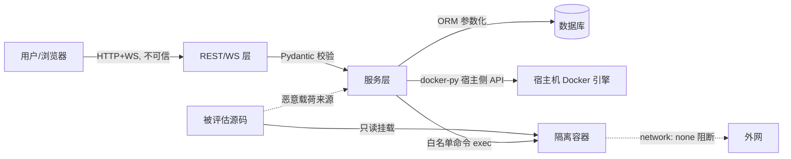

# 安全规范-自动化安全评估系统

> 安全规范文档（Security Specification）
>
> 本文档为《PRD-自动化安全评估系统》与《SPEC-自动化安全评估系统》的安全实现规范，定义输入验证、认证授权、数据保护三大安全域的可落地措施。所有措施均与已定架构（FastAPI + SQLAlchemy 2.0 + Pydantic v2 + JWT + bcrypt + Docker 隔离 + React 18）严格对齐。

| 项目 | 内容 |
| --- | --- |
| 文档名称 | 自动化安全评估系统 安全规范 |
| 版本 | v1.0 |
| 日期 | 2026-08-25 |
| 作者 | 高见远（架构师） |
| 依据 | SPEC-自动化安全评估系统 v1.0 |
| 适用范围 | 后端（FastAPI）、前端（React）、隔离环境（Docker）、数据层 |
| 状态 | 可评审（Ready for Review） |

---

## 目录

1. [安全设计原则与威胁模型](#1-安全设计原则与威胁模型)
2. [输入验证](#2-输入验证)
3. [认证授权](#3-认证授权)
4. [数据保护](#4-数据保护)
5. [隔离环境安全](#5-隔离环境安全)
6. [安全基线清单（Security Baseline Checklist）](#6-安全基线清单security-baseline-checklist)

---

## 1. 安全设计原则与威胁模型

### 1.1 设计原则

| 原则 | 说明 | 落地锚点 |
| --- | --- | --- |
| 纵深防御（Defense in Depth） | 不依赖单一防线，输入验证 + 隔离环境 + 最小权限多层叠加 | §2 输入验证 + §5 隔离环境 |
| 最小权限（Least Privilege） | 进程/用户/容器仅授予完成任务所需最小权限 | §3.5 RBAC + §5.3 容器权限 |
| 默认拒绝（Deny by Default） | 命令白名单、路径白名单、接口鉴权均采用白名单语义 | §2.3 命令白名单 + §2.4 路径校验 |
| 永不信任输入（Never Trust Input） | 所有外部输入（用户、文件、源码内容、报告）均视为不可信 | §2 全章 |
| 安全默认值（Secure by Default） | 敏感配置默认关闭，须显式开启 | §4.3 密钥管理 + §5 隔离默认项 |

### 1.2 威胁模型（本系统特有）

本系统自身即为「安全评估工具」，会**在隔离容器内执行源码分析命令**，因此威胁面同时来自两类方向：

| 威胁方向 | 攻击者 | 典型攻击 | 对应防御 |
| --- | --- | --- | --- |
| 外部攻击 | 未授权/已授权用户 | SQL 注入、XSS、越权（IDOR）、JWT 伪造、口令爆破 | §2 + §3 |
| 隔离逃逸/命令注入 | 被评估的**恶意源码**或恶意 `source_path` | 命令注入、容器逃逸、路径穿越、出网外带、资源耗尽 | §2.3 + §2.4 + §5 |
| 数据泄露 | 内外部 | 密钥泄露、日志泄露、报告未脱敏、未加密传输 | §4 |

> **关键结论**：输入验证（§2）与隔离环境（§5）必须**同时成立**——即使输入验证被绕过，隔离环境的只读挂载、网络隔离与命令白名单仍是最后一道不可逾越的防线；反之，即使容器被攻破，输入验证也能阻止攻击者将恶意载荷注入宿主机（docker-py 宿主侧 API、数据库、文件系统）。

### 1.3 信任边界图



---

## 2. 输入验证

> 目标：对所有外部输入严格校验、过滤与转义。Pydantic v2 作为**第一道防线**（类型 + 长度 + 枚举 + 正则），业务层做**语义校验**（路径、范围、状态机），隔离层做**白名单过滤**（命令、参数）。

### 2.1 分层校验模型

| 层 | 校验内容 | 实现位置 | 失败处理 |
| --- | --- | --- | --- |
| L1 协议层 | HTTP 头、Content-Type、请求体大小 | ASGI 中间件 | 400 / 413 |
| L2 结构层 | 类型、必填、长度、枚举、格式 | Pydantic v2 schema | 422 → 统一 1001 |
| L3 语义层 | 路径合法性、资源归属、状态机前置 | Service 层 | 400/403/404/409 |
| L4 隔离层 | 命令白名单、参数白名单 | utils/命令白名单模块 | 拒绝执行并告警 |

### 2.2 Pydantic v2 作为第一道防线

#### 2.2.1 全局配置

```python
# app/schemas/__init__.py 约定
from pydantic import BaseModel, ConfigDict, Field, field_validator

class StrictModel(BaseModel):
    """所有请求模型统一继承，禁止多余字段 + 禁止隐式类型强转"""
    model_config = ConfigDict(
        extra="forbid",          # 拒绝未知字段，防参数投毒
        str_strip_whitespace=True,  # 字符串去首尾空白
        str_max_length=512,      # 全局字符串长度上限兜底
        validate_assignment=True,
    )
```

#### 2.2.2 项目创建入参校验（正例）

```python
# app/schemas/project.py
import re
from pydantic import Field, field_validator

GIT_URL_RE = re.compile(r"^https://[^\s]+\.git$")  # 仅允许 HTTPS，禁止 ssh:// file:// git://

class ProjectCreate(StrictModel):
    project_name: str = Field(min_length=1, max_length=128)
    source_type: Literal["local_path", "git_repo"]
    source_path: str = Field(min_length=1, max_length=512)
    task_content: str | None = Field(default=None, max_length=4096)

    @field_validator("project_name")
    @classmethod
    def _no_control_chars(cls, v: str) -> str:
        if any(ord(c) < 32 for c in v):   # 禁止控制字符（含 \n \r \t \0）
            raise ValueError("project_name 含非法控制字符")
        return v

    @field_validator("source_path")
    @classmethod
    def _validate_source(cls, v: str, info) -> str:
        st = info.data.get("source_type")
        if st == "git_repo" and not GIT_URL_RE.match(v):
            raise ValueError("git_repo 必须为 https:// 开头的 .git 地址")
        if st == "local_path" and not v.startswith("/"):
            raise ValueError("local_path 必须为绝对路径")
        return v
```

**反例（禁止）**：

```python
# ❌ 禁止：不做校验，直接透传到 docker-py / os 调用
source_path = request.json().get("source_path")
docker_client.containers.run(..., volumes={source_path: {"bind": "/src", "mode": "ro"}})
```

### 2.3 SQL 注入防护

| 规则 | 措施 |
| --- | --- |
| 强制 ORM | 所有读写走 SQLAlchemy 2.0 `select()` / `session`，禁止裸 SQL |
| 参数化 | 若确需原生 SQL，必须用 `text("...")` + 绑定参数，禁止 `%`/`f-string` 拼接 |
| 排序/分页 | `order_by`、`page`、`page_size` 等动态字段走**列名白名单映射**，不直接拼字段名 |
| 权限过滤 | 列表查询在 ORM 层强制追加 `created_by == current_user.id`（普通用户）过滤条件 |

**正例**：

```python
# app/services/project_service.py
from sqlalchemy import select

def list_projects(db, user, page, page_size, status):
    stmt = select(Project).where(Project.created_by == user.id)  # 参数化 + 越权兜底
    if status:
        stmt = stmt.where(Project.project_status == status)       # 绑定参数，非拼接
    stmt = stmt.order_by(Project.id.desc()).offset((page - 1) * page_size).limit(page_size)
    return db.execute(stmt).scalars().all()
```

**反例（禁止）**：

```python
# ❌ 禁止：字符串拼接 SQL
db.execute(text(f"SELECT * FROM projects WHERE project_name = '{name}'"))
```

**排序字段白名单**（防止 `ORDER BY` 注入）：

```python
SORTABLE_COLUMNS = {"id": Project.id, "created_at": Project.created_at,
                    "project_status": Project.project_status}
col = SORTABLE_COLUMNS.get(sort_by, Project.id)   # 未知字段回退默认列
```

### 2.4 XSS 防护与报告 HTML 净化

| 场景 | 措施 |
| --- | --- |
| React 渲染 | 默认 JSX 转义，**禁止** `dangerouslySetInnerHTML` 渲染任何外部/源码/报告内容 |
| 报告 HTML | 后端生成 HTML 前用净化库处理；Markdown 为权威，HTML 仅派生 |
| CSP | 生产环境部署响应头 CSP，限制脚本来源 |

#### 2.4.1 后端报告 HTML 净化

> 报告内容可能包含被评估源码片段与 LLM 生成文本，二者均不可信。HTML 派生时须净化。依赖选型：**`nh3`**（Rust 实现，比 `bleach` 更安全且维护活跃；`bleach` 已弃用，不建议新增）。

```python
# app/services/report_service.py
import nh3

ALLOWED_TAGS = {"h1","h2","h3","h4","p","ul","ol","li","code","pre","blockquote",
                "table","thead","tbody","tr","th","td","strong","em","a","hr","br","span"}
ALLOWED_ATTRS = {"a": {"href", "title"}, "code": {"class"}, "span": {"class"}}

def markdown_to_html(md_text: str) -> str:
    raw_html = markdown.markdown(md_text, extensions=["fenced_code", "tables"])
    return nh3.clean(
        raw_html,
        tags=ALLOWED_TAGS,
        attributes=ALLOWED_ATTRS,
        url_schemes={"http", "https", "mailto"},   # 禁止 javascript: data:
        link_rel="noopener noreferrer",
    )
```

#### 2.4.2 前端防 XSS（反例/正例）

```tsx
// ❌ 禁止：直接注入 HTML（报告/源码/日志内容绝不可这么渲染）
<div dangerouslySetInnerHTML={{ __html: reportHtml }} />

// ✅ 正例：报告 HTML 经后端 nh3 净化后，前端也保持默认转义展示 Markdown 文本
<div>{reportMarkdown}</div>
```

#### 2.4.3 CSP 响应头（生产）

```text
Content-Security-Policy: default-src 'self';
  script-src 'self';
  style-src 'self' 'unsafe-inline';
  img-src 'self' data:;
  connect-src 'self' ws: wss:;
  object-src 'none'; base-uri 'self'; frame-ancestors 'none'
```

### 2.5 命令注入防护（隔离环境命令执行）

> 核心原则：**命令白名单 + 参数校验 + 参数数组执行**，禁止 shell 字符串拼接。

#### 2.5.1 命令白名单

对齐 SPEC §1.3 Q-5 决策，内置**只读命令白名单**：

| 命令 | 允许参数约束 | 说明 |
| --- | --- | --- |
| `grep` | `-r -n -i -E -l` 等只读选项，禁止 `-o` 写文件 | 关键字搜索 |
| `find` | `-type -name -maxdepth` 等 | 目录遍历 |
| `cat` / `head` / `tail` | 仅接受已解析的绝对路径，`-n` 限定行数 | 文件读取 |
| `sed` | 仅 `sed -n 'Np'` 形式，禁止 `-i` 原地写 | 定位行 |
| `ls` | `-l -a -R` | 列目录 |
| `file` / `stat` | 单文件路径 | 元信息 |

**严格禁止**：`sh/bash/zsh`、管道 `|`、重定向 `>`/`>>`、命令替换 `` ` `` / `$()`、分号/`&&`/`||` 链接、任何具备写权限或网络能力的命令（`curl/wget/nc/ssh/git clone` 等）。

#### 2.5.2 安全命令执行实现（正例）

```python
# app/utils/command_whitelist.py
from dataclasses import dataclass

@dataclass(frozen=True)
class CommandSpec:
    argv0: str                      # 绝对路径可执行文件
    allowed_flags: frozenset[str]   # 允许的选项集合
    allow_path_arg: bool            # 是否允许路径参数（须先经路径校验）

COMMAND_WHITELIST: dict[str, CommandSpec] = {
    "grep": CommandSpec("/usr/bin/grep", frozenset({"-r","-n","-i","-E","-l","-c"}), True),
    "find": CommandSpec("/usr/bin/find", frozenset({"-type","-name","-maxdepth","-print"}), True),
    "cat":  CommandSpec("/usr/bin/cat",  frozenset({"-n"}), True),
    "head": CommandSpec("/usr/bin/head", frozenset({"-n"}), True),
    "tail": CommandSpec("/usr/bin/tail", frozenset({"-n"}), True),
    "sed":  CommandSpec("/usr/bin/sed",  frozenset({"-n"}), True),
    "ls":   CommandSpec("/usr/bin/ls",   frozenset({"-l","-a","-R"}), True),
}

def build_command(name: str, flags: list[str], target: str) -> list[str]:
    spec = COMMAND_WHITELIST.get(name)
    if spec is None:
        raise SecurityError(f"命令不在白名单: {name}")
    for f in flags:
        if f not in spec.allowed_flags:
            raise SecurityError(f"非法选项: {name} {f}")
    validate_container_path(target)          # §2.6 路径校验，防路径穿越
    return [spec.argv0, *flags, target]      # 参数数组，非 shell 字符串
```

```python
# app/services/worker_service.py —— 通过 docker exec 参数数组执行
argv = build_command("grep", ["-r", "-n", "-i"], "/src/")
container.exec_run(argv, demux=False)     # ❌ 绝不 shell=True / 拼接字符串
```

**反例（禁止）**：

```python
# ❌ 禁止：拼接 shell 字符串（即使变量来自数据库/源码，也可能被注入）
cmd = f"grep -rn '{keyword}' {path}"        # keyword 含 ' 即注入
container.exec_run(f"sh -c '{cmd}'")        # 绝对禁止 sh -c

# ❌ 禁止：直接使用宿主机 os/subprocess 执行
subprocess.run(cmd, shell=True)
```

#### 2.5.3 关键字参数化防护

关键字搜索若需将用户/规则关键字传入命令，关键字必须经过**正则元字符转义**（作为字面量匹配），并**禁止**进入 shell：

```python
import re
def escape_literal(pattern: str) -> str:
    return re.escape(pattern)   # 将 . * + ? [ ] 等转义为字面量
# 仅允许以「参数数组 + 文件/标准输入」方式传关键字，禁止以 -e 注入正则
```

### 2.6 文件路径校验与防路径穿越

> `source_path`、报告导出路径、容器内命令路径均须校验。

| 规则 | 措施 |
| --- | --- |
| 绝对路径 | `local_path` 必须绝对路径（`/` 开头），拒绝相对路径 |
| 规范化比对 | `os.path.realpath` 规范化后，必须落在**允许的 workspace 根**内 |
| 穿越检测 | 规范化路径不得含 `..` 穿越出根目录 |
| 符号链接 | 挂载到容器的源码解析后校验，禁止 symlink 指向 workspace 外 |

```python
# app/utils/path_safety.py
import os
from pathlib import Path

WORKSPACE_ROOT = Path("/data/code-sec-evaluator/workspace")   # 宿主机源码根，可配

def validate_host_path(p: str) -> Path:
    if not os.path.isabs(p):
        raise SecurityError("local_path 必须为绝对路径")
    real = Path(os.path.realpath(p))              # 解析符号链接
    root = Path(os.path.realpath(WORKSPACE_ROOT))
    if not real.is_relative_to(root):             # 必须在 workspace 根内
        raise SecurityError("路径越界: 不允许访问 workspace 之外的路径")
    return real

def validate_container_path(p: str) -> str:
    # 容器内路径仅允许 /src/ 只读挂载点下，且规范化后不得穿越
    norm = os.path.normpath(p)
    if norm != "/src" and not norm.startswith("/src/"):
        raise SecurityError("容器内路径必须位于 /src/ 下")
    if ".." in Path(norm).parts:
        raise SecurityError("检测到路径穿越")
    return norm
```

**反例（禁止）**：

```python
# ❌ 禁止：直接 os.path.join 未经验证的用户输入
open(os.path.join(WORKSPACE_ROOT, user_input))   # user_input = "../../etc/passwd"
```

### 2.7 文件上传（预留）与源码仓库克隆

本系统 P0 无用户文件上传（源码通过 `local_path` 或 `git_repo` 提供），但保留以下约束以防 P2 扩展：

| 项 | 措施 |
| --- | --- |
| 上传（P2 预留） | 校验 Content-Type、文件大小上限、扩展名白名单、落盘重命名（服务端生成 UUID 文件名），禁止保留原始文件名 |
| `git_repo` 克隆 | 仅允许 `https://`，禁用 `file://`、`ssh://`、`git://`、`--upload-pack` 等可触发任意命令执行的协议/参数；克隆目标目录由服务端生成，禁止用户指定 |

---

## 3. 认证授权

### 3.1 认证方案总览（对齐 SPEC §1.2.4）

| 项 | 决策 | 说明 |
| --- | --- | --- |
| 认证方式 | JWT 无状态令牌 | `Authorization: Bearer <token>` |
| 签名算法 | HS256（单实例）| P2 多实例建议升级 RS256 或统一密钥管理 |
| 有效期 | 默认 24h，经 `system_config` 可调 | 到期强制重新登录 |
| 刷新机制 | P2 增加 refresh token（短期 access + 长期 refresh 分离） | 见 §3.1.3 |
| 密码存储 | bcrypt 哈希（passlib）| 绝不落明文 |
| 密码哈希 cost | bcrypt rounds=12 | 平衡安全与性能 |

### 3.2 JWT 认证流程与密钥管理

#### 3.2.1 签发与校验（正例）

```python
# app/core/security.py
import jwt
from datetime import datetime, timedelta, timezone

ALGORITHM = "HS256"

def create_access_token(user_id: int, role: str, expires_minutes: int = 1440) -> str:
    now = datetime.now(timezone.utc)
    payload = {
        "sub": str(user_id),          # 主题：用户 ID
        "role": role,                 # 角色声明（鉴权用）
        "iat": now,                   # 签发时间
        "exp": now + timedelta(minutes=expires_minutes),
        "jti": uuid4().hex,           # 令牌唯一 ID（注销黑名单用）
        "iss": "code-sec-evaluator",
        "aud": "code-sec-evaluator-api",
    }
    return jwt.encode(payload, settings.SECRET_KEY, algorithm=ALGORITHM)

def decode_token(token: str) -> dict:
    try:
        payload = jwt.decode(
            token, settings.SECRET_KEY,
            algorithms=[ALGORITHM],
            audience="code-sec-evaluator-api",
            issuer="code-sec-evaluator",
            options={"require": ["sub", "exp", "iat", "jti", "role"]},
        )
        return payload
    except jwt.ExpiredSignatureError:
        raise AuthError(1002, "登录态已过期")
    except jwt.InvalidTokenError:
        raise AuthError(1002, "非法令牌")
```

#### 3.2.2 密钥管理（必须）

| 规则 | 措施 |
| --- | --- |
| 来源 | `SECRET_KEY` 仅从环境变量 / 密钥管理服务读取，**禁止硬编码或入仓** |
| 强度 | 至少 32 字节随机串（`python -c "import secrets; print(secrets.token_urlsafe(48))"`） |
| 默认值 | 开发环境 `.env.example` 只放占位符，不含真实密钥；生产缺失即**拒绝启动** |
| 轮换 | 支持 `SECRET_KEY` 轮换（P2：`JWT_KEYS` 多密钥，新签旧验） |

```python
# app/config.py
class Settings(BaseSettings):
    SECRET_KEY: str                      # 无默认值，缺失启动即失败
    ACCESS_TOKEN_EXPIRE_MINUTES: int = 1440
    model_config = SettingsConfigDict(env_file=".env", extra="ignore")
```

#### 3.2.3 刷新机制（P2）

| 方案 | 说明 |
| --- | --- |
| 双令牌 | `access_token`（15~60 min）+ `refresh_token`（7~30 天，仅用于 `/api/system/refresh`） |
| refresh 存储 | 服务端持久化 refresh token 哈希，支持吊销 |
| 前端策略 | access 过期 → 静默用 refresh 换新 → 失败则跳登录 |

### 3.3 密码策略

#### 3.3.1 复杂度要求

| 项 | 规则 |
| --- | --- |
| 长度 | 8 ~ 64 位 |
| 组成 | 至少含大写、小写、数字、特殊字符中三类 |
| 禁止 | 与用户名相同、常见弱口令（如 `admin123`、`password`） |
| 存储 | `bcrypt` 加盐哈希（passlib `CryptContext(schemes=["bcrypt"], bcrypt__rounds=12)`） |
| 明文禁令 | 日志、响应、数据库任何位置不得出现明文密码 |

```python
# app/core/security.py —— 密码哈希
from passlib.context import CryptContext
pwd_context = CryptContext(schemes=["bcrypt"], deprecated="auto")

def hash_password(plain: str) -> str:
    return pwd_context.hash(plain)

def verify_password(plain: str, hashed: str) -> bool:
    return pwd_context.verify(plain, hashed)   # 常量时间比较，防时序攻击
```

```python
# 密码强度校验（Pydantic field_validator）
@field_validator("password")
@classmethod
def _strong(cls, v: str) -> str:
    if not (8 <= len(v) <= 64):
        raise ValueError("密码长度须为 8~64 位")
    cats = sum([bool(re.search(r"[a-z]", v)), bool(re.search(r"[A-Z]", v)),
                bool(re.search(r"[0-9]", v)), bool(re.search(r"[^A-Za-z0-9]", v))])
    if cats < 3:
        raise ValueError("密码须含大写/小写/数字/特殊字符中的至少三类")
    return v
```

**反例（禁止）**：

```python
# ❌ 禁止：明文存储 / 明文比较
user.password = password                       # 存明文
if password == user.password: ...              # 明文比较，且非恒定时间
# ❌ 禁止：自定义哈希（MD5/SHA1）代替 bcrypt
hashlib.md5(password.encode()).hexdigest()
```

#### 3.3.2 登录防爆破

| 措施 | 说明 |
| --- | --- |
| 失败计数 | 同用户名/IP 连续失败 5 次锁定 15 分钟（P1） |
| 响应统一 | 登录失败统一返回「用户名或密码错误」，不区分用户是否存在 |
| 速率限制 | 登录接口全局限流（如 10 次/分钟/IP） |
| 日志 | 记录登录失败但**不记录密码** |

### 3.4 多因素认证（MFA，P2 增强）

| 项 | 方案 |
| --- | --- |
| 形式 | TOTP（时间同步一次性口令，兼容 Google Authenticator） |
| 存储 | 用户绑定 `totp_secret`（加密存储，非明文），启用后登录需二次校验 |
| 流程 | 密码校验通过 → 校验 TOTP → 签发 JWT |
| 恢复 | 提供一次性恢复码（哈希存储），供丢失设备时使用 |
| 管理员 | 默认对 `admin` 角色强制启用（生产） |

### 3.5 会话管理与注销

无状态 JWT 的注销/失效策略：

| 策略 | 措施 | 优先级 |
| --- | --- | --- |
| 短期有效期 | access_token 默认 24h，降低被盗窗口 | P0 |
| 黑名单吊销 | 服务端维护 `jti` 黑名单（内存 + 可持久化），注销/改密/禁用时加入 | P1 |
| 密码变更失效 | 用户改密后，旧 `jti`/旧令牌全部失效 | P1 |
| 状态校验 | 每次鉴权读取 `users.status`，`disabled` 立即拒 | P0 |
| 前端清理 | 注销清除 localStorage 中的 token，主动断开 WebSocket | P0 |

```python
# app/core/security.py —— 鉴权时校验状态 + 黑名单
def get_current_user(token: str, db: Session) -> User:
    payload = decode_token(token)
    if token_revocation.is_revoked(payload["jti"]):
        raise AuthError(1002, "令牌已失效")
    user = db.get(User, int(payload["sub"]))
    if user is None or user.status != "active":
        raise AuthError(1002, "用户不存在或已禁用")
    return user
```

### 3.6 授权：RBAC 角色权限矩阵

角色：`admin` / `user`（对齐 SPEC §2.2.1 users.role）。

| 接口/资源 | admin | user | 说明 |
| --- | --- | --- | --- |
| POST /api/system/init | ✅（未初始化时） | ❌ | 仅首个管理员初始化 |
| POST /api/system/login | ✅ | ✅ | 公开 |
| GET/PUT /api/system/config | ✅ | ❌ | 系统配置仅管理员 |
| POST /api/projects | ✅ | ✅ | 创建项目 |
| GET /api/projects | ✅（全部） | ✅（仅自己 created_by） | 列表范围不同 |
| GET /api/projects/{id} | ✅ | ✅（仅自己） | 越权拦截 |
| POST /api/projects/{id}/start/stop | ✅ | ✅（仅自己） | |
| DELETE /api/projects/{id} | ✅（任意） | ✅（仅自己） | 删除需二次校验 |
| GET 结果/日志/资源/报告 | ✅ | ✅（仅自己） | |
| WS /api/projects/{id}/stream | ✅ | ✅（仅自己） | 握手鉴权 |

### 3.7 接口级鉴权与防越权（IDOR）

#### 3.7.1 依赖注入鉴权（正例）

```python
# app/api/deps.py
def get_current_user(
    token: str = Depends(oauth2_scheme),
    db: Session = Depends(get_db),
) -> User:
    payload = decode_token(token)
    if token_revocation.is_revoked(payload["jti"]):
        raise AuthError(1002, "令牌已失效")
    user = db.get(User, int(payload["sub"]))
    if not user or user.status != "active":
        raise AuthError(1002, "用户不存在或已禁用")
    return user

def require_admin(user: User = Depends(get_current_user)) -> User:
    if user.role != "admin":
        raise AuthError(1003, "权限不足，需管理员角色")
    return user

def get_owned_project(project_id: int, user: User = Depends(get_current_user),
                      db: Session = Depends(get_db)) -> Project:
    project = db.get(Project, project_id)
    if project is None:
        raise AuthError(2001, "项目不存在")
    if user.role != "admin" and project.created_by != user.id:   # IDOR 拦截
        raise AuthError(1003, "无权访问该项目")
    return project
```

```python
# app/api/projects.py —— 路由挂载鉴权与归属校验
@router.get("/{project_id}/report")
def get_report(project: Project = Depends(get_owned_project)):
    return project_service.get_report(project.id)

@router.put("/system/config")
def update_config(_, user: User = Depends(require_admin)):
    ...
```

**反例（禁止）**：

```python
# ❌ 禁止：仅校验登录态，不校验资源归属（IDOR）
@router.get("/{project_id}/report")
def get_report(project_id: int, user: User = Depends(get_current_user)):
    return db.get(Report, project_id)   # 任意用户可读他人项目
```

#### 3.7.2 WebSocket 握手鉴权

```python
# app/api/ws.py —— 握手即鉴权，鉴权失败立即拒绝
@router.websocket("/{project_id}/stream")
async def stream(ws: WebSocket, project_id: int, token: str = Query(...)):
    try:
        user = authenticate_ws(token)                    # 复用 REST 鉴权逻辑
        project = require_owned(project_id, user)        # 越权校验
    except AuthError:
        await ws.close(code=4001, reason="unauthorized")  # 拒绝握手
        return
    await ws.accept()
    await ws_manager.subscribe(project_id, ws)
```

| 项 | 措施 |
| --- | --- |
| token 位置 | `?token=` 查询参数或 `Authorization` 头，两者均校验 |
| 鉴权失败 | `ws.close(code=4001)`，不建立连接 |
| 越权 | 订阅他人 project_id 直接拒绝 |
| 心跳 | 服务端不接收业务消息，仅响应 ping，防连接劫持/滥用 |
| 消息过滤 | 广播仅发送给**已授权该 project_id 的**连接集合 |

---

## 4. 数据保护

### 4.1 敏感数据加密存储

| 数据 | 存储方式 | 说明 |
| --- | --- | --- |
| 用户密码 | bcrypt 哈希（rounds=12），绝不明文 | SPEC §2.2.1 `password_hash` |
| JWT 密钥 | 环境变量/密钥管理服务，不入库不入仓 | §3.2.2 |
| 数据库口令 | 环境变量 `DB_PASSWORD`，不入库不入仓 | §4.3 |
| TOTP 密钥（P2） | 对称加密存储（AES-GCM），密钥来自 KMS/环境变量 | §3.4 |
| 敏感源码/报告 | 仅存于服务端受控目录，权限 `0700`/`0600`，对外仅鉴权接口 | §4.5 |

### 4.2 传输加密（HTTPS/TLS）

| 项 | 措施 |
| --- | --- |
| 生产强制 | 生产环境强制 HTTPS（TLS 1.2+），HTTP 仅允许开发环境 |
| 证书 | 由反向代理（Nginx/Caddy）终结 TLS，证书私钥权限 `0600` |
| HSTS | 生产响应头 `Strict-Transport-Security: max-age=31536000; includeSubDomains` |
| WebSocket | 生产用 `wss://`，与 HTTPS 同证书 |
| 内网 | 宿主机 ↔ 容器通信走 Docker API（本地 unix socket），不暴露 TCP 端口 |

### 4.3 密钥管理

| 规则 | 措施 |
| --- | --- |
| 环境变量注入 | `SECRET_KEY`、`DB_PASSWORD` 等经 `.env`（本地）/ 平台 Secret（生产）注入 |
| 不入仓 | `.env` 加入 `.gitignore`；仓库仅保留 `.env.example`（占位符） |
| 权限 | `.env` 文件权限 `0600`，属运行用户 |
| 轮换 | 密钥支持轮换，轮换后旧令牌作废 |
| 分级 | 生产密钥经密钥管理服务（KMS/Vault）托管，禁止明文写入部署脚本 |

```text
# .gitignore（必须包含）
.env
*.pem
*.key
```

### 4.4 日志脱敏

| 规则 | 措施 |
| --- | --- |
| 禁止项 | 日志不得出现：密码明文、JWT token、`SECRET_KEY`、数据库口令、`Authorization` 头 |
| 结构化 | 统一日志格式 `{ts, level, module, project_id, user_id, msg, trace_id}` |
| 脱敏工具 | 提供 `mask()` 工具：对 token→`***`、密码→`***`、路径可配遮蔽 |
| 敏感路径 | 源码/报告绝对路径按配置遮蔽（如只记相对 project_id 路径） |
| 审计日志 | 登录、鉴权失败、删除、配置修改等**安全事件**单独审计日志（含 IP、user_id、动作、结果） |

```python
# app/utils/logging.py
import re
SENSITIVE_RE = [
    (re.compile(r"Bearer\s+[A-Za-z0-9\-._~+/]+=*"), "Bearer ***"),
    (re.compile(r"(password[\"']?\s*[:=]\s*)[^\s,}]+", re.I), r"\1***"),
]
def mask(msg: str) -> str:
    for pat, repl in SENSITIVE_RE:
        msg = pat.sub(repl, msg)
    return msg
```

### 4.5 数据备份与销毁

#### 4.5.1 备份策略

| 项 | 措施 |
| --- | --- |
| 数据库备份 | 每日全量 + 定期归档；备份文件加密存储，权限 `0600` |
| 恢复演练 | 定期恢复演练，验证备份可用性 |
| 保留期 | 对齐 `retention.days`（默认 30 天，SPEC §2.5） |

#### 4.5.2 项目删除时的数据销毁（对齐 SPEC §2.4 级联删除）

删除项目须在单事务内完成，且文件销毁失败**不阻塞回滚但须告警**：

```text
删除项目安全顺序：
1. 校验权限（§3.7.1 get_owned_project）
2. 停止并销毁隔离容器（isolation_service.destroy_environment）
3. 数据库级联删除（projects → stages/worker_tasks/vulnerabilities/attack_paths/
   chat_messages/runtime_logs/resource_usages/reports）
4. 删除文件目录 runtime_logs/{id}/、reports/{id}/、workspace/{id}/
5. 审计日志记录删除事件（操作者、时间、project_id）
```

```python
# app/services/project_service.py —— 删除正例
def delete_project(db, project_id: int, user: User):
    project = get_owned_project(db, project_id, user)      # 1. 鉴权+越权校验
    isolation_service.destroy_environment(project_id)      # 2. 销毁容器
    db.delete(project)                                      # 3. 级联删除（ORM cascade）
    db.commit()
    fs_safe_remove(project_id)                              # 4. 文件销毁（失败告警不阻塞）
    audit_log("project.deleted", user.id, project_id)       # 5. 审计
```

### 4.6 隐私合规（中国法规）

| 法规 | 适用要点 | 落地措施 |
| --- | --- | --- |
| 《数据安全法》 | 数据分类分级、安全评估数据属重要数据时加强保护 | 源码/报告按「敏感」分级，访问最小化 + 审计 |
| 《个人信息保护法》 | 涉及个人信息须告知 + 最小必要 + 可删除 | 收集最小必要用户信息（仅 username）；用户/项目删除即清除关联数据 |
| 《网络安全法》 | 留存网络日志、配合监管 | 保留安全审计日志（≥6 个月），不含敏感明文 |
| 评估授权 | 对被评估源码的扫描须经授权 | 系统使用方须具备对目标源码的合法评估授权，界面提示「仅可评估已授权代码」 |

**合规基线**：

1. 用户个人信息最小化：仅收集 `username`，不采集手机/邮箱/身份证等。
2. 用户可请求删除账户及关联项目数据（对应删除事务）。
3. 审计日志留存 ≥6 个月，日志脱敏。
4. 系统首次使用弹窗告知数据用途与安全声明。
5. 禁止将源码/报告上传至任何第三方外部服务（LLM 调用若走外部 API，须配置数据脱敏/本地化选项，P2）。

---

## 5. 隔离环境安全

> 本系统会执行源码分析命令，隔离环境是「防逃逸/防命令注入」的最终防线。对齐 SPEC §1.2.5（Docker + 只读挂载 + 网络隔离）。

### 5.1 隔离基线（必须）

| 项 | 措施 | 对应 system_config |
| --- | --- | --- |
| 只读挂载 | 源码以 `ro` 只读卷挂载到 `/src` | `isolation.mount_readonly=true` |
| 网络隔离 | 容器 `network_mode=none`（禁止出网/入网） | `isolation.network_mode=none` |
| 专用镜像 | 仅含只读命令的精简镜像，不含 shell 交互环境 | `isolation.default_image` |
| 非 root | 容器以非 root 用户运行，`--user` 指定低权限 UID | - |
| 资源限制 | CPU/内存/磁盘限制，防资源耗尽 | - |
| 只读根文件系统 | `read_only=True` 根文件系统，仅 `/tmp` 可写 | - |
| 禁用能力 | `cap_drop=["ALL"]`，禁 `--privileged` | - |
| 无宿主机挂载 | 仅挂载项目源码目录，禁止挂载 `/var/run/docker.sock` | - |

```python
# app/services/isolation_service.py —— 容器创建正例
container = docker_client.containers.run(
    image=settings.isolation_default_image,
    command=["sleep", "infinity"],
    network_mode="none",                    # 网络隔离
    volumes={host_src: {"bind": "/src", "mode": "ro"}},  # 只读挂载
    read_only=True,                         # 根文件系统只读
    tmpfs={"/tmp": "size=64m"},
    cap_drop=["ALL"],
    security_opt=["no-new-privileges:true"],
    mem_limit="512m",
    cpu_quota=50000,
    pids_limit=256,
    user="1000:1000",                       # 非 root
    detach=True,
)
```

**反例（禁止）**：

```python
# ❌ 禁止：特权容器 / 读写挂载 / 桥接网络 / 挂载 docker.sock
containers.run(image, privileged=True, network_mode="bridge",
               volumes={"/var/run/docker.sock": {"bind": "/var/run/docker.sock"}})
```

### 5.2 命令执行安全（与 §2.5 联动）

| 规则 | 措施 |
| --- | --- |
| exec 方式 | `container.exec_run(argv)` 传**参数数组**，禁 `sh -c` / shell 字符串 |
| 白名单 | 仅 `COMMAND_WHITELIST` 内命令（§2.5.1） |
| 超时 | 每个命令带超时（`task.default_timeout_seconds` 派生子超时），超时即 kill |
| 输出截断 | 单命令输出大小上限，超出截断，防日志/内存耗尽 |
| 用户隔离 | exec 以容器内低权限用户运行 |

### 5.3 隔离环境逃逸检测与告警

| 信号 | 处置 |
| --- | --- |
| 尝试出网（即便 `none` 网络也记录） | 记日志并拦截，网络策略兜底 |
| 异常资源占用（CPU/内存/磁盘突增） | psutil 采集告警，超阈值暂停容器 |
| 容器退出码异常 / 反复崩溃 | 标记阶段 failed，终止任务 |
| 写只读挂载失败（源码被尝试修改） | 记录告警（说明被评估源码含恶意写行为） |
| `no-new-privileges` + `cap_drop=ALL` 违规尝试 | 拦截并记录 |

### 5.4 宿主侧安全

| 项 | 措施 |
| --- | --- |
| Docker API | 仅本机 unix socket 访问，不暴露 TCP（`2375/2376` 禁止开放） |
| 权限 | 后端运行用户加入受限 docker 组或用 rootless Docker，避免 root 运行后端 |
| 镜像供应链 | 镜像构建锁定基础镜像版本，扫描基础镜像漏洞 |
| 资源配额 | 通过 `task.max_concurrency` + 容器配额限制并行容器数与单容器资源 |

---

## 6. 安全基线清单（Security Baseline Checklist）

### 6.1 输入验证

| # | 检查项 | 状态 |
| --- | --- | --- |
| IV-01 | 所有请求模型继承 StrictModel（`extra="forbid"`） | ☐ |
| IV-02 | 所有字符串字段声明 `max_length`，枚举用 `Literal` | ☐ |
| IV-03 | 100% 走 SQLAlchemy ORM，无字符串拼接 SQL | ☐ |
| IV-04 | 动态排序/分页走列名白名单 | ☐ |
| IV-05 | 报告 HTML 经 `nh3` 净化，禁止 `dangerouslySetInnerHTML` | ☐ |
| IV-06 | 命令执行走 `COMMAND_WHITELIST` + 参数数组，禁 shell 字符串 | ☐ |
| IV-07 | `source_path`/容器路径经 `validate_*_path` 防穿越 | ☐ |
| IV-08 | `git_repo` 仅允许 `https://`，禁 `file://`/`ssh://` | ☐ |
| IV-09 | 关键字搜索做正则元字符转义 | ☐ |

### 6.2 认证授权

| # | 检查项 | 状态 |
| --- | --- | --- |
| AA-01 | JWT 含 `sub/exp/iat/jti/iss/aud`，校验 issuer/audience | ☐ |
| AA-02 | `SECRET_KEY` 仅环境变量，≥32 字节，不入仓 | ☐ |
| AA-03 | 密码 bcrypt 哈希（rounds≥12），无明文落库/日志 | ☐ |
| AA-04 | 登录防爆破（失败锁定 + 限流 + 统一错误提示） | ☐ |
| AA-05 | 鉴权时校验 `users.status` + `jti` 黑名单 | ☐ |
| AA-06 | 所有资源接口经 `get_owned_project` 校验归属（防 IDOR） | ☐ |
| AA-07 | admin 接口经 `require_admin` 鉴权 | ☐ |
| AA-08 | WebSocket 握手鉴权失败 `close(4001)` | ☐ |
| AA-09 | 管理员初始化接口仅未初始化时开放 | ☐ |

### 6.3 数据保护

| # | 检查项 | 状态 |
| --- | --- | --- |
| DP-01 | 生产强制 HTTPS/TLS 1.2+，配置 HSTS | ☐ |
| DP-02 | 日志脱敏（token/密码/密钥不落日志） | ☐ |
| DP-03 | 安全事件审计日志留存 ≥6 个月 | ☐ |
| DP-04 | 项目删除单事务：销毁容器 + 级联删除 + 文件清理 + 审计 | ☐ |
| DP-05 | 数据库备份加密存储，对齐 `retention.days` | ☐ |
| DP-06 | 用户信息最小化（仅 username），支持账户/数据删除 | ☐ |
| DP-07 | `.env`/证书在 `.gitignore`，仓库仅 `.env.example` | ☐ |

### 6.4 隔离环境

| # | 检查项 | 状态 |
| --- | --- | --- |
| ISO-01 | 容器只读挂载源码（`mode=ro`）+ 根文件系统 `read_only` | ☐ |
| ISO-02 | `network_mode=none` 网络隔离 | ☐ |
| ISO-03 | `cap_drop=["ALL"]` + `no-new-privileges` + 非 root | ☐ |
| ISO-04 | CPU/内存/PID/输出大小限制 + 命令超时 | ☐ |
| ISO-05 | 禁止 `privileged` / 挂载 `docker.sock` | ☐ |
| ISO-06 | Docker API 仅 unix socket，不暴露 TCP | ☐ |

---

## 7. 安全措施与文件映射（供工程师落地）

| 安全域 | 落地文件（对齐 SPEC §4 目录结构） |
| --- | --- |
| JWT/bcrypt/密码策略 | `backend/app/core/security.py` |
| Pydantic 校验模型 | `backend/app/schemas/*.py`（继承 `StrictModel`） |
| 鉴权依赖注入 | `backend/app/api/deps.py` |
| 命令白名单/路径校验 | `backend/app/utils/command_whitelist.py`、`path_safety.py`、`logging.py` |
| 隔离环境 | `backend/app/services/isolation_service.py` |
| 报告净化 | `backend/app/services/report_service.py`（`nh3`） |
| 密钥/配置 | `backend/app/config.py` + `.env.example` |
| CSP/HSTS 头 | `backend/app/main.py`（中间件）或反向代理配置 |
| 隔离镜像 | `docker/evaluator.Dockerfile`（非 root + 只读命令集） |

---

> **一致性声明**：本安全规范与《SPEC-自动化安全评估系统》自洽——JWT（§1.2.4）、Docker 隔离（§1.2.5）、命令白名单（Q-5）、级联删除（§2.4）、接口鉴权（§3.1.3）、目录结构（§4）均一一对应；新增依赖仅 `nh3`（HTML 净化，替代已弃用的 `bleach`），其余沿用 SPEC §5.1 依赖清单。工程实现须以本规范为安全验收基线，未通过 §6 清单项不得发布。
