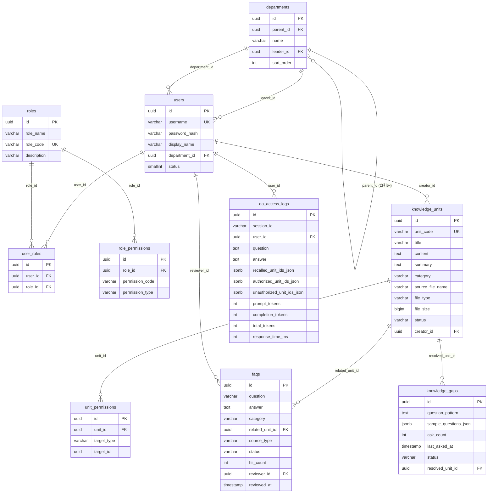
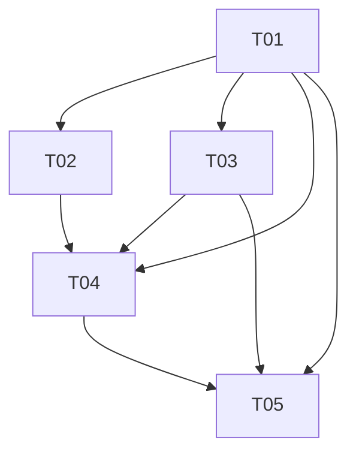
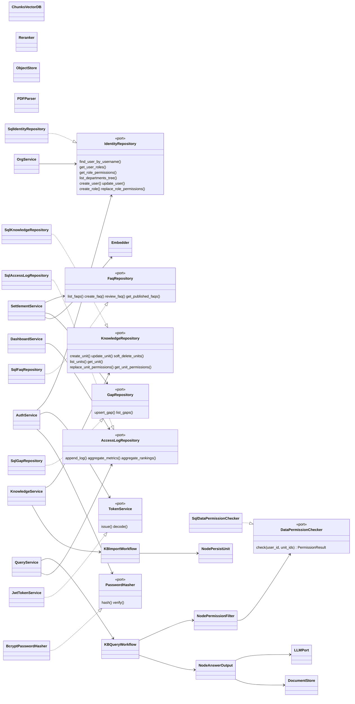
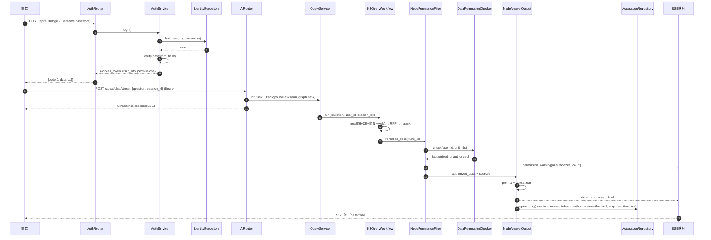

# 知识库管理平台（KBMS）技术规范（SPEC）

> **TL;DR**：在既有「FastAPI + MongoDB + Milvus + MinIO + DashScope(BGE-M3/MinerU)」端口-适配器架构之上，**新增 PostgreSQL（SQLAlchemy 2.0 + Alembic）承载 2.9.7 的 10 张关系型表**，MongoDB 保留专责会话消息；以 JWT + RBAC 实现操作权限、以独立「数据权限引擎（DataPermissionChecker）」实现全局/部门/角色/个人四维 OR 鉴权，并作为新节点注入既有 LangGraph 问答工作流；统一 API 前缀为 `/api`，改造既有 `/api/v1/upload`→`/api/knowledge/import`、`/api/v1/query`+`/stream/{session_id}`→`/api/ai/chat/stream`（单请求 SSE）；看板/沉淀模块复用既有端口与工厂新增服务层实现。

> **本次更新摘要（用户最终决策 + 新增工程规范）**：
> 1. **后端技术栈沿用（已确认）**：FastAPI + Milvus + MongoDB + MinIO + DashScope 均不改。
> 2. **Embedder/Reranker 端口不变，未来适配「在线模型服务」**：预留 `DashScopeEmbedder`/`DashScopeReranker` 在线适配器，与本地 `bge_m3.py`/`bge_local.py` 并列、由配置切换；本地 BGE-M3/BGE-Reranker 视为可替换临时实现。
> 3. **文件格式**：默认 PDF/Word/Markdown/TXT，新增「可扩展解析器注册表」（`PDFParser`/`DocxParser`/`MarkdownParser`/`TxtParser`，未来 Excel/HTML/OCR 插件式接入）。
> 4. **部门权限含子部门（已确认，默认开启）**：`DATA_PERM_DEPT_RECURSIVE=true`。
> 5. **FAQ 阈值进配置**：`FAQ_SIMILARITY_THRESHOLD=0.85`、`FAQ_MIN_FREQUENCY=3`（env 可覆盖，DB 后台调参为进阶项）。
> 6. **缺口阈值进配置**：`GAP_SIMILARITY_THRESHOLD=0.5`。
> 7. **Token/响应时间口径**：区分输入/输出 Token（`prompt_tokens`/`completion_tokens` 分开，`total_tokens`=二者之和）；`response_time_ms` 仅统计服务端处理耗时，**不含**流式推送耗时。
> 8. **软删除与版本**：`qa_access_logs` 保留 180 天（分区 + 定时清理）；知识单元**无版本历史**（编辑即覆盖）。
> 9. **新增 5 章工程规范**：编码（§10）、测试（§11）、安全（§12）、部署运维（§13）、OpenAPI 文档（§14）。

---

## 1. 技术选型与理由

### 1.1 选型总表（结论 + 理由 + 备选）

| 层 | 结论 | 理由 | 备选 |
|---|---|---|---|
| 后端框架 | **FastAPI（沿用）** | 既有 `main.py`、依赖注入、SSE、BackgroundTasks 全部基于 FastAPI，无需迁移 | — |
| 前端 | **Vite + React 18 + TypeScript + MUI + Tailwind + ECharts**（新增 `frontend/`） | PRD 建议栈；管理后台 + 问答工作台 + 看板图表均覆盖 | Ant Design Pro（较重） |
| **关系型存储（新增，10 张表落地）** | **PostgreSQL 16 + SQLAlchemy 2.0 ORM + Alembic** | 见 1.2 详述 | MySQL 8 / SQLite（dev） |
| 文档/会话存储 | **MongoDB 7（沿用）** | `chat_message` 为非结构化追加型数据，schema-free 是 MongoDB 强项，既有 `MongoService` 直接复用 | 并入 PG 亦可 |
| 向量库 | **Milvus 2.5（沿用）** | chunks/item_names 两集合已就绪，混合检索（dense+sparse）已封装 | — |
| 对象存储 | **MinIO（沿用）** | 源文件/图片已接入，`MinIOService` 复用 | — |
| 鉴权 | **JWT（PyJWT）+ bcrypt 密码哈希** | 轻量、无状态、多服务共享；`password_hash` 字段天然对应 bcrypt | OAuth2 密码模式（FastAPI 内置） |
| 操作权限（RBAC） | **role_permissions(permission_code + permission_type) + FastAPI 依赖注入** | 与 2.9.7 契约字段一一对应；DB 实时解析保证「改权限即时生效」 | 把 permissions 嵌入 JWT（即时性差） |
| 数据权限（四维） | **独立 `DataPermissionChecker` 端口 + SQL 一次查询 OR 求值** | 满足「命中任一即可访问」的 OR 语义；服务端强制，前端不参与 | 逐条内存过滤（不可扩展） |
| LLM / Embedding / Rerank / 解析 | **DashScope(qwen) + BGE-M3(embedding，本地) + BGE-Reranker(rerank，本地) + MinerU（沿用）**；embedding/rerank 未来切**在线模型服务（远程 API）** | 既有 `DashScopeService/BgeM3Embedding/MineruService` 复用；`Embedder/Reranker` 端口不变，预留 `DashScopeEmbedder`/`DashScopeReranker` 在线适配器 | — |
| 任务进度 | **沿用内存 `task_utils` + `TaskRepository` 抽象**（可切换 `TaskRepositoryMongo`） | 单进程演示足够；抽象已存在，生产可切持久化 | Celery（过度设计） |
| 缓存（FAQ 命中/权限结果） | **进程内 `cachetools.TTLCache`（默认）+ 可选 Redis** | 避免为 POC 引入新组件；FAQ 命中与权限结果短 TTL 缓存 | Redis（生产升级路径） |
| 部署 | **Docker Compose（补 PostgreSQL 服务）** | 一键启动（PRD 5.3） | — |

> **确认状态**：上表「沿用」项（后端框架 FastAPI、MongoDB、Milvus、MinIO、DashScope 等）已经用户确认**不改**；Embedding/Rerank 的本地实现（BGE-M3/BGE-Reranker）为可替换临时实现，未来适配方向为在线 API 服务（见 §1.4 决策 2）。

### 1.2 关键决策：10 张关系表为何「新增 PostgreSQL」而非沿用 MongoDB

**结论：引入 PostgreSQL（SQLAlchemy 2.0 + Alembic），MongoDB 保留专责 `chat_message`。**

理由（对应需求与既有架构）：

1. **强关系语义**：2.9.7 的 10 张表存在大量外键与多对多关联（`users.department_id → departments.id`、`user_roles(user_id,role_id)`、`role_permissions(role_id,*)`、`unit_permissions(unit_id, target_type, target_id)`、`faqs.related_unit_id`、`knowledge_gaps.resolved_unit_id`），且有 `UNIQUE(user_id,role_id)`、`UNIQUE(unit_id,target_type,target_id)`、`users.username` 唯一、`roles.role_code` 唯一等约束。关系库是这些约束的天然载体，MongoDB 需要应用层自管约束，易漏易错。
2. **事务一致性**：`知识单元创建 + 批量配置权限`、`角色创建 + 批量配置权限`、`用户创建 + 关联角色`、`FAQ 审核发布`等操作必须原子（要么全部成功要么回滚）。PostgreSQL ACID 事务直接满足；MongoDB 需副本集才支持跨文档事务，部署与心智成本高。
3. **看板聚合**：`/api/dashboard/*` 依赖 `qa_access_logs` 的 `GROUP BY / COUNT / SUM / 排行 / 按日聚合`。SQL 一行表达，Mongo aggregation pipeline 可读性差、维护成本高。
4. **端口-适配器天然兼容**：既有代码严格分层（`domain/ports/*` 抽象 + `infra/persistence/*` 适配 + `factories/*` 组合根）。新增「关系库端口 + SQLAlchemy 适配器」完全顺应该风格，**不改动任何既有端口**。
5. **可移植性**：SQLAlchemy 方言化，`DATABASE_URL` 切 SQLite 即可跑无依赖的 dev/test，切 MySQL 亦无代码改动；Alembic 提供版本化迁移与初始化脚本（满足 AC-8「数据库初始化脚本」）。

**为什么 Mongo 不能/不该承载这 10 张表**：无 schema 约束（字段漂移）、join 能力弱（多表联查需多次往返或 `$lookup`）、聚合管线复杂、权限多对多关系（unit_permissions 的 OR 求值）需 N 次查询或聚合、事务需副本集。这些正是 2.9.7 的核心诉求点。

### 1.3 关键难点与框架选择小结

| 难点 | 解决方案 | 框架/组件 |
|---|---|---|
| 文档→知识单元拆分 | 复用 MinerU(PDF→MD)→按标题切分→BGE-M3 向量化，**新增「单元持久化节点」写入 knowledge_units + Milvus chunks 关联 unit_id**；解析器走**可扩展注册表**（默认 PDF/Word/MD/TXT，未来 Excel/HTML/OCR 插件式扩展） | MinerU / DocxParser / MarkdownParser / TxtParser / langchain-text-splitters / Milvus |
| 四维数据权限 OR 语义 | `DataPermissionChecker` 一次 SQL 求 `unit_id ∈ 召回集 AND (global OR user OR role OR department)` | SQLAlchemy |
| AI 鉴权问答 | 问答工作流 `node_rerank` 后新增 `node_permission_filter`，仅授权内容进入 `node_answer_output` | LangGraph |
| SSE 流式 + 权限提示 | 单请求 `POST /api/ai/chat/stream` 返回 `StreamingResponse`，复用 `sse_utils`，新增 `permission_warning`/`sources` 事件 | FastAPI StreamingResponse |
| FAQ 语义去重 | 复用 `Embedder.generate_embeddings` 对 question 聚类/相似度判定（阈值 `FAQ_SIMILARITY_THRESHOLD`/`FAQ_MIN_FREQUENCY` 进配置，未来可切在线 API） | Embedder（本地 BGE-M3 或在线 DashScope） |
| 看板统计 | `qa_access_logs` 聚合 SQL | SQLAlchemy / PostgreSQL |

### 1.4 用户确认决策汇总（本次更新）

| # | 问题 | 最终决策 | 落地位置 |
|---|---|---|---|
| 1 | 后端技术栈 | **沿用** FastAPI + Milvus + MongoDB + MinIO + DashScope，**不改**（已确认） | §1.1 |
| 2 | LLM/Embedding/Rerank 模型 | **沿用** DashScope / BGE-M3 / MinerU；bge embedding 与 rerank **后续改调在线模型服务（远程 API）**，本地 BGE-M3/BGE-Reranker 视为可替换临时实现；`Embedder`/`Reranker` 端口不变，预留 `DashScopeEmbedder`/`DashScopeReranker` 在线适配器（与本地 `bge_m3.py`/`bge_local.py` 并列，配置切换） | §1.1、§1.3、§4、§5.6 |
| 3 | 文件格式 | 默认 **PDF/Word/Markdown/TXT**，支持后续扩展 Excel/HTML/图片 OCR → 新增「可扩展解析器注册表」（`PDFParser` 之外新增 `DocxParser`/`MarkdownParser`/`TxtParser`，未来插件式接入） | §1.3、§5.6 |
| 4 | 部门权限含子部门 | **是**，递归包含子部门成员（已确认，默认开启 `DATA_PERM_DEPT_RECURSIVE=true`） | §2.2 |
| 5 | FAQ 去重/频次阈值 | 进 `settings.py`：`FAQ_SIMILARITY_THRESHOLD=0.85`、`FAQ_MIN_FREQUENCY=3`，env 可覆盖；DB 后台调参列为进阶项 | §5.5、§8 |
| 6 | 缺口相似度阈值 | 进 `settings.py`：`GAP_SIMILARITY_THRESHOLD=0.5`，env 可覆盖 | §5.5、§8 |
| 7 | Token/响应时间口径 | 区分输入/输出（`prompt_tokens`/`completion_tokens` 分开，`total_tokens`=二者之和）；`response_time_ms`=服务端处理耗时（召回+重排+鉴权+LLM 完整生成），**不含**流式推送耗时 | §2.1、§5.7 |
| 8 | 软删除与版本 | `qa_access_logs` **保留 180 天**（按 `created_at` 分区 + 定时清理）；知识单元**无版本历史**（编辑即覆盖 `content/updated_at`，无版本表） | §2.2、§5.4 |

---

## 2. 完整数据模型（10 张表）

> **字段名以需求原文 2.9.7 为精确契约**。PRD「附录 A」为规范化梳理，存在差异处本表以 2.9.7 为准，差异清单见 2.3。类型采用 PostgreSQL 风格；主键统一 `UUID`（uuid4，字符串，与既有 Mongo/Milvus 字符串 ID 风格一致，便于异步导入时无 DB 往返生成）。备选 `BIGSERIAL` 自增（见 2.2 备注）。

### 2.1 表定义

#### users（用户表）
| 字段 | 类型 | 约束/说明 |
|---|---|---|
| id | UUID | PK，默认 `gen_random_uuid()` |
| username | VARCHAR(64) | NOT NULL，UNIQUE |
| password_hash | VARCHAR(255) | NOT NULL（bcrypt） |
| display_name | VARCHAR(64) | NOT NULL |
| department_id | UUID NULL | FK → departments.id，ON DELETE SET NULL |
| status | SMALLINT | NOT NULL DEFAULT 1（1 启用 / 0 禁用） |
| created_at | TIMESTAMPTZ | NOT NULL DEFAULT now() |
| updated_at | TIMESTAMPTZ | NOT NULL |

索引：`uk_users_username(username)`、`idx_users_department(department_id)`

#### departments（部门表）
| 字段 | 类型 | 约束/说明 |
|---|---|---|
| id | UUID | PK |
| parent_id | UUID NULL | FK → departments.id（根节点为 NULL，等价需求「0 为根」语义） |
| name | VARCHAR(64) | NOT NULL |
| leader_id | UUID NULL | FK → users.id，ON DELETE SET NULL |
| sort_order | INT | NOT NULL DEFAULT 0 |
| created_at | TIMESTAMPTZ | NOT NULL DEFAULT now() |
| updated_at | TIMESTAMPTZ | NOT NULL |

索引：`idx_departments_parent(parent_id)`、`idx_departments_leader(leader_id)`

#### roles（角色表）
| 字段 | 类型 | 约束/说明 |
|---|---|---|
| id | UUID | PK |
| role_name | VARCHAR(64) | NOT NULL |
| role_code | VARCHAR(64) | NOT NULL，UNIQUE |
| description | VARCHAR(255) | NULL |
| created_at | TIMESTAMPTZ | NOT NULL DEFAULT now() |
| updated_at | TIMESTAMPTZ | NOT NULL |

索引：`uk_roles_code(role_code)`

#### user_roles（用户-角色关联表）
| 字段 | 类型 | 约束/说明 |
|---|---|---|
| id | UUID | PK |
| user_id | UUID | NOT NULL，FK → users.id ON DELETE CASCADE |
| role_id | UUID | NOT NULL，FK → roles.id ON DELETE CASCADE |
| created_at | TIMESTAMPTZ | NOT NULL DEFAULT now() |

约束：`UNIQUE(user_id, role_id)`；索引：`idx_user_roles_role(role_id)`

#### role_permissions（角色权限表）
| 字段 | 类型 | 约束/说明 |
|---|---|---|
| id | UUID | PK |
| role_id | UUID | NOT NULL，FK → roles.id ON DELETE CASCADE |
| permission_code | VARCHAR(64) | NOT NULL（资源/菜单标识，如 `knowledge:unit`、`dashboard`） |
| permission_type | VARCHAR(16) | NOT NULL（`create/read/update/delete/ai_access`） |
| created_at | TIMESTAMPTZ | NOT NULL DEFAULT now() |

约束：`UNIQUE(role_id, permission_code, permission_type)`；索引：`idx_rp_role(role_id)`

#### knowledge_units（知识单元表）
| 字段 | 类型 | 约束/说明 |
|---|---|---|
| id | UUID | PK |
| unit_code | VARCHAR(64) | NOT NULL，UNIQUE（如 `KU-20250825-xxxxxxxx`） |
| title | VARCHAR(255) | NOT NULL |
| content | TEXT | NOT NULL（切分后的完整 Markdown 正文） |
| summary | TEXT | NULL（LLM 摘要） |
| category | VARCHAR(64) | NULL |
| source_file_name | VARCHAR(255) | NULL |
| file_type | VARCHAR(16) | NULL（pdf/docx/md/txt） |
| file_size | BIGINT | NULL（字节） |
| status | VARCHAR(16) | NOT NULL DEFAULT `draft`（`draft/published/offline`，仅 `published` 参与召回） |
| creator_id | UUID NULL | FK → users.id，ON DELETE SET NULL |
| created_at | TIMESTAMPTZ | NOT NULL DEFAULT now() |
| updated_at | TIMESTAMPTZ | NOT NULL |

索引：`uk_ku_unit_code(unit_code)`、`idx_ku_status(status)`、`idx_ku_category(category)`、`idx_ku_creator(creator_id)`、`idx_ku_title(title)`

#### unit_permissions（知识单元数据权限表）
| 字段 | 类型 | 约束/说明 |
|---|---|---|
| id | UUID | PK |
| unit_id | UUID | NOT NULL，FK → knowledge_units.id ON DELETE CASCADE |
| target_type | VARCHAR(16) | NOT NULL（`global/department/role/user`） |
| target_id | UUID NULL | 目标实体 ID（`global` 时为 NULL/忽略） |
| created_at | TIMESTAMPTZ | NOT NULL DEFAULT now() |

约束：`UNIQUE(unit_id, target_type, target_id)`；索引：`idx_up_target(target_type, target_id)`。鉴权语义为 **OR**。

#### qa_access_logs（问答访问日志表）
| 字段 | 类型 | 约束/说明 |
|---|---|---|
| id | UUID | PK |
| session_id | VARCHAR(64) | NOT NULL |
| user_id | UUID NULL | FK → users.id，ON DELETE SET NULL |
| question | TEXT | NOT NULL |
| answer | TEXT | NULL（仅含已授权内容） |
| recalled_unit_ids_json | JSONB | NULL（召回单元 ID 数组） |
| authorized_unit_ids_json | JSONB | NULL（鉴权通过单元 ID 数组） |
| unauthorized_unit_ids_json | JSONB | NULL（无权限单元 ID 数组） |
| prompt_tokens | INT | NULL |
| completion_tokens | INT | NULL |
| total_tokens | INT | NULL |
| response_time_ms | INT | NULL |
| created_at | TIMESTAMPTZ | NOT NULL DEFAULT now() |

索引：`idx_qal_created(created_at)`、`idx_qal_user(user_id)`、`idx_qal_session(session_id)`、`idx_qal_user_created(user_id, created_at)`

> **Token/耗时口径**：`total_tokens = prompt_tokens + completion_tokens`；`response_time_ms` = 服务端处理耗时（召回 + 重排 + 鉴权 + LLM 完整生成），**不含**把 token 流式推送到客户端的时间（测量口径见 §5.7）。日志保留 180 天（见 §2.2）。

#### faqs（FAQ 表）
| 字段 | 类型 | 约束/说明 |
|---|---|---|
| id | UUID | PK |
| question | VARCHAR(1024) | NOT NULL |
| answer | TEXT | NOT NULL |
| category | VARCHAR(64) | NULL |
| related_unit_id | UUID NULL | FK → knowledge_units.id，ON DELETE SET NULL |
| source_type | VARCHAR(16) | NOT NULL DEFAULT `manual`（`manual/auto_mined`） |
| status | VARCHAR(16) | NOT NULL DEFAULT `pending_review`（`pending_review/published/rejected`） |
| hit_count | INT | NOT NULL DEFAULT 0 |
| reviewer_id | UUID NULL | FK → users.id，ON DELETE SET NULL |
| reviewed_at | TIMESTAMPTZ | NULL |
| created_at | TIMESTAMPTZ | NOT NULL DEFAULT now() |
| updated_at | TIMESTAMPTZ | NOT NULL |

索引：`idx_faq_status(status)`、`idx_faq_category(category)`、`idx_faq_hit(hit_count)`

#### knowledge_gaps（知识缺口表）
| 字段 | 类型 | 约束/说明 |
|---|---|---|
| id | UUID | PK |
| question_pattern | TEXT | NOT NULL（聚合后的问题模式/代表问题） |
| sample_questions_json | JSONB | NULL（样例问题数组） |
| ask_count | INT | NOT NULL DEFAULT 1 |
| last_asked_at | TIMESTAMPTZ | NULL |
| status | VARCHAR(16) | NOT NULL DEFAULT `unresolved`（`unresolved/resolved/ignored`） |
| resolved_unit_id | UUID NULL | FK → knowledge_units.id，ON DELETE SET NULL |
| created_at | TIMESTAMPTZ | NOT NULL DEFAULT now() |
| updated_at | TIMESTAMPTZ | NOT NULL |

索引：`idx_gap_status(status)`、`idx_gap_ask(ask_count)`、`idx_gap_last(last_asked_at)`

### 2.2 设计备注

- **ID 策略**：主键统一 UUID（uuid4）。理由：异步导入流程需在无 DB 往返下生成 `knowledge_units.id`，且需回写到 Milvus chunk 的 `unit_id` 字段，字符串 UUID 跨存储友好。备选 `BIGSERIAL` 自增（更省索引空间），但需先插入拿自增 ID 再回写 Milvus，牺牲一点流程简洁性。
- **部门根节点**：需求 `parent_id` 语义「0 为根」，UUID 主键下用 `NULL` 表示根（等价语义，文中显式说明）。
- **部门继承**：四维权限中「department」是否含子部门成员——**已确认：含子部门（递归）**，通过 `WITH RECURSIVE` 计算用户所属部门闭包，配置项 `DATA_PERM_DEPT_RECURSIVE=true` 默认开启（可关闭，对应 PRD 附录 E 问题 4）。
- **软删除**：`knowledge_units` 不物理删除，`DELETE /api/knowledge/units` 置 `status=offline` 并清理 Milvus 向量（保留行以不破坏 `qa_access_logs` 引用，对应 PRD 附录 E 问题 8）。
- **版本策略（无历史版本）**：知识单元**不保留历史版本**，编辑即覆盖 `content`/`updated_at`（并重新向量化该 unit 的 chunks），**无版本表**；不再使用「软删 + updated_at 承载版本」的表述。
- **问答日志保留策略**：`qa_access_logs` **保留 180 天**，到期归档/清理——建议按 `created_at` 按月分区（PostgreSQL 声明式分区），并由定时任务（如每日）清理 180 天前的数据（可先 `pg_dump` 归档到对象存储再删除）。

### 2.3 与 PRD 附录 A 的字段差异（以 2.9.7 为准）

| 表 | PRD 附录 A 字段 | 2.9.7 契约字段 | 采纳 |
|---|---|---|---|
| users | real_name / email / phone / avatar | **display_name** | 采用 `display_name`，删除 email/phone/avatar |
| departments | code / status | **leader_id** | 采用 `leader_id`，删除 code/status |
| roles | name | **role_name / role_code** | 采用 `role_name`、`role_code` |
| role_permissions | menu_code / action_code | **permission_code / permission_type** | 采用 `permission_code`、`permission_type` |
| knowledge_units | source_file / version / chunk_count | **source_file_name / file_size / category / summary** | 采用契约字段（无 version/chunk_count；**无版本历史**，编辑即覆盖 content/updated_at） |
| unit_permissions | perm_type | **target_type** | 采用 `target_type` |
| qa_access_logs | retrieved_units / authorized_units / denied_units / tokens_used / hit_status | **recalled/authorized/unauthorized_unit_ids_json / prompt/completion/total_tokens / response_time_ms** | 采用契约字段（Token 拆分三列，满足附录 E 问题 7） |
| faqs | candidate/published、source_unit_ids、published_by/at | **pending_review/published/rejected、related_unit_id、source_type、reviewer_id/reviewed_at、hit_count** | 采用契约字段 |
| knowledge_gaps | similarity_score / matched_unit_id / frequency / open|converted | **question_pattern / sample_questions_json / ask_count / unresolved|resolved|ignored / resolved_unit_id** | 采用契约字段 |

### 2.4 ER 图



---

## 3. API 接口清单

> 路径以需求原文 2.9.8 为**精确契约**，统一前缀 **`/api`**（不含 `/v1`，取舍见 5.2）。除 `/api/auth/login` 外均需 `Authorization: Bearer <token>`。统一响应包（见第 8 节共享约定）：成功 `{code:0, message:"ok", data:{...}}`。

### 3.1 认证与组织（Auth / Org）

| 方法 | 路径 | 请求体 | 响应 data | 鉴权 | 说明 |
|---|---|---|---|---|---|
| POST | `/api/auth/login` | `{username, password}` | `{access_token, user_info, permissions}` | 无 | 签发 JWT；`permissions` 为 `[{permission_code, permission_type}]` 扁平列表 |
| GET | `/api/auth/me` | — | `{id, username, display_name, department, roles[], permissions[]}` | JWT | 辅助接口（当前用户） |
| POST | `/api/auth/logout` | — | `{}` | JWT | 辅助接口（客户端丢弃 token；可选服务端黑名单） |
| GET | `/api/org/departments` | — | `[{id, parent_id, name, leader_id, sort_order, children[]}]` | JWT | 部门树 |
| GET | `/api/org/users` | query: `keyword, department_id, page, page_size` | `{items[], total}` | JWT + `org:user:read` | 辅助接口（用户列表） |
| POST | `/api/org/users` | `{username, password, display_name, department_id, role_ids[], status}` | `{id,...}` | JWT + `org:user:create` | 创建用户（含角色） |
| PUT | `/api/org/users/{id}` | 同上（密码可选） | `{id,...}` | JWT + `org:user:update` | 更新用户 |
| DELETE | `/api/org/users/{id}` | — | `{}` | JWT + `org:user:delete` | 辅助接口（删除/停用） |
| GET | `/api/org/roles` | — | `[{id, role_name, role_code, description, permissions[]}]` | JWT + `org:role:read` | 角色列表 |
| POST | `/api/org/roles` | `{role_name, role_code, description}` | `{id,...}` | JWT + `org:role:create` | 辅助接口（创建角色） |
| POST | `/api/org/roles/{id}/permissions` | `{permissions:[{permission_code, permission_type}]}` | `{}` | JWT + `org:role:update` | 批量配置角色权限（事务覆盖） |

### 3.2 知识维护与数据权限（Knowledge）

| 方法 | 路径 | 请求体 | 响应 data | 鉴权 | 说明 |
|---|---|---|---|---|---|
| POST | `/api/knowledge/import` | `multipart/form-data`: `files[]`（单/批量）+ `category`（可选） | `{task_ids[], units[]}` | JWT + `knowledge:unit:create` | 单/批量上传解析入库；默认 `status=draft`、**无任何数据权限**；异步任务，`task_ids` 用于轮询进度 |
| GET | `/api/knowledge/units` | query: `title, category, status, page, page_size` | `{items[], total}` | JWT + `knowledge:unit:read` | 标题/分类/状态分页 |
| GET | `/api/knowledge/units/{id}` | — | `{unit..., permissions[]}` | JWT + `knowledge:unit:read` | 详情 + 数据权限列表 |
| PUT | `/api/knowledge/units/{id}` | `{title, content, summary, category, status}` | `{id,...}` | JWT + `knowledge:unit:update` | 编辑；`status=published` 时才进索引 |
| DELETE | `/api/knowledge/units` | `{unit_ids[]}` | `{deleted_count}` | JWT + `knowledge:unit:delete` | 批量删除（软删 `status=offline` + 清 Milvus） |
| POST | `/api/knowledge/units/{id}/permissions` | `{permissions:[{target_type, target_id}]}` | `{}` | JWT + `knowledge:unit:update` | 批量配置权限实体（事务覆盖） |
| POST | `/api/knowledge/check-permissions` | `{user_id, unit_ids[]}` | `{authorized_unit_ids[], unauthorized_unit_ids[]}` | JWT + `knowledge:unit:read` | 服务端数据权限批量校验（OR 语义） |
| GET | `/api/knowledge/tasks/{task_id}/status` | — | `{status, done_list[], running_list[]}` | JWT | 辅助接口（导入进度，复用 task_router） |

### 3.3 AI 鉴权问答（AI）

| 方法 | 路径 | 请求体 | 响应 | 鉴权 | 说明 |
|---|---|---|---|---|---|
| POST | `/api/ai/chat/stream` | `{question, session_id?}` | **SSE 流**（见 3.5） | JWT + `ai_access` | 单请求 SSE；登录态强校验；召回→鉴权过滤→仅拼装有权限内容→流式答案 + 引用来源 + 权限缺失提示 |
| GET | `/api/ai/sessions` | query: `page, page_size` | `{items[], total}` | JWT | 辅助接口（我的会话列表，源自 qa_access_logs 按 session 聚合） |
| GET | `/api/ai/sessions/{session_id}/history` | — | `{session_id, items[]}` | JWT | 辅助接口（历史详情，复用 MongoService.get_recent_messages） |

### 3.4 数据看板与知识沉淀（Dashboard / Settlement）

| 方法 | 路径 | 请求体 | 响应 data | 鉴权 | 说明 |
|---|---|---|---|---|---|
| GET | `/api/dashboard/metrics` | query: `from, to` | `{访问量, 访问人数, 知识单元总量, faq_total, gap_total}` | JWT + `dashboard:read` | 指标卡 |
| GET | `/api/dashboard/rankings/questions` | query: `from, to, limit` | `[{question, ask_count, ...}]` | JWT + `dashboard:read` | 高频问题排行 |
| GET | `/api/dashboard/rankings/units` | query: `from, to, limit` | `[{unit_id, unit_code, title, hit_count}]` | JWT + `dashboard:read` | 高频知识单元排行 |
| GET | `/api/dashboard/stats/tokens` | query: `from, to` | `[{date, prompt_tokens, completion_tokens, total_tokens, avg_response_time_ms}]` | JWT + `dashboard:read` | Token 消耗 + 响应时间按日聚合趋势 |
| GET | `/api/settlement/faqs/recommendations` | query: `limit` | `[{question, answer?, related_unit_id?, ask_count, source_type}]` | JWT + `settlement:faq:read` | 高频候选 FAQ 推荐（语义去重 + 频次阈值） |
| POST | `/api/settlement/faqs/{id}/review` | `{action: approve|reject, edited_answer?}` | `{id, status}` | JWT + `settlement:faq:update` | 审核发布/驳回；approve 后写缓存（`hit_count` 递增、`reviewer_id/reviewed_at` 记录） |
| GET | `/api/settlement/faqs` | query: `status, category, page, page_size` | `{items[], total}` | JWT + `settlement:faq:read` | 辅助接口（FAQ 列表，按状态筛选） |
| GET | `/api/settlement/knowledge-gaps` | query: `status, page, page_size` | `{items[], total}` | JWT + `settlement:gap:read` | 知识缺口列表（按频次聚合） |

### 3.5 SSE 事件协议（`/api/ai/chat/stream`）

`Content-Type: text/event-stream`，每个事件 `event: <name>\ndata: <json>\n\n`：

| event | data 载荷 | 说明 |
|---|---|---|
| `ready` | `{}` | 连接建立 |
| `progress` | `{status, done_list[], running_list[]}` | 工作流进度（复用 task_utils 中文名映射） |
| `delta` | `{delta}` | LLM 增量文本 |
| `sources` | `{items:[{unit_id, unit_code, title}]}` | 引用来源（已授权知识单元） |
| `permission_warning` | `{unauthorized_count, message}` | 权限缺失友好提示（「部分内容因权限不足未展示，共 N 条」），**不泄露正文** |
| `final` | `{answer, status, sources[], unauthorized_count, image_urls[]}` | 收尾汇总 |
| `error` | `{error}` | 异常 |

> **统计口径**：`response_time_ms` 在服务端 `node_answer_output` 于 LLM 生成完成、写 `qa_access_logs` 时打点计算（从请求进入 / 工作流启动到 LLM 生成完成），**不含** SSE 流式推送到客户端的网络/读取耗时；Token 按输入/输出分开统计（`prompt_tokens`/`completion_tokens`，`total_tokens` 为二者之和）。详见 §5.7。

---

## 4. 项目目录结构（目标态）

> 标注 `【保留】/【改造】/【新增】`。既有 `backend/` 作为后端，新增同级 `frontend/`。

```
kbms/
├── docker-compose.yml                  【改造】根编排：include infra/ + backend/，路径 app/→backend/ 对齐
├── infra/
│   └── docker-compose.yml              【保留】Milvus + etcd + milvus-minio
├── backend/
│   ├── pyproject.toml                  【改造】新增 sqlalchemy/alembic/psycopg/pyjwt/bcrypt/cachetools/python-multipart
│   ├── main.py                         【改造】挂载新 router（前缀 /api），保留 /static、/health
│   ├── .env.example                    【新增】环境变量样例（DATABASE_URL/JWT_SECRET/各类阈值）
│   ├── Dockerfile                      【新增】后端镜像（见 §13 部署运维）
│   ├── tests/                          【新增】单元/集成/契约/流式/安全测试（见 §11）
│   ├── alembic/                        【新增】迁移脚本 + versions/（10 张表 + 种子数据）
│   ├── scripts/
│   │   ├── init_db.py                  【新增】建库建表 + 种子（admin 账号/默认角色/示例权限）
│   │   └── ...                         【保留】test_connections 等
│   ├── domain/
│   │   ├── models/
│   │   │   ├── task.py                 【保留】
│   │   │   └── entities.py             【新增】SQLAlchemy ORM 模型（10 张表）
│   │   └── ports/
│   │       ├── doc_store.py            【保留】会话消息
│   │       ├── embedder.py             【保留】
│   │       ├── llm.py                  【保留】
│   │       ├── object_store.py         【保留】
│   │       ├── pdf_parser.py           【保留】解析器端口（可扩展注册表：PDFParser/DocxParser/MarkdownParser/TxtParser，未来 Excel/HTML/OCR）
│   │       ├── reranker.py             【保留】
│   │       ├── vector_db.py            【改造】ChunksVectorDB 输出带 unit_id；新增 FaqVectorDB 可选
│   │       ├── web_search.py           【保留】
│   │       ├── task_repository.py      【保留】
│   │       ├── identity_repository.py  【新增】users/departments/roles/user_roles/role_permissions 仓储端口
│   │       ├── knowledge_repository.py 【新增】knowledge_units/unit_permissions 仓储端口
│   │       ├── access_log_repository.py【新增】qa_access_logs 仓储端口
│   │       ├── faq_repository.py       【新增】faqs 仓储端口
│   │       ├── gap_repository.py       【新增】knowledge_gaps 仓储端口
│   │       ├── permission_checker.py   【新增】数据权限引擎端口（check(user_id, unit_ids)）
│   │       └── auth_port.py            【新增】TokenService / PasswordHasher 端口
│   ├── infra/
│   │   ├── config/settings.py          【改造】新增 DATABASE_URL、JWT_SECRET、JWT_EXPIRE、DATA_PERM_DEPT_RECURSIVE、FAQ_SIMILARITY_THRESHOLD、FAQ_MIN_FREQUENCY、GAP_SIMILARITY_THRESHOLD 等（env 可覆盖）
│   │   ├── external/                   【保留+新增】embedder/llm/reranker/mineru/mcp_search；embedder/reranker 新增在线适配器（DashScopeEmbedder/DashScopeReranker），与本地 bge_m3.py/bge_local.py 并列、配置切换
│   │   ├── persistence/
│   │   │   ├── milvus.py               【改造】chunks 集合新增 unit_id 字段；新增 FaqMilvusService 可选
│   │   │   ├── minio.py                【保留】
│   │   │   ├── mongo.py                【保留】chat_message
│   │   │   ├── task_repo_*.py          【保留】
│   │   │   └── sqlalchemy/
│   │   │       ├── base.py             【新增】Engine/Session/DeclarativeBase
│   │   │       ├── identity_repo.py    【新增】IdentityRepository 适配器
│   │   │       ├── knowledge_repo.py   【新增】KnowledgeRepository 适配器
│   │   │       ├── access_log_repo.py  【新增】AccessLogRepository 适配器
│   │   │       ├── faq_repo.py         【新增】FaqRepository 适配器
│   │   │       └── gap_repo.py         【新增】GapRepository 适配器
│   │   └── security/
│   │       ├── jwt.py                  【新增】JwtTokenService（签发/校验，sub=user_id）
│   │       └── password.py             【新增】BcryptPasswordHasher
│   ├── auth/
│   │   └── permission_engine.py        【新增】DataPermissionChecker 实现（四维 OR + 部门递归）
│   ├── factories/
│   │   ├── infra.py                    【改造】新增 get_identity_repo/get_knowledge_repo/.../get_token_service/get_password_hasher/get_permission_checker
│   │   ├── services.py                 【改造】新增 create_auth_service/create_org_service/create_knowledge_service/create_dashboard_service/create_settlement_service
│   │   └── workflows.py                【改造】ingestion 注入 node_persist_unit；query 注入 node_permission_filter
│   ├── services/
│   │   ├── ingestion_service.py        【改造】上传后创建 knowledge_units + 状态流转（复用 object_store/workflow）
│   │   ├── query_service.py            【改造】注入 user_id、写 qa_access_logs、发 permission_warning/sources 事件
│   │   ├── task_service.py             【保留】
│   │   ├── auth_service.py             【新增】登录/签发/校验
│   │   ├── org_service.py              【新增】用户/角色/部门/权限 CRUD
│   │   ├── knowledge_service.py        【新增】单元 CRUD + 权限配置 + check-permissions 编排
│   │   ├── dashboard_service.py        【新增】聚合统计
│   │   └── settlement_service.py       【新增】FAQ 推荐/审核 + 缺口识别
│   ├── workflows/
│   │   ├── ingestion/                  【改造】main_graph 增加 node_persist_unit（写 knowledge_units + chunk.unit_id）
│   │   │   └── nodes/node_persist_unit.py【新增】
│   │   └── query/
│   │       ├── state.py                【改造】新增 user_id / authorized_docs / unauthorized_unit_ids / sources
│   │       ├── main_graph.py           【改造】rerank → permission_filter → answer_output 边
│   │       ├── nodes/node_permission_filter.py【新增】鉴权过滤节点
│   │       └── nodes/node_answer_output.py 【改造】仅消费 authorized_docs，发 permission_warning/sources
│   ├── api/
│   │   ├── middleware/
│   │   │   ├── cors.py                 【保留】
│   │   │   ├── request_logger.py       【保留】
│   │   │   ├── auth.py                 【新增】get_current_user（JWT 解析 → 注入 CurrentUser）
│   │   │   └── rbac.py                 【新增】require_permission(code, type)（操作权限依赖）
│   │   ├── v1/                         【保留·deprecated】health/ingest/query/task 旧路由（过渡期保留）
│   │   ├── deps.py                     【改造】新增各服务工厂依赖
│   │   ├── auth_router.py              【新增】
│   │   ├── org_router.py               【新增】
│   │   ├── knowledge_router.py         【新增】（import/units/permissions/check-permissions/tasks）
│   │   ├── ai_router.py                【新增】（chat/stream + sessions）
│   │   ├── dashboard_router.py         【新增】
│   │   └── settlement_router.py        【新增】
│   ├── schema/
│   │   ├── ingestion_schema.py         【保留】
│   │   ├── query_schema.py             【保留】
│   │   ├── task_schema.py              【保留】
│   │   ├── auth_schema.py              【新增】
│   │   ├── org_schema.py               【新增】
│   │   ├── knowledge_schema.py         【新增】
│   │   ├── ai_schema.py                【新增】
│   │   ├── dashboard_schema.py         【新增】
│   │   └── settlement_schema.py        【新增】
│   └── utils/                          【保留】sse_utils/task_utils/logger/api_throttle/backup_utils/json_format_utils
└── frontend/                           【新增】Vite + React + TS + MUI + Tailwind + ECharts
    ├── src/pages/{Login,Org,Knowledge,AiChat,Dashboard,Settlement}
    ├── src/api/（axios 封装，统一响应包 + Bearer 拦截）
    ├── src/stores/（auth 状态）
    ├── .eslintrc.* / .prettierrc        【新增】ESLint + Prettier（见 §10）
    └── vite.config.ts / tsconfig.json
```

---

## 5. 已有代码适配方案（重点）

### 5.1 现有文件 → 需求模块映射表

| 现有文件 | 需求模块 | 动作 | 说明 |
|---|---|---|---|
| `main.py` | 全局路由 | 改造 | 挂载 6 个新 router（前缀 `/api`）；保留 `/static`、`/health`；旧 `/api/v1` 降级为 deprecated |
| `api/v1/ingest_router.py` | 知识导入 | 改造/迁移 | 逻辑迁入 `knowledge_router` 的 `POST /knowledge/import`，保留 `BackgroundTasks` 多文件 |
| `api/v1/query_router.py` | AI 问答 | 改造/拆分 | `POST /query`+`GET /stream/{session_id}` → 合并为 `POST /ai/chat/stream`（单请求 SSE）；`/history` → `/ai/sessions/{id}/history` |
| `api/v1/task_router.py` | 导入进度 | 复用 | `/status/{task_id}` 挂到 `/knowledge/tasks/{task_id}/status` |
| `api/v1/deps.py` | DI | 改造 | 新增服务工厂依赖 |
| `api/v1/health_router.py`、`api/ui_router.py` | 健康/静态页 | 复用 | 前端切 React 后 `ui_router` 可移除 |
| `factories/infra.py` | 组合根 | 改造 | 新增关系库/仓储/安全/权限引擎工厂 |
| `factories/services.py` | 组合根 | 改造 | 新增 5 个 service 工厂；query/ingestion 工厂注入新节点 |
| `factories/workflows.py` | 工作流组装 | 改造 | ingestion + `node_persist_unit`；query + `node_permission_filter` |
| `services/ingestion_service.py` | 导入 | 改造 | 上传后创建 `knowledge_units`（draft、无权限）；完成回填 chunk 数 |
| `services/query_service.py` | 问答 | 改造 | 注入 user_id、写 `qa_access_logs`、SSE 发 `permission_warning`/`sources` |
| `domain/ports/*` | 端口 | 复用 + 新增 | 新增 8 个端口（见目录树） |
| `infra/persistence/milvus.py` | 向量 | 改造 | chunks schema 增加 `unit_id: VARCHAR(64)`；`hybrid_search_chunks` 返回 `unit_id`；`delete_data_by_unit_id` |
| `infra/persistence/mongo.py` | 会话 | 复用 | `chat_message` 原样使用 |
| `infra/persistence/minio.py` | 对象 | 复用 | 源文件/图片 |
| `workflows/ingestion/*` | 导入工作流 | 改造 | 图尾新增 `node_persist_unit` |
| `workflows/query/*` | 问答工作流 | 改造 | `state.py` 加字段；`main_graph.py` 加边；`node_answer_output` 消费授权文档 |
| `schema/*` | 请求校验 | 复用 + 新增 | 新增 6 个 schema 文件 |
| `utils/*` | 工具 | 复用 | sse_utils/task_utils 直接复用 |
| `infra/persistence/task_repo_*` | 任务 | 复用（可选） | 生产可切 `TaskRepositoryMongo` |

### 5.2 API 路径适配与统一前缀取舍

**结论：统一前缀定为 `/api`（严格匹配 2.9.8 契约），废弃 `/api/v1`。** 取舍理由：契约路径为权威且无版本号；既有 `/api/v1` 仅 4 个内部路由，尚未对外承诺兼容，迁移成本低。`settings.API_V1_STR` 保留为兼容变量，新路由挂载点改为 `/api`（新增 `settings.API_STR="/api"`）。

| 旧路径（现状） | 新路径（契约） | 改造要点 |
|---|---|---|
| `POST /api/v1/upload` | `POST /api/knowledge/import` | 文件名 `files[]` 不变；请求体加 `category`；返回 `{task_ids[], units[]}`；上游 `IngestionService` 增加「创建 knowledge_units」步骤 |
| `POST /api/v1/query` | `POST /api/ai/chat/stream` | 合并提交与 SSE 为一请求：`BackgroundTasks(service.run_graph_task)` + 直接返回 `StreamingResponse(sse_generator(session_id))` |
| `GET /api/v1/stream/{session_id}` | （并入上述） | `sse_generator` 复用；删除独立 GET 流端点 |
| `GET /api/v1/history/{session_id}` | `GET /api/ai/sessions/{session_id}/history` | 逻辑复用 `QueryService.get_history` |
| `DELETE /api/v1/history/{session_id}` | 保留辅助 `DELETE /api/ai/sessions/{session_id}` | 复用 `clear_history` |
| `GET /api/v1/status/{task_id}` | `GET /api/knowledge/tasks/{task_id}/status` | task_router 复用 |

**SSE 改造（两段式 → 单请求式）**：既有实现是「POST 提交返回 task_id → GET 拉 SSE 队列」两段式。新契约要求「POST → 直接 SSE」。改造方案：

```python
# api/ai_router.py
@router.post("/chat/stream")
async def chat_stream(req: ChatStreamRequest,
                      background: BackgroundTasks,
                      user: CurrentUser = Depends(get_current_user),
                      service: QueryService = Depends(get_query_service)):
    session_id = req.session_id or service.generate_session_id()
    task_id = service.generate_task_id()
    service.init_task(task_id, session_id, True, user)      # 提前建 SSE 队列 + 记录日志
    background.add_task(service.run_graph_task, task_id, session_id, req.question, True, user)
    return StreamingResponse(
        sse_generator(session_id, request), media_type="text/event-stream",
        headers={"Cache-Control":"no-cache","Connection":"keep-alive","X-Accel-Buffering":"no"})
```

`run_graph_task` 在后台跑 LangGraph，`node_answer_output`/`node_permission_filter` 经 `push_sse_event` 把 `delta/sources/permission_warning/final` 写入 session 队列，`sse_generator` 消费。**无需改动 `sse_utils`**，仅需在 `QueryService.run_graph_task` 增加 `user` 入参并注入 state。

### 5.3 鉴权过滤如何注入既有 query workflow（保持端口-适配器风格）

- **注入点**：`node_rerank` → `node_permission_filter` → `node_answer_output`（在重排之后、拼装 Prompt 之前）。重排结果 `reranked_docs` 每条已携带 `unit_id`（来自 Milvus chunk 新字段），过滤发生在**最终答案生成前**，确保「仅拼装有权限内容」。
- **端口形式**：新增领域端口 `DataPermissionChecker`（抽象），实现 `SqlDataPermissionChecker`（`auth/permission_engine.py`），通过 `factories/workflows.py` 注入新节点 `NodePermissionFilter(permission_checker)`。与既有 `NodeRerank(reranker)` 注入方式完全一致。
- **节点行为**：
  1. 从 `reranked_docs` 提取 `unit_id` 集合（去重）；
  2. 调 `checker.check(user_id, unit_ids)` → `{authorized_unit_ids, unauthorized_unit_ids}`；
  3. 将 `reranked_docs` 拆为 `authorized_docs` / `unauthorized_count`；
  4. 若 `unauthorized_count>0`，`push_sse_event(session_id, "permission_warning", {...})`（仅计数，不含正文）；
  5. 返回 state：`authorized_docs`、`sources`（授权单元 `unit_id/unit_code/title`）、`unauthorized_unit_ids`。
- **`node_answer_output` 改造**：`_construct_prompt` 改用 `authorized_docs`；`process` 末尾写 `qa_access_logs`（question/answer/recalled/authorized/unauthorized/tokens/response_time_ms）。
- **防御纵深（可选优化）**：在 `NodeSearchEmbedding`/`NodeSearchEmbeddingHyde` 检索时，用 `checker` 预取的「用户可见单元集合」作为 Milvus `expr` 过滤（`unit_id in [...]`），减少无权限内容进入召回；**权威过滤仍以 post-rerank 节点为准**（不依赖向量库过滤正确性）。
- **状态流转**：`QueryGraphState` 新增字段 `user_id`、`authorized_docs`、`unauthorized_unit_ids`、`sources`。

### 5.4 knowledge_units 与 Milvus chunk 的映射关系

- **1 知识单元 = 1 个源文件（或 1 个逻辑单元），映射到 N 个 Milvus chunk（1:N）**。
- 导入流水线产出：`node_persist_unit` 将整篇 MD `content` + LLM `summary` + 元信息写入 `knowledge_units`；`node_import_milvus` 在写 chunks 时为每个 chunk 附带 `unit_id`（= `knowledge_units.id`）与既有 `file_title`。
- 关联键：Milvus `kb_chunks` 集合**新增字段 `unit_id: VARCHAR(64)`**（`file_title` 保留用于兼容旧数据与幂等删除）。
- 检索→鉴权链路：chunk 召回时返回 `unit_id` → `NodePermissionFilter` 以 `unit_id` 为粒度做权限判定（与 `unit_permissions.unit_id` 对齐）。
- 删除/下线：`DELETE /knowledge/units` 与「下线」时，按 `unit_id` 清理对应 chunks（`delete_data_by_unit_id`）。
- 版本：2.9.7 无 version 字段，**不保留历史版本**（无版本表），编辑即更新 `content/updated_at`，重新向量化该 unit 的 chunks（先删后插）。

### 5.5 看板/沉淀模块如何新增并复用既有工厂与端口

- **看板（dashboard）**：`DashboardService` 依赖新增的 `AccessLogRepository`（qa_access_logs）与 `KnowledgeRepository`、`FaqRepository`、`GapRepository`，纯 SQL 聚合（`GROUP BY date_trunc('day', created_at)`、`COUNT(DISTINCT user_id)`、`SUM(total_tokens)`、`AVG(response_time_ms)`）。通过 `factories/services.py` 的 `create_dashboard_service()` 组合，无既有端口改动。
- **FAQ 沉淀（settlement）**：`SettlementService` 复用 `Embedder`（`generate_embeddings` 做 question 语义去重/聚类）+ `AccessLogRepository`（按 question 归一化聚合）+ `FaqRepository`（候选/审核）+ `KnowledgeGapRepository`（低相似度/无支撑 → 缺口）。阈值统一进 `settings.py`（pydantic-settings，默认值 + 环境变量覆盖）：`FAQ_SIMILARITY_THRESHOLD=0.85`、`FAQ_MIN_FREQUENCY=3` → 候选 FAQ；`GAP_SIMILARITY_THRESHOLD=0.5` → 召回相似度低于该值或无授权内容判定为知识缺口（对应 PRD 附录 E 问题 5/6，已确认）。DB 后台动态调参列为**进阶项**（可选，非本期）。
- **缓存**：`FaqCache`（`cachetools.TTLCache`，端口 `auth_port` 旁新增 `FaqCachePort` 可选）缓存「已发布 FAQ 的 question→answer」命中；`SettlementService.approve` 时写缓存，`QueryService` 在进入工作流前先查 FAQ 缓存（命中则直接流式返回，降低 LLM 成本）。
- **工厂复用**：以上服务均沿用 `lru_cache` 组合根模式（`factories/infra.py` 造端口适配器 → `factories/services.py` 造服务 → `factories/workflows.py` 造工作流）。

### 5.6 可扩展解析器注册表（文件格式扩展）

> 用户确认：默认支持 **PDF / Word(docx) / Markdown / TXT**，后续可扩展 **Excel / HTML / 图片 OCR**。

- **端口不变**：沿用 `domain/ports/pdf_parser.py` 抽象，泛化为「文档解析器」端口（`parse(file) -> ParsedDocument`，含 Markdown 正文 + 元信息），不破坏既有 MinerU 调用。
- **注册表模式**：新增 `infra/external/parser_registry.py`，以 `{扩展名/内容类型 → Parser 实现}` 注册，运行时按文件类型路由。
  - 内置实现：`PDFParser`（MinerU）、`DocxParser`（python-docx/mammoth）、`MarkdownParser`、`TxtParser`。
  - 扩展点：未来 `ExcelParser`（openpyxl/pandas）、`HtmlParser`（trafilatura/bs4）、`OcrImageParser`（DashScope OCR/本地 OCR）以**插件式**注册即可接入，无需改动导入工作流。
- **导入流水线接入**：`node_parse`（导入工作流首个节点）改为「先查注册表选 Parser → 解析 → 统一输出 Markdown」，下游切分/向量化/`node_persist_unit` 逻辑不变。
- **安全约束**：文件类型白名单 + 大小限制 + 文件名清洗在入口 `POST /api/knowledge/import` 强制（见 §12）。

### 5.7 Token 与响应时间统计口径（已确认）

| 指标 | 口径 | 打点位置 |
|---|---|---|
| `prompt_tokens` | 输入 token（Prompt = 系统提示 + 召回上下文 + 问题） | LLM 调用前统计 |
| `completion_tokens` | 输出 token（LLM 生成正文） | LLM 生成完成后统计 |
| `total_tokens` | `prompt_tokens + completion_tokens` | 写入时计算 |
| `response_time_ms` | 服务端处理耗时 = 请求进入工作流 → 召回 → 重排 → 鉴权 → **LLM 完整生成** 的端到端耗时；**不含** SSE 把 token 流式推送到客户端的时间 | `node_answer_output` 写 `qa_access_logs` 前打点 |

**如何测量（实现约定）**：

1. `QueryService.run_graph_task` 入口（或 `init_task`）记录 `t0 = time.perf_counter()`。
2. `node_answer_output` 在 LLM **完整生成完成**（流式结束后）记录 `t1 = time.perf_counter()`。
3. `response_time_ms = int((t1 - t0) * 1000)`，与 token 计数一起写入 `qa_access_logs`。
4. SSE 推送阶段（`sse_generator` 从队列消费、`StreamingResponse` 网络回传）**不计入** `response_time_ms`。

---

## 6. 第三方依赖清单（Required Packages）

后端 `backend/pyproject.toml` 新增：

```
- sqlalchemy>=2.0.30       # ORM
- alembic>=1.13.2          # 数据库迁移
- psycopg[binary]>=3.2     # PostgreSQL 驱动（dev 可切 sqlite：无额外依赖）
- pyjwt>=2.9.0             # JWT 签发/校验
- bcrypt>=4.2.0            # 密码哈希
- cachetools>=5.5.0        # FAQ/权限 TTL 缓存
- python-multipart>=0.0.9  # UploadFile 解析（既有 upload 依赖但缺失显式声明）
# 可选：redis>=5.0（生产缓存升级路径）
```

开发/质量依赖（dev，见 §10/§11）：

```
- ruff>=0.6              # lint + format
- black>=24.8            # 格式化
- isort>=5.13            # import 排序
- pytest>=8.3            # 测试
- pytest-asyncio>=0.24   # 异步测试
- httpx>=0.27            # FastAPI TestClient/AsyncClient
- coverage>=7.6          # 覆盖率（目标行覆盖 ≥80%）
# 可选：mypy>=1.11（类型检查）
```

前端 `frontend/package.json`（新建）：

```
- react@^18.3.1 / react-dom@^18.3.1
- react-router-dom@^6.26.0
- @mui/material@^5.16.0 / @emotion/react@^11 / @emotion/styled@^11
- @mui/icons-material@^5.16.0
- tailwindcss@^3.4.0
- echarts@^5.5.0 / echarts-for-react@^3.0.2
- axios@^1.7.0
- zustand@^4.5.0（轻量状态）
- vite@^5 / @vitejs/plugin-react / typescript@^5
# devDependencies: eslint@^8 / prettier@^3 / eslint-config-prettier / @typescript-eslint/*
```

---

## 7. 实施任务分解（≤ 5 任务）

| Task | 名称 | 源文件（新建/改造） | 依赖 | 优先级 |
|---|---|---|---|---|
| T01 | 项目基础设施 + 关系数据层基座 | `pyproject.toml`、`infra/config/settings.py`、`infra/persistence/sqlalchemy/{base,identity_repo,knowledge_repo,access_log_repo,faq_repo,gap_repo}.py`、`domain/models/entities.py`、`domain/ports/{identity,knowledge,access_log,faq,gap}_repository.py`、`alembic/*`、`scripts/init_db.py`、`docker-compose.yml`（backend 补 postgres 服务） | — | P0 |
| T02 | 认证 + 组织架构（RBAC） | `infra/security/{jwt,password}.py`、`domain/ports/auth_port.py`、`services/auth_service.py`、`services/org_service.py`、`api/middleware/{auth,rbac}.py`、`api/{auth_router,org_router}.py`、`schema/{auth_schema,org_schema}.py`、`api/deps.py` | T01 | P0 |
| T03 | 知识单元 + 数据权限 + 导入适配 | `auth/permission_engine.py`、`domain/ports/permission_checker.py`、`services/knowledge_service.py`、`api/knowledge_router.py`、`schema/knowledge_schema.py`、`workflows/ingestion/nodes/node_persist_unit.py`、`workflows/ingestion/main_graph.py`、`infra/persistence/milvus.py`（unit_id）、`services/ingestion_service.py`、`factories/{infra,services,workflows}.py` | T01 | P0 |
| T04 | AI 鉴权问答改造（SSE + 过滤 + 日志） | `workflows/query/state.py`、`workflows/query/main_graph.py`、`workflows/query/nodes/node_permission_filter.py`、`workflows/query/nodes/node_answer_output.py`、`services/query_service.py`、`api/ai_router.py`、`schema/ai_schema.py` | T01, T02, T03 | P0 |
| T05 | 看板 + 知识沉淀 + 集成调试 | `services/{dashboard_service,settlement_service}.py`、`api/{dashboard_router,settlement_router}.py`、`schema/{dashboard_schema,settlement_schema}.py`、`main.py`（挂载全部路由）、`frontend/*`（可选对接） | T01, T03, T04 | P1 |

**依赖图**：



---

## 8. 共享约定（Shared Knowledge）

- 统一响应包：成功 `{ "code": 0, "message": "ok", "data": ... }`；失败返回对应 HTTP 4xx/5xx 且 `{ "code": <errno>, "message": "...", "detail": "..." }`。SSE 端点除外。
- 鉴权：JWT `Authorization: Bearer <token>`，payload `{sub: user_id, username, roles: [role_code]}`；操作权限（RBAC）每次请求从 DB 实时解析 `role_permissions`（保证「改权限即时生效」）；数据权限（四维）服务端 `DataPermissionChecker` 强制，前端仅展示。
- 时间戳统一 `TIMESTAMPTZ`（PostgreSQL）/ ISO 8601 UTC（接口输出）。
- 密码 bcrypt 加盐哈希存储，禁止明文/日志。
- 知识单元默认 `status=draft`、**默认无任何数据权限**；仅 `published` 且命中授权实体才可被召回。
- 数据权限 OR 语义：`global` 命中即放行；否则 `department`（含子部门，可配）/`role`/`user` 任一命中即放行。
- FAQ/缺口阈值进 `settings.py`（env 可覆盖）：`FAQ_SIMILARITY_THRESHOLD=0.85`、`FAQ_MIN_FREQUENCY=3`、`GAP_SIMILARITY_THRESHOLD=0.5`。
- Token 口径：`prompt_tokens`/`completion_tokens` 分开统计，`total_tokens = prompt_tokens + completion_tokens`；`response_time_ms` = 服务端处理耗时（召回+重排+鉴权+LLM 完整生成），**不含** SSE 流式推送耗时（见 §5.7）。
- 知识单元**无版本历史**（编辑即覆盖）；`qa_access_logs` **保留 180 天**（分区 + 定时清理）。
- 无权限召回内容不得出现在 answer、日志、异常、SSE 报文（仅输出计数）。

---

## 9. 架构图

### 9.1 类图（端口-适配器 + 服务 + 工作流）

见 `docs/class-diagram.mermaid`（下图为要点版）。



### 9.2 时序图

见 `docs/sequence-diagram.mermaid`。关键调用序列（登录→鉴权问答 SSE、知识导入、FAQ 沉淀）见下：



---

## 10. 编码规范

### 10.1 代码风格

| 端 | 工具 | 说明 |
|---|---|---|
| Python | **ruff**（lint + format）+ **black** + **isort** | 统一风格；CI 中执行 `ruff check`、`black --check`、`isort --check` |
| 前端 TS | **ESLint** + **Prettier** | `eslint-config-prettier` 消除冲突；保存自动格式化 |

配置文件：`backend/pyproject.toml`（`[tool.ruff]`/`[tool.black]`/`[tool.isort]`）、`frontend/.eslintrc.*`/`.prettierrc`。

### 10.2 命名规则

| 类别 | Python | TypeScript / React |
|---|---|---|
| 变量 / 函数 | `snake_case`（`get_user_by_id`） | `camelCase`（`getUserById`） |
| 类 / 组件 | `PascalCase`（`AuthService`） | `PascalCase`（`LoginForm`） |
| 模块 / 文件 | 小写下划线（`auth_service.py`） | 小写 / kebab（`auth-service.ts`） |
| 常量 | `UPPER_SNAKE`（`FAQ_SIMILARITY_THRESHOLD`） | `UPPER_SNAKE` |
| 布尔字段 | `is_`/`has_` 前缀（`is_active`、`has_permission`） | `is`/`has` 前缀 |
| DB 字段 | `snake_case`（`created_at`、`unit_id`） | — |

### 10.3 注释与文档

- **docstring**：Python 一律 **Google 风格**（`Args`/`Returns`/`Raises`）。
- **必须注释**：复杂逻辑、算法、**权限语义（OR / 含子部门 / 越权零泄露）**必须有解释性注释。
- **公共端口/接口必须写 docstring**：`domain/ports/*`、`services/*`、`api/*_router` 的公共方法与接口契约必写。
- **禁止无意义注释**：不写 `i += 1  # 自增` 之类；注释解释「为什么」，代码本身表达「是什么」。

---

## 11. 测试规范

### 11.1 测试场景覆盖

| 层次 | 覆盖场景 |
|---|---|
| 单元测试 | 数据权限四维 OR 引擎、鉴权过滤节点（`NodePermissionFilter`）、JWT 签发/校验、bcrypt 密码哈希、FAQ 阈值判定、缺口识别、聚合统计 SQL（看板） |
| 集成测试 | 登录→问答全链路、导入→拆分→入库→召回、权限配置→鉴权过滤生效 |
| 接口/契约测试 | OpenAPI 契约校验、鉴权 401、RBAC 越权 403、数据权限 OR 边界 |
| 流式 SSE 测试 | `delta`/`sources`/`permission_warning`/`final` 事件序列、首字延迟 |
| 安全测试 | 越权数据零泄露、SQL 注入、XSS、Token 过期 |

### 11.2 框架与指标

- 框架：**pytest + pytest-asyncio + httpx（FastAPI `TestClient`/`AsyncClient`）+ coverage**。
- 目标：**行覆盖率 ≥ 80%**（核心路径：权限引擎、鉴权过滤、认证尽量 100% 覆盖）。
- 目录：`backend/tests/`（`unit/`、`integration/`、`contract/`、`streaming/`、`security/`）。
- CI 门槛：`pytest --cov=app --cov-report=term-missing --cov-fail-under=80`。

---

## 12. 安全规范

| 类别 | 要求 |
|---|---|
| 输入验证 | Pydantic **严格模式**（`extra="forbid"`、类型/长度/枚举校验）；文件类型白名单 + 大小限制 + 文件名清洗 |
| 认证授权 | JWT 过期/刷新、bcrypt 加盐、RBAC 每次请求从 DB 实时解析、数据权限服务端强制（前端仅展示） |
| 数据保护 | 密码不落日志；无权限正文不落日志/SSE/异常；SQL 全部参数化防注入；CORS 白名单；敏感接口限流 |
| 审计日志 | 登录、权限变更、知识删除、FAQ 审核等关键操作写审计日志（含 user_id、时间、动作、目标） |

---

## 13. 部署运维规范

| 项 | 约定 |
|---|---|
| 编排 | **Docker Compose**：`backend` / `frontend` / `postgres` / `milvus` / `etcd` / `minio` / `mongo` |
| 配置 | 环境变量走 `.env`（`DATABASE_URL`/`JWT_SECRET`/各类阈值），`.env.example` 入库，敏感值不入库 |
| 迁移 | 启动前执行 **`alembic upgrade head`**（backend 入口脚本先跑迁移再起服务） |
| 健康检查 | `/health` 存活探针 + 就绪探针（依赖 PG/Milvus/MinIO 连通性） |
| 日志 | **loguru** 结构化日志、按日轮转（`rotation="1 day"`），关键字段可检索 |
| 监控 | Prometheus `/metrics`（可选，进阶项） |
| 备份 | PostgreSQL 定时 `pg_dump` + MinIO 桶同步（`utils/backup_utils` 已具备基础能力） |
| 缓存 TTL | FAQ 命中 / 权限结果 `cachetools.TTLCache`（TTL 可配，见 §1.1） |
| 定时清理 | `qa_access_logs` 保留 180 天，定时任务（如每日）清理 180 天前数据（可选先归档，见 §2.2） |

---

## 14. API 接口文档（OpenAPI）

- FastAPI 原生暴露 **`/docs`（Swagger UI）** 与 **`/openapi.json`**，作为唯一权威契约。
- 每个接口必须写 **`summary` + `description`**，并给出**请求/响应 Schema**（含错误码，如 401/403/404/422）与**鉴权标注**。
- **SSE 端点**单独说明事件协议（`event`/`data` 结构与语义，见 §3.5），并在 description 中标注 `text/event-stream`。
- OpenAPI 生成规范：
  - `tags` 分组（`auth`/`org`/`knowledge`/`ai`/`dashboard`/`settlement`），与 router 对齐；
  - `operation_id` 全局唯一（`snake_case`，如 `login_for_access_token`）；
  - 安全 scheme 统一 `bearerAuth`（`HTTPBearer`），除 `/api/auth/login` 外全部标记 `security`。
- 接口契约测试（§11.1）以 `/openapi.json` 为准做一致性校验。

---

*本 SPEC 为 KBMS v2.9 后端实现的技术契约，字段/路径以需求原文 2.9.7/2.9.8 为准；与 PRD 附录差异已在 2.3 显式说明。*
